| Author | Contact | Date |
|---|---|---|
| Riccardo Cecchini | rcecchini.ds[at]gmail.com | 25 December 2025 |

# Prime-Compound Phase-Lane Token Protocol (PCPL) for Symmetric Continuous Tokenizer Devices

### Continuous symmetric key generator using asymmetric keys

Version 1.3 - 27 December 2025

## Abstract
I present the Prime-Compound Phase-Lane Token Protocol (PCPL), a no-handshake token system where a device emits one token per cycle and exactly one provider can validate it. PCPL combines (1) a public phase clock derived from coprime residues, (2) hidden prime-compound bouquets per provider, and (3) device-only state evolution that chains all lanes. I also introduce the symmetric continuous tokenizer device model, motivated by FPGA-based dynamic hash circuits and twin circuits for peer validation. A step-by-step algorithm description, correctness properties, and a deterministic simulation trace are provided.

## 1. Symmetric continuous tokenizer devices
PCPL runs on a “symmetric continuous tokenizer” device designed for consumer computing. The device is envisioned as a reconfigurable hardware unit (for example, an FPGA-based key) that can:

- Acquire unique, device-specific hashing circuits or internal start variables.
- Continuously generate short-lived tokens or keys.
- Be validated only by its twin circuit(s), which share the same circuit family or seed lineage.

The symmetry comes from pairing: two devices can load the same dynamic hash circuit and evolve internal state in the same way, enabling mutual validation without exposing the evolving secrets.

### 1.1 Forks by variable alternation
Beyond PCPL, the same circuit can be “forked” by alternating variable sets over time windows. Let a device maintain a base circuit $C$ and a family of variables $V_k$ selected by time window $W_k$. Each fork evolves as:

$$
\begin{aligned}
S_{t+1}^{(k)} &= H\!\left(C,\, S_t^{(k)},\, V_k,\, t\right), \\
&\quad(T_i(t)) &= \mathrm{Trunc}_k\!\left(H\!\left(K_i(t)\|\mathrm{enc\_t}(t)\|\Phi_t\|\mathrm{TAG\_TOK}\right)\right).in W_k.
\end{aligned}
$$

This creates multiple parallel token streams sharing the same circuit but with distinct, time-delimited variable schedules. Such forks can be used for provider lanes (as in PCPL) or for isolated peer-to-peer sessions that are difficult to parallelize or replay.

### 1.2 Peer-to-peer continuity
The device model also targets in loco connections among peers. Two devices that share a circuit family and seed lineage can establish an isolated encryption context by evolving state in lockstep without querying a central provider.

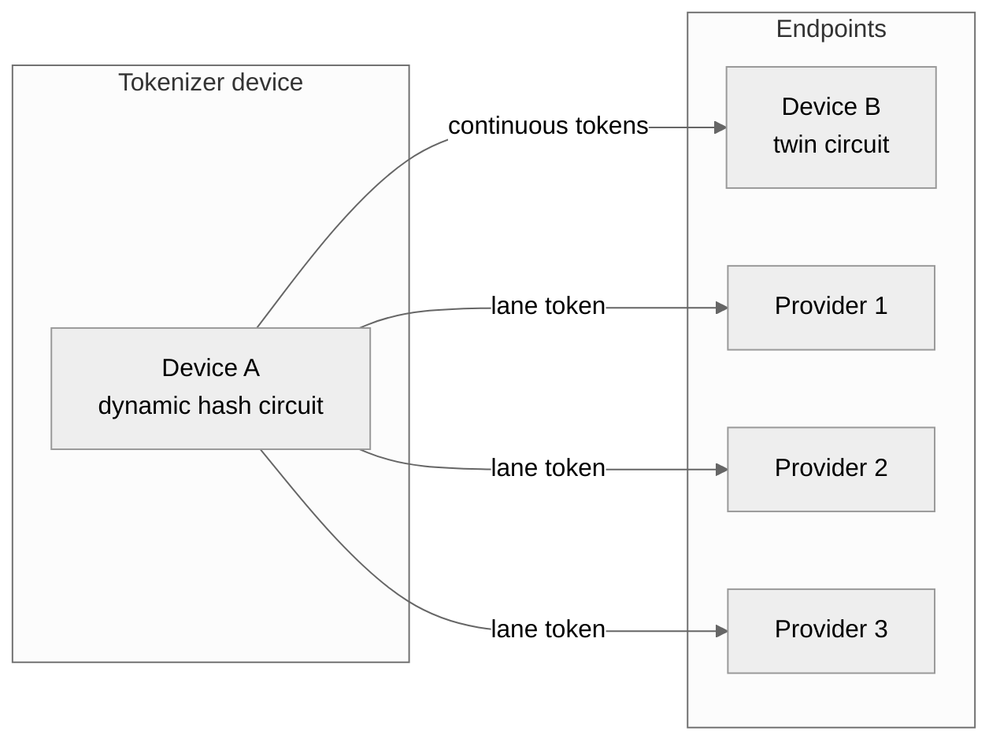

## 2. System model and goals
PCPL is designed for:

- No runtime challenge/response or synchronization negotiation.
- One token per cycle, routed to exactly one provider out of $x$.
- Provider-side validation by local recomputation.

Threat model (minimal):

- A provider should not compute tokens for other providers.
- Observing accepted tokens should not reveal other lanes.
- Public time/phase information should not enable cross-lane forgery.

The "primes' compounds" approach as differentiate hashing algorithm should be considered the simplest one. Even with certain vulnerabilities depending on chosen parameters, it's good for working with integer-only circuits.

## 3. Notation and public parameters
Let:

- $x$ be the number of providers (lanes).
- $P, Q, R$ be pairwise coprime primes (also coprime with $x$).
- $M$ be a prime modulus for multiplicative-group arithmetic.
- $H(\cdot)$ be a cryptographic hash (or a dynamic hash circuit).
- $\mathrm{Trunc}_k(\cdot)$ be truncation to $k$ bits.
- $t$ be the cycle counter.
- $\|$ denote byte/bit-string concatenation.

Each provider $i$ has three secret bouquets: $\mathrm{BouquetA}_i, \mathrm{BouquetB}_i, \mathrm{BouquetC}_i$, each a list of prime compounds.

### 3.0 Symbols and domain tags

To avoid accidental cross-use of hashes (“domain confusion”), **every hash that serves a distinct role appends a distinct domain tag**.
These tags are **constants**. In the formulas we write them as `TAG_PHASE`, `TAG_KDF`, etc. In an implementation each `TAG_*` is a fixed byte string (e.g. `TAG_PHASE = b"PHASE"`), appended **as-is**.  
There is no need to “ISO‑encode keywords as decimals”: they are labels, not numeric variables. If you want symbol‑free circuits, replace byte tags with fixed-width numeric tag constants (e.g. `u32`) and serialize them with the same canonical integer encoding as everything else; the only requirement is that tags are distinct.

Glossary:

- **CRT clock:** the public schedule formed by the three residues mod \(P,Q,R\).
- **Lane / provider:** one of \(x\) independent validators that each own distinct secrets.
- **Bouquet:** a per-lane list of modular bases (typically composite “prime compounds”) used in the modular product.
- **QFT:** quantum Fourier transform (period finding) — optional analysis tool that can reveal *public* periods.

Domain tags (constants) used in this paper:

- `TAG_SEED` — derive the initial evolving state \(S_0\)
- `TAG_W` — derive per-lane memory words \(W_i^{(0)}\)
- `TAG_PRIME` — derive candidate primes for \(P,Q,R\) (and optionally \(M\))
- `TAG_A0`, `TAG_B0`, `TAG_C0` — derive **public** phase offsets \(a_0,b_0,c_0\)
- `TAG_PERMKEY` — derive the device-only permutation key `perm_key`
- `TAG_PERMSEED` — derive the per-block shuffle seed used by \(\pi_B\)
- `TAG_PHASE` — domain tag for the phase digest \(\Phi_t\)
- `TAG_EXP` — domain tag for bouquet exponent derivation \(e_j\)
- `TAG_KDF` — domain tag for per-lane key material \(K_i(t)\)
- `TAG_TOK` — domain tag for the final emitted token \(T_i(t)\)
- `TAG_EVOLVE` — domain tag for state evolution \(S_{t+1}\)

### 3.1 Seed construction and coprime extraction
The device bootstraps a root seed $Z$ from device-local entropy and context (for example: device secret, serial, provider list, and a boot nonce). In the demo, $Z$ is produced by a deterministic RNG seeded with `--seed`, then bound to labels with $H(\cdot)$:

- $\mathrm{perm\_key} = H(Z \| \text{TAG\_PERMKEY})$
- $S_0 = H(Z \| \text{"SEED"})$
- $W_i = \mathrm{Trunc}_k(H(Z \| \text{"W"} \| i))$

To extrapolate coprimes for $P,Q,R$ (and optionally $M$), derive candidates from a seeded stream and select the first primes that are distinct and coprime with $x$:

1. $c_k \leftarrow \mathrm{next\_prime}(H(Z \| \text{"PRIME"} \| k) \bmod 2^b)$
2. accept $c_k$ if $\gcd(c_k, x)=1$ and $c_k \notin \{P,Q,R,M\}$
3. continue until $P,Q,R$ (and $M$ if generated) are assigned


### 3.1.1 Public phase offsets and public parameter publication
The phase clock in §5.1 uses **public offsets** $a_0\in[0,P)$, $b_0\in[0,Q)$, $c_0\in[0,R)$. They are **not** lane secrets: every validator must be able to recompute $(a_t,b_t,c_t)$ from the same public schedule.

A simple deterministic derivation (used in the demo) is:

- $a_0 = H(Z \| \text{"A0"}) \bmod P$
- $b_0 = H(Z \| \text{"B0"}) \bmod Q$
- $c_0 = H(Z \| \text{"C0"}) \bmod R$

Even if derived from the device root seed $Z$, these offsets are treated as **published configuration**, together with $x, P, Q, R$ (and $M$ if used). Equivalently, you can derive them from a separate *public* setup seed $Z_{\text{pub}}$.

### 3.1.2 Provisioning contract (who knows what)
PCPL is “no-handshake” at runtime, but it still needs a provisioning step (manufacture, enrollment, or out-of-band setup). The clean separation is:

- **Public configuration (shared with everyone):** $x$, $P,Q,R$, $M$, $a_0,b_0,c_0$, the permutation algorithm description, and the canonical byte encoding rules (§5.0).
- **Device-only secrets:** $Z$, `perm_key`, $S_t$, the full bouquet set for all providers, and the lane-memory vector $W[0..x-1]$.
- **Provider-$i$ secrets:** $(\mathrm{BouquetA}_i, \mathrm{BouquetB}_i, \mathrm{BouquetC}_i)$ and its stable identifier $i$ (or `provider_id`).

The runtime cycle counter $t$ must be common to device and providers. In practice, either:
1) $t$ is derived from a shared epoch and fixed cycle duration, or  
2) the device includes $t$ alongside the emitted token (recommended for robustness).


### 3.2 Best-practice coprimes, compounds, and key selection
Parameter and key selection should scale with the peer count and keep strict domain separation between device-only and provider-only secrets.

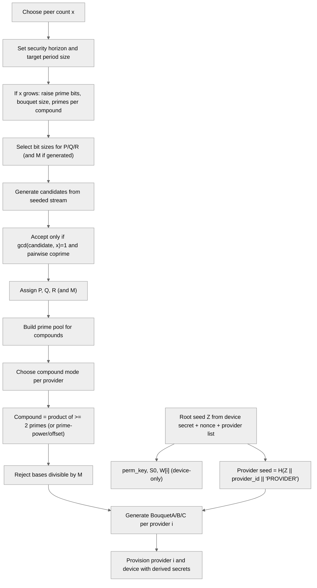

### 3.2.1 Seeded example flows (real values)
The demo can be run with small bit sizes so prime-factor detail fits on the page. The examples below use `prime_mode=generated`, `prime_bits=12`, `modulus_bits=16`, `compound_mode=classic`, `compound_primes=3`, `compound_count=4`, and the built-in prime pool; the compound example uses provider 0's BouquetA[0..1]. Each node shows the integer value and its prime-power factorization.

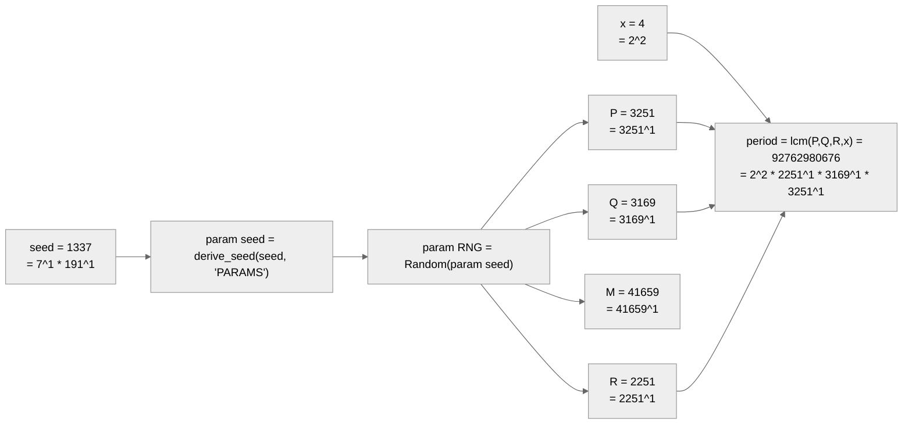

**Important:** the schedule/modulus primes (**P, Q, R** and **M**) are chosen for the public clock period and modular arithmetic. They are **not** meant to appear as factors inside bouquet compounds. Bouquets are built from a separate prime pool (small in the demo, larger in production) because the protocol only uses each compound as a *base modulo* **M** in `pow(compound % M, exponent, M)`. The only required constraint is `compound % M != 0` (equivalently `gcd(compound, M)=1`).

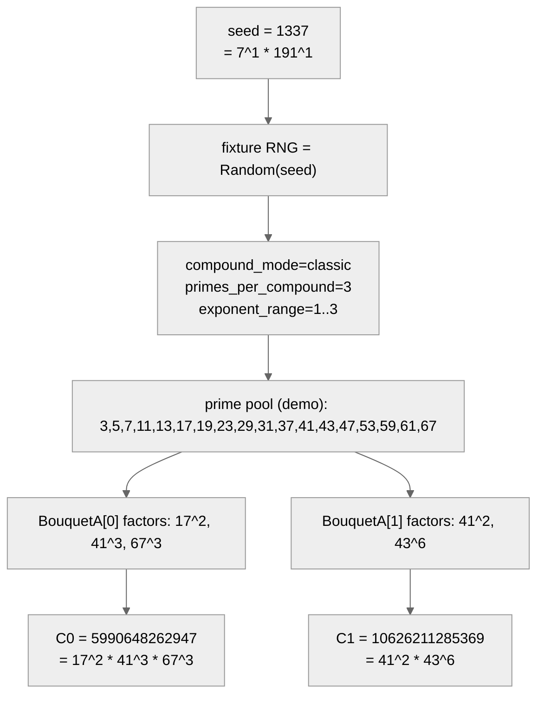

## 4. PCPL protocol overview
The protocol uses:

1. A public phase clock (CRT residues and coupled products).
2. A per-block permutation schedule to enforce “returns every $x$”.
3. Hidden bouquets to derive lane-specific tokens.
4. Device-only seed evolution that chains all lanes.

### 4.1 User device circuit (emitter)
The device knows the full schedule and all lane secrets, so it computes only the
active lane per cycle and emits exactly one token.

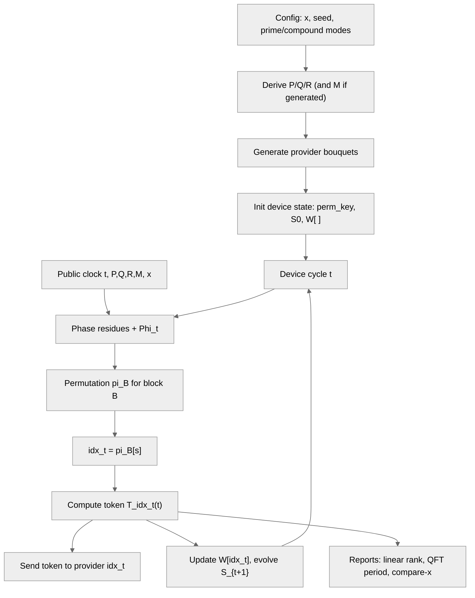

### 4.2 Blind provider circuit (validator)
Each provider only knows its own bouquets. It recomputes $T_i(t)$ every cycle, but the received token matches only once per block of $x$ cycles. The other $x-1$ cycles are expected mismatches because the device emitted a different lane.

**Why only 1-of-$x$ is correct:** the provider computes the *same* lane token formula as the device, but with a fixed lane index $i$. The device emits $T_{\mathrm{idx}_t}(t)$ where $\mathrm{idx}_t = \pi_B[s]$ is hidden by $\mathrm{perm\_key}$. Therefore the provider is correct iff $i = \mathrm{idx}_t$.
Because $\pi_B$ is a permutation, this happens exactly once per block of $x$ cycles. The device is “always right” because it emits the scheduled lane token; the provider is “blind” because it does not know $\mathrm{perm\_key}$ and cannot predict which cycle is its match.

Provider-side token generation (every cycle):

$$
\begin{aligned}
EA_i(t) &= \mathrm{Eval}(\mathrm{BouquetA}_i, a_t, u_1), \\
EB_i(t) &= \mathrm{Eval}(\mathrm{BouquetB}_i, b_t, u_2), \\
EC_i(t) &= \mathrm{Eval}(\mathrm{BouquetC}_i, c_t, u_3), \\
K_i(t) &= H\!\left(
\mathrm{enc\_i}(i)\|\mathrm{encM}(EA_i(t))\|\mathrm{encM}(EB_i(t))\|\mathrm{encM}(EC_i(t))\|\Phi_t\|\mathrm{TAG\_KDF}
\right), \\
T_i(t) &= \mathrm{Trunc}_k\!\left(
H\!\left(K_i(t)\|\mathrm{enc\_t}(t)\|\Phi_t\|\mathrm{TAG\_TOK}\right)
\right).
\end{aligned}
$$

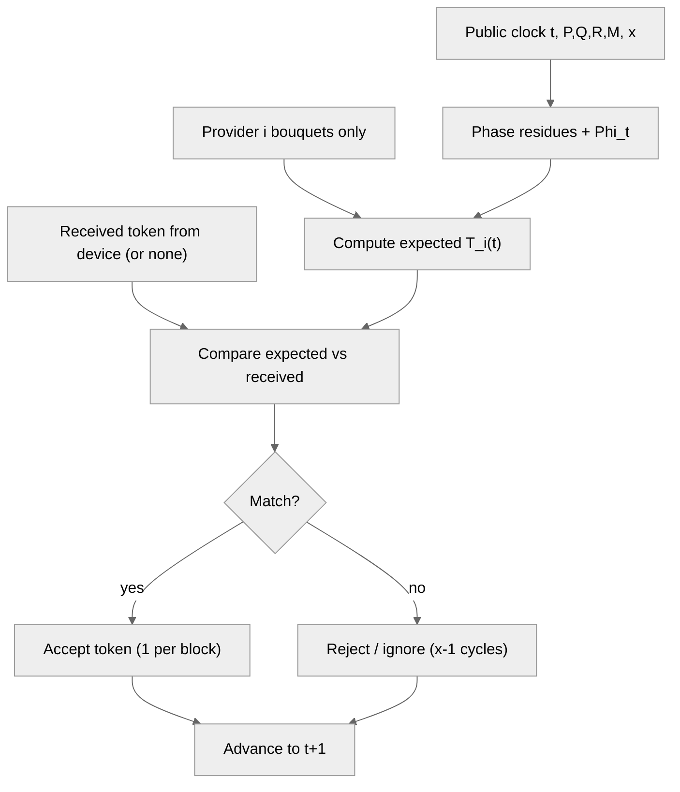

## 5. Step-by-step algorithm


### 5.0 Canonical encoding and concatenation (unambiguous hash inputs)

The operator `||` / \(\|\) in the formulas means **byte-string concatenation**. Implementations **MUST** use a canonical serialization so that different tuples cannot map to the same byte string (classic “`1|23` vs `12|3`” bug).

Use fixed-length big-endian integer encoding (**I2OSP**) with lengths derived from the public moduli:

- \(\ell_P=\lceil\log_2(P)/8\rceil\), \(\ell_Q\), \(\ell_R\), \(\ell_M\) similarly
- lane identifier: \(\ell_i=4\) bytes (`enc_i(i) = I2OSP(i,4)`) unless you need a larger ID space
- cycle counter: \(\ell_t=8\) bytes (`enc_t(t) = I2OSP(t,8)`) unless you expect more than \(2^{64}\) cycles
- small indices (bouquet element index \(j\), prime-candidate index \(k\), …): `encU32(n) = I2OSP(n,4)`

Encoding functions:

- `encP(a) = I2OSP(a, ℓP)` and similarly `encQ`, `encR`, `encM`
- `enc_i(i) = I2OSP(i, ℓi)`, `enc_t(t) = I2OSP(t, ℓt)`

Domain tags (`TAG_PHASE`, `TAG_EXP`, `TAG_KDF`, `TAG_TOK`, …) are fixed byte strings as defined in §3.0 and are appended **as-is**. If you prefer numeric tags, serialize the numeric constant with `I2OSP(tag, 4)` (or any fixed width) — the only requirement is uniqueness.

With this convention, the core digests become:

$$
\Phi_t = H\!\left(
\mathrm{encP}(a_t)\|\mathrm{encQ}(b_t)\|\mathrm{encR}(c_t)\|
\mathrm{encM}(u_1)\|\mathrm{encM}(u_2)\|\mathrm{encM}(u_3)\|
\mathrm{TAG\_PHASE}
\right).
$$

$$
e_j = H\!\left(
\mathrm{encRes}(x_{\mathrm{res}})\|\mathrm{encM}(u)\|\mathrm{encU32}(j)\|\mathrm{TAG\_EXP}
\right) \bmod (M-1),
$$
where `encRes` is the residue encoder for \(a_t\) / \(b_t\) / \(c_t\) (use `encP`, `encQ`, or `encR` depending on which residue is in scope).

$$
K_i(t)=H\!\left(
\mathrm{enc\_i}(i)\|\mathrm{encM}(EA_i(t))\|\mathrm{encM}(EB_i(t))\|\mathrm{encM}(EC_i(t))\|
\Phi_t\|\mathrm{TAG\_KDF}
\right),
$$

$$
T_i(t)=\mathrm{Trunc}_k\!\left(
H\!\left(K_i(t)\|\mathrm{enc\_t}(t)\|\Phi_t\|\mathrm{TAG\_TOK}\right)
\right).
$$

`Trunc_k` can mean “take the first \(k\) bits” (most common), or “interpret as an integer and reduce mod \(2^k\)”. The demo uses byte truncation.

**Rule of thumb:** never concatenate decimal strings, and never concatenate variable-length integers without either fixed widths or length-prefixes.

### 5.1 Phase clock
Public offsets $a_0,b_0,c_0$ are part of the public configuration (§3.1.1).

For cycle $t$:

$$
\begin{aligned}
a_t &= (a_0 + t) \bmod P, \\
b_t &= (b_0 + t) \bmod Q, \\
c_t &= (c_0 + t) \bmod R.
\end{aligned}
$$

Coupled products:

$$
\begin{aligned}
u_1 &= (a_t\, b_t) \bmod M, \\
u_2 &= (b_t\, c_t) \bmod M, \\
u_3 &= (c_t\, a_t) \bmod M.
\end{aligned}
$$

Phase digest:

$$
\Phi_t = H\!\left(
\mathrm{encP}(a_t)\|\mathrm{encQ}(b_t)\|\mathrm{encR}(c_t)\|
\mathrm{encM}(u_1)\|\mathrm{encM}(u_2)\|\mathrm{encM}(u_3)\|
\mathrm{TAG\_PHASE}
\right).
$$

### 5.2 Permutation schedule (“returns every x”)
Let:

$$
B = \left\lfloor \frac{t}{x} \right\rfloor, \quad s =T_i(t) &= \mathrm{Trunc}_k\!\left(H\!\left(K_i(t)\|\mathrm{enc\_t}(t)\|\Phi_t\|\mathrm{TAG\_TOK}\right)\right).bmod x.
$$

Compute a permutation $\pi_B$ of $\{0,\ldots,x-1\}$ using a hash-driven shuffle seeded by a block-level phase digest (computed at $t = B\cdot x$) so the schedule is stable within each block. Then:

$$
\mathrm{idx}_t = \pi_B[s].
$$

This guarantees each provider appears exactly once per block.

### 5.2.1 Device-side destination selection
The device determines the current destination provider using only public phase data and its private permutation key:

$$
\begin{aligned}
&B = \left\lfloor \frac{t}{x} \right\rfloor,\quad s =T_i(t) &= \mathrm{Trunc}_k\!\left(H\!\left(K_i(t)\|\mathrm{enc\_t}(t)\|\Phi_t\|\mathrm{TAG\_TOK}\right)\right).bmod x \\
&\pi_B = \mathrm{Permute}\left(\mathrm{perm\_key}, B, \Phi_{B\cdot x}\right) \\
&\mathrm{idx}_t = \pi_B[s]
\end{aligned}
$$

Providers do not know $\mathrm{perm\_key}$, so the schedule is blinded from them even though $t$ and $\Phi_t$ are public.

### 5.3 Bouquet evaluation

Each bouquet is a list of compounds \(C_j\), each a modular base (typically a product of primes). For a residue \(x_{\mathrm{res}}\) and coupling \(u\), define the per-element exponent:

$$
e_j = H\!\left(
\mathrm{encRes}(x_{\mathrm{res}})\|\mathrm{encM}(u)\|\mathrm{encU32}(j)\|\mathrm{TAG\_EXP}
\right) \bmod (M-1).
$$

Bouquet evaluation is the modular product:

$$
\mathrm{Eval}(\mathrm{Bouquet}, x_{\mathrm{res}}, u) = \prod_j C_j^{e_j} \bmod M.
$$

For provider \(i\):

$$
\begin{aligned}
EA_i(t) &= \mathrm{Eval}(\mathrm{BouquetA}_i, a_t, u_1), \\
EB_i(t) &= \mathrm{Eval}(\mathrm{BouquetB}_i, b_t, u_2), \\
EC_i(t) &= \mathrm{Eval}(\mathrm{BouquetC}_i, c_t, u_3).
\end{aligned}
$$

### 5.3.1 Prime-compound construction variants
Compounds do not need to be prime: any base coprime with $M$ is valid. Here, “prime compound” means a composite base built from two or more primes (a compound prime). This expands the base space and lets you tune complexity by increasing the number of factors and exponents, while preserving continuity.
The only hard requirement is $\gcd(C, M)=1$ (no factor of $M$). This coprimality is **with respect to the modulus $M$**, not with respect to $P,Q,R$ or $x$: compounds may share factors with each other, but they must not share factors with $M$ to stay in $\mathbb{F}_M^{\ast}$.

- **Multi-prime compounds:** $C = \prod_{i=1}^{r} p_i^{e_i}$ with $r \ge 2$ (the general case).
- **Prime powers:** $C = p^k$ (smooth but non-prime bases).
- **Semiprimes:** $C = p q$ (a 2-prime special case).
- **Offset compounds:** $C = \left(\prod p_i^{e_i}\right) + \delta$ with small $\delta$ to create a quasi-continuous family.
- **Quantized reals:** map a real parameter $\rho$ to $C = \lfloor \alpha \rho \rfloor$ for fixed scale $\alpha$, then ensure $\gcd(C, M)=1$.

The demo exposes these families via compound generation modes while keeping the exponent schedule unchanged; the “blend” mode just mixes these families and does not change the phase periodicity, which is driven solely by $P,Q,R$ and $x$.

### 5.4 Token derivation

Key derivation (domain-separated by lane identifier \(i\)):

$$
K_i(t) = H\!\left(
\mathrm{enc\_i}(i)\|\mathrm{encM}(EA_i(t))\|\mathrm{encM}(EB_i(t))\|\mathrm{encM}(EC_i(t))\|
\Phi_t\|\mathrm{TAG\_KDF}
\right).
$$

Token:

$$
T_i(t) = \mathrm{Trunc}_k\!\left(
H\!\left(K_i(t)\|\mathrm{enc\_t}(t)\|\Phi_t\|\mathrm{TAG\_TOK}\right)
\right).
$$

Implementation notes:
- In code, \(K_i(t)\) is the **hash digest bytes** (not an integer).
- When concatenating integers, always use the canonical fixed-length encoding (§5.0).
- Including \(i\) inside the KDF provides explicit lane domain-separation even if two providers were accidentally provisioned with identical bouquets.

### 5.4.1 Worked example with real integers (toy parameters + SHA-256)
This example is **not** meant to be secure (the primes are tiny); it exists only to show the math and key composition end-to-end with concrete numbers.

Parameters:

- $x=4$
- $P=11$, $Q=13$, $R=17$ (pairwise coprime and coprime with $x$)
- $M=19$ (prime modulus, so $\lvert\mathbb{F}_M^{\ast}\rvert=M-1=18$)
- public offsets: $a_0=2$, $b_0=3$, $c_0=5$
- lane: $i=2$
- cycle: $t=7$
- encoding: fixed-length big-endian as in §5.0 (here every modulus fits in 1 byte)
- hash: SHA-256, $k=64$ (token is first 64 bits of the final hash)

Provider $i=2$ bouquets (each base is coprime with $M$):

- $\mathrm{BouquetA}_2=[15,\,77]$ (compounds: $3\cdot 5$ and $7\cdot 11$)
- $\mathrm{BouquetB}_2=[91,\,143]$ (compounds: $7\cdot 13$ and $11\cdot 13$)
- $\mathrm{BouquetC}_2=[85,\,187]$ (compounds: $5\cdot 17$ and $11\cdot 17$)

Computed public phase values:

- $a_t=9$, $b_t=10$, $c_t=12$
- $u_1=14$, $u_2=6$, $u_3=13$
- $\Phi_t = \mathrm{SHA256}(\texttt{09 0a 0c 0e 06 0d} \| \text{TAG\_PHASE}) = \texttt{0x809eec62…}$

Computed bouquet exponents and evaluations (all exponents reduced mod $18$):

- $e^A=[2,17] \Rightarrow EA_2(t)=16$
- $e^B=[7,5] \Rightarrow EB_2(t)=1$
- $e^C=[0,14] \Rightarrow EC_2(t)=4$

Final key and token:

- $K_2(t)=\mathrm{SHA256}(i\|EA\|EB\|EC\|\Phi_t\|\text{TAG\_KDF})=\texttt{0x4ca0cd19…}$
- $T_2(t)=\mathrm{Trunc}_{64}(\mathrm{SHA256}(K_2(t)\|t\|\Phi_t\|\text{TAG\_TOK}))=\texttt{0x548c40b9091d8ed7}$

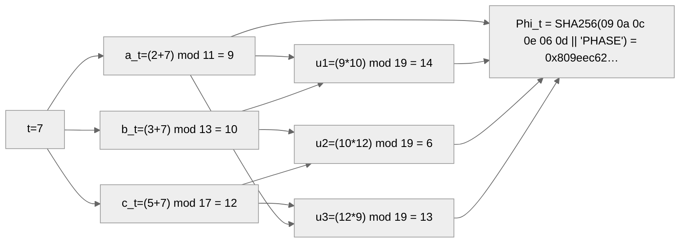

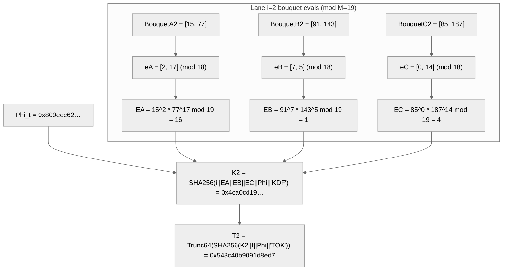

This is the exact structure the providers use: even though they cannot predict **which** lane the device will emit on a given cycle, they can still recompute their own lane's expected $T_i(t)$ and accept only when it matches.

### 5.4.2 Why SHA-256 and truncation still respect the permutation rule (and enable async validation)

PCPL has two *separate* mechanisms that people often conflate:

1. **Permutation rule (“returns every x”)** — decides **which lane** is active at time $t$.
2. **Token derivation** — decides **what value** the device emits for that lane at time $t$.

Truncation affects only (2), never (1).

#### A. The permutation rule is independent of hashing and truncation
Within a block $B=\lfloor t/x\rfloor$, the device computes a deterministic permutation $\pi_B$ of the lane indices and selects:

$$
\mathrm{idx}_t = \pi_B[t \bmod x].
$$

Because $\pi_B$ is a **permutation**, every lane appears exactly once per block, regardless of how you compute $K_i(t)$ or $T_i(t)$.
So “returns every $x$” is preserved as long as `Permute(...)` is deterministic.

#### B. Determinism is what makes re-derivation possible
For any fixed lane $i$ and cycle $t$, the derivation is a pure function:

$$
K_i(t)=H(\mathrm{enc}_i(i)\|\mathrm{encM}(EA_i(t))\|\mathrm{encM}(EB_i(t))\|\mathrm{encM}(EC_i(t))\|\Phi_t\|\mathrm{TAG\_KDF})
$$

$$
T_i(t)=\mathrm{Trunc}_k\Big(H\big(K_i(t)\|\mathrm{enc}_t(t)\|\Phi_t\|\mathrm{TAG\_TOK}\big)\Big).
$$

There are no hidden “external variables” beyond:

- public parameters ($P,Q,R,M,x,a_0,b_0,c_0$, and the definition of $H$ and truncation),
- the cycle counter $t$ (sent in the message, or derived from a shared epoch),
- and the lane’s provisioned secrets (bouquets).

So a provider can recompute its expected $T_i(t)$ **for any $t$**, even if it has not seen recent traffic.

#### C. Truncation preserves correctness (it only trades bandwidth for collision probability)
Both device and provider compute the same 256-bit hash output, then apply the same deterministic truncation rule.
Therefore truncation cannot “break synchronization” — it can only increase the chance that two different inputs collide in $k$ bits.
Choose $k$ large enough for your threat model (e.g., 64 bits is already far beyond typical OTP sizes).

#### D. Why this is “async”: providers don’t need the permutation key
Providers do **not** need `perm_key` or $\pi_B$ to validate.
They only validate *when contacted*:

- Device sends $(t, i, T)$ to provider $i$.
- Provider computes $T_i(t)$ locally and checks equality.

If $i$ is not the active lane at that time, the token simply won’t match — no schedule knowledge required.

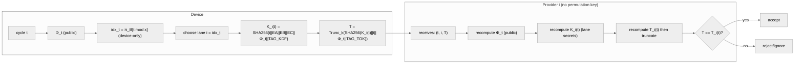


### 5.5 Device emission and state evolution

The device computes only \(T_{\mathrm{idx}_t}(t)\) for the scheduled lane and updates internal state:

- \(W[i]\) is a per-lane **memory word**. Initialize as \(W_i^{(0)}\) (§3.1), then update only when lane \(i\) is active (e.g., store `Int(T) mod M` or store raw token bytes — choose one representation and encode it canonically in the hash below).
- The seed \(S_t\) evolves using **all lanes** and adjacent products, so “inactive” lanes still influence the future through their last stored \(W[i]\).

For \(x\) lanes, define (non-cyclic adjacency):

$$
m_\ell = (W_\ell \cdot W_{\ell+1}) \bmod M, \quad \ell = 0,\ldots,x-2.
$$

Seed evolution:

$$
S_{t+1} = H\!\left(
S_t \| W_0 \| \cdots \| W_{x-1} \| m_0 \| \cdots \| m_{x-2} \| \Phi_t \| \mathrm{TAG\_EVOLVE}
\right).
$$

Implementation note: if \(W[i]\) and \(m_\ell\) are stored as integers, serialize them with `encM(·)` (or another fixed-width encoder) before hashing.

### 5.6 Provider verification
Provider $i$ recomputes $T_i(t)$ and accepts the token if it matches.

### 5.7 Device-side vs provider-side variables
The protocol deliberately separates what the device computes from what providers can infer:

- **Public inputs:** $t$ (or its epoch mapping), $x$, $P,Q,R,M$, the public offsets $a_0,b_0,c_0$, the permutation algorithm (but not `perm_key`), and the canonical encoding rules.
- **Device-only state:** $\mathrm{perm\_key}$, $S_t$, all lane secrets, and the lane-memory vector $W[0..x-1]$.
- **Provider $i$ secrets:** $\mathrm{BouquetA}_i, \mathrm{BouquetB}_i, \mathrm{BouquetC}_i$.
- **Ignored by providers:** $\mathrm{perm\_key}$, $S_t$, other providers’ bouquets, and the full $W$ vector.

The device computes only $T_{\mathrm{idx}_t}(t)$ for the current lane; the provider computes only its own lane token and does not need the device seed.

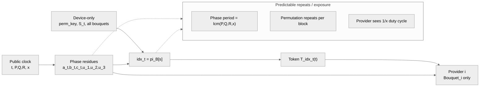


### 5.8 Reference pseudocode (implementation-oriented)

The following pseudocode matches the specification above (not optimized).

```text
# Public parameters (shared):
#   x, P, Q, R, M, a0, b0, c0
# Hash function H(·) and Trunc_k(·) agreed by all parties
# Canonical encoders: encP, encQ, encR, encM, enc_i, enc_t, encU32
# Domain tags: TAG_PHASE, TAG_EXP, TAG_KDF, TAG_TOK, TAG_EVOLVE, TAG_PERMSEED

function Phase(t):
    a = (a0 + t) mod P
    b = (b0 + t) mod Q
    c = (c0 + t) mod R
    u1 = (a * b) mod M
    u2 = (b * c) mod M
    u3 = (c * a) mod M

    Phi = H( encP(a) || encQ(b) || encR(c) ||
             encM(u1) || encM(u2) || encM(u3) ||
             TAG_PHASE )
    return (a,b,c,u1,u2,u3,Phi)

function PermuteBlock(perm_key, B, Phi_block, x):
    # Deterministic Fisher–Yates using hash-derived bytes as a PRNG stream.
    # Stable for the whole block B.
    seed = H( perm_key || encU32(B) || Phi_block || TAG_PERMSEED )
    L = [0,1,2,...,x-1]
    stream = Expand(seed)      # e.g., seed || H(seed||0) || H(seed||1) || ...
    for i from x-1 downto 1:
        r = NextU32(stream)    # pull 32 bits from stream
        j = r mod (i+1)
        swap L[i], L[j]
    return L   # permutation π_B

function EvalBouquet(bouquet, res_encoder, x_res, u, M):
    acc = 1 mod M
    for j from 0 to len(bouquet)-1:
        Cj = bouquet[j] mod M
        ej = H( res_encoder(x_res) || encM(u) || encU32(j) || TAG_EXP ) mod (M-1)
        acc = (acc * pow(Cj, ej, M)) mod M
    return acc

function LaneToken(i, t, bouquets_i):
    (a,b,c,u1,u2,u3,Phi) = Phase(t)
    EA = EvalBouquet(bouquets_i.A, encP, a, u1, M)
    EB = EvalBouquet(bouquets_i.B, encQ, b, u2, M)
    EC = EvalBouquet(bouquets_i.C, encR, c, u3, M)

    K  = H( enc_i(i) || encM(EA) || encM(EB) || encM(EC) || Phi || TAG_KDF )
    T  = Trunc_k( H( K || enc_t(t) || Phi || TAG_TOK ) )
    return T

# DEVICE (emitter)
state: perm_key (secret), S, W[0..x-1] (secret per-lane memory), bouquets_all
for each cycle t = 0,1,2,...:
    (a,b,c,u1,u2,u3,Phi) = Phase(t)

    B = floor(t / x)
    s = t mod x
    Phi_block = Phase(B*x).Phi
    pi = PermuteBlock(perm_key, B, Phi_block, x)
    idx = pi[s]

    T = LaneToken(idx, t, bouquets_all[idx])
    send (t, idx, T) to provider idx

    W[idx] = Int(T) mod M   # or store raw bytes; if bytes, encode consistently in EVOLVE
    m[ℓ] = (W[ℓ] * W[ℓ+1]) mod M for ℓ = 0..x-2
    S = H( S || W[0] || ... || W[x-1] || m[0] || ... || m[x-2] || Phi || TAG_EVOLVE )

# PROVIDER i (validator)
state: bouquets_i (secret), i (public identifier)
on receive (t, i, T_rx):
    T_exp = LaneToken(i, t, bouquets_i)
    accept iff (T_rx == T_exp)
```

Notes:
- `Expand(seed)` is any deterministic method to obtain enough pseudorandom bytes from `seed`
  (e.g., `H(seed||0)`, `H(seed||1)`, …). Both device and any party that needs to recompute `π_B`
  must use the **same** expansion.
- Providers do **not** need `perm_key` and do not need to know `π_B` to validate: they only verify when contacted.


## 6. Correctness and periodicity

### 6.1 Exact 1-of-x matching
Within each block of length $x$, $\pi_B$ is a permutation. Therefore each provider index appears exactly once per block, and exactly one provider matches per cycle.

### 6.2 Phase periodicity
The phase clock is three modular counters: $a_t = (a_0 + t) \bmod P$ and likewise for $b_t$ and $c_t$. The joint state repeats after the least common multiple of their moduli, so the period is $\mathrm{lcm}(P,Q,R)$. When $P,Q,R$ are pairwise coprime (i.e., $\gcd(P,Q)=\gcd(P,R)=\gcd(Q,R)=1$), the lcm is $PQR$.

The *schedule* also depends on the block index $B=\lfloor t/x \rfloor$ and the slot $s =T_i(t) &= \mathrm{Trunc}_k\!\left(H\!\left(K_i(t)\|\mathrm{enc\_t}(t)\|\Phi_t\|\mathrm{TAG\_TOK}\right)\right).bmod x$, so the combined public schedule repeats after $\mathrm{lcm}(P,Q,R,x)$. If $x$ is coprime to each of $P,Q,R$ (i.e., $\gcd(P,x)=\gcd(Q,x)=\gcd(R,x)=1$), then the schedule period is exactly $PQRx$. 

If $x$ shares a factor with any of $P,Q,R$, the combined period is smaller. This periodicity is purely about the public clock; the choice of compound bases (even “blend” composites) does not change it, as long as those bases remain coprime with $M$.

### 6.3 Modular exponent correctness
With $M$ prime, the multiplicative group $\mathbb{F}_M^{\ast}$ has order $M-1$.
Reducing exponents modulo $M-1$ makes $C_j^{e_j} \bmod M$ well-defined for any base $C_j$ with $\gcd(C_j, M)=1$. This holds for primes and composite compounds alike; the only disallowed case is a base sharing a factor with $M$, which would collapse the product (e.g., $C_j \equiv 0 \bmod M$).

### 6.4 Peer-count variations (x=2,3,4 and composite counts)
Changing $x$ changes the block size, the number of permutations, and the chain width:

| x | block length | permutations | chain products | note |
|---:|---:|---:|---:|---|
| 2 | 2 | 2 | 1 | twin pairing (2 lanes) |
| 3 | 3 | 6 | 2 | prime lane count |
| 4 | 4 | 24 | 3 | $2^2$ prime power |
| 6 | 6 | 720 | 5 | composite ($2 \cdot 3$) |

In general: block length $= x$, permutation space $= x!$, chain width $= x-1$,
and schedule period $= \mathrm{lcm}(P,Q,R,x)$. For composite $x$ (e.g., $6=2\cdot 3$),
choose $P,Q,R$ coprime with all prime factors of $x$ to avoid shrinking the period.

## 7. Security intuition (informal)
- **Lane isolation:** each provider uses distinct secret bouquets, so observing one lane does not reveal others.
- **Phase coupling:** public residues are mixed and hashed, preventing linear predictability from the CRT clock alone.
- **Device chaining:** even stale lanes influence future state, reinforcing the requirement that “every token matters”.
- **Quantum period-finding:** QFT can reveal the public period $\mathrm{lcm}(P,Q,R,x)$ but not the hidden bouquets or $\mathrm{perm\_key}$; use large coprimes and device-only chaining to avoid exploitable structure.

## 8. Experimental validation (deterministic simulation)
A simulator was implemented cycle-by-cycle to validate correctness. The demo verifies:

- Each block yields a valid permutation.
- Exactly one provider matches each cycle.
- Each provider appears once per block.
- Optional pre-hash difficulty metrics and QFT-visible period reports.
- Optional prime/compound generation modes for non-arbitrary parameter testing.

Repository: [cekkr/phaselane-algorithm@github.com](https://github.com/cekkr/phaselane-algorithm).

### 8.1 Sample token trace (x=4, seed=1337)
For PDF export, the original wide table was replaced with an A4-friendly summary table and a sequence diagram (tokens truncated for readability; the matched provider’s recomputed token equals the device token by construction).

| t | block | slot | idx_t | device token (truncated) | matched provider |
|---:|---:|---:|---:|---|---:|
| 0 | 0 | 0 | 3 | `0xaa81443d…6e0e02` | 3 |
| 1 | 0 | 1 | 0 | `0x21faa3d7…2dbe77` | 0 |
| 2 | 0 | 2 | 2 | `0x888b2137…903179` | 2 |
| 3 | 0 | 3 | 1 | `0xa591e8bf…03b4b4` | 1 |
| 4 | 1 | 0 | 2 | `0x5da9a61c…1d52ff` | 2 |
| 5 | 1 | 1 | 0 | `0x8abe0866…9d17b6` | 0 |
| 6 | 1 | 2 | 1 | `0x39d33ef1…6fd92e` | 1 |
| 7 | 1 | 3 | 3 | `0xe25bb134…064674` | 3 |

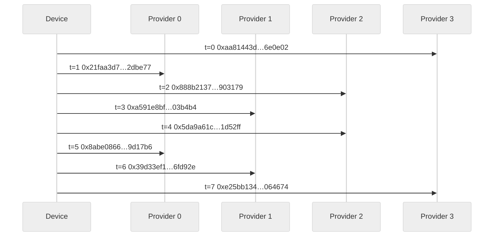

### 8.2 Full token trace (verbatim values)

The full deterministic trace (block permutations, schedule, device tokens, and per-lane tokens) is exported to a separate, auto-generated file to keep the paper A4-friendly. See `papers/token-trace.md`, generated by `demo/export_token_trace.py`.

Regenerate with:
`python3 demo/export_token_trace.py --blocks 4 --out papers/token-trace.md`

### 8.3 Pre-hash difficulty and period reporting
The demo can emit a linear pre-hash difficulty report (rank of exponent vectors modulo 2 and 65537) and the QFT-visible public period:

- `python3 demo/pcpl_cycle_test.py --linear-report --analysis-window 64`
- `python3 demo/pcpl_cycle_test.py --qft-report`
- `python3 demo/pcpl_cycle_test.py --compare-x 2,3,4,5,6`
- `python3 demo/pcpl_cycle_test.py --prime-mode generated --prime-bits 31 --compound-mode blend --compound-prime-bits 12`

### 8.4 Multi-configuration results snapshot
All runs below completed the full correctness checks (permutation, 1-of-x matching, chaining).

Fixed primes (P/Q/R near 1e6, seed=1337) with compare-x and 64-cycle linear window:

| x | chain width (x-1) | QFT period bits | QFT period (decimal) |
|---:|---:|---:|---|
| 2 | 1 | 61 | 2000146002862007326 |
| 3 | 2 | 62 | 3000219004293010989 |
| 4 | 3 | 62 | 4000292005724014652 |
| 5 | 4 | 63 | 5000365007155018315 |
| 6 | 5 | 63 | 6000438008586021978 |

Across all x above, the pre-hash exponent vectors reached full rank (4/4) modulo 2 and 65537, with 64/64 unique rows for A/B/C over the sample window.

For $x=6$ (composite $2 \cdot 3$), the schedule still yields exactly one match
per cycle, but the duty cycle per provider is $1/6$ and the permutation space
grows to $6! = 720$. Ensure $P,Q,R$ are coprime with both 2 and 3 to keep the
public period large.

Generated primes (x=4, 64 cycles, 12-bit compound primes):

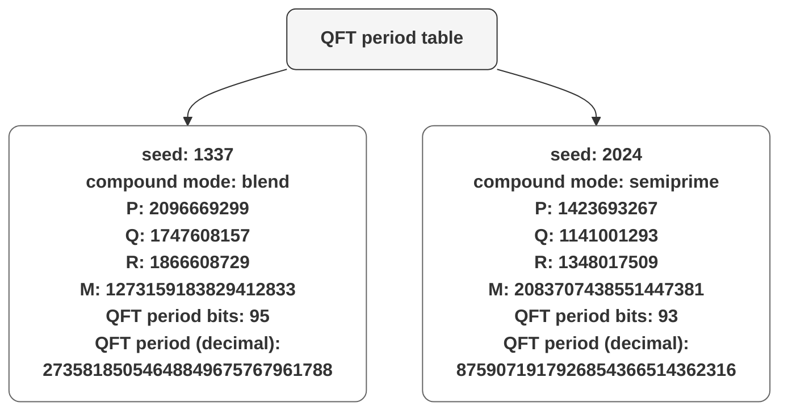

Full multi-configuration outputs (additional compound modes and seeds) are in `papers/pcpl-results.md`.

## 9. Discussion and limitations
- Parameter choice matters; $P, Q, R, M$ must be prime and pairwise coprime.
- The permutation schedule is device-only; leakage of the permutation key can reveal lane order, but not lane tokens.
- The security of the scheme relies on the strength of $H(\cdot)$ and the secrecy of bouquets, not on the hardness of factoring revealed integers.
- The public period $\mathrm{lcm}(P,Q,R,x)$ is visible (and QFT-recoverable), so period size should be chosen large enough for the deployment horizon.
- For testing, primes and compound bases can be generated from a seeded stream to avoid arbitrary constants.
- This paper was developed and formatted with the help of OpenAI models.

## 10. Conclusion
PCPL provides a deterministic, no-handshake token protocol with exact 1-of-$x$ matching and a device-only chaining mechanism. Combined with symmetric continuous tokenizer devices, it supports both provider validation and peer-to-peer isolation with dynamic, evolving secrets. The included simulation and trace demonstrate the protocol’s behavior cycle by cycle.
