| Author | Contact | Date |
|---|---|---|
| Riccardo Cecchini | rcecchini.ds[at]gmail.com | 25 December 2025 |

# Prime-Compound Phase-Lane Token Protocol (PCPL) for Symmetric Continuous Tokenizer Devices

### (Continuous symmetric encryption starting from asymmetric keys)

Version 1.9 — 14 July 2026

## Premise

This research began as a response to the EU "Chat Control" proposal and the client-side scanning it would impose — effectively a state trojan on end-user devices. The goal is a cheap but structurally intricate protection layer for end-to-end users, built on always-running symmetric key generators. Two deployment shapes are targeted:

- a set of parallel server providers, none of which sees the full validation picture, and
- direct end-to-end pairing between two user devices, with no provider at all.

On the provider side, a single shared circuit can serve many users with shared but non-overlapping keys, which keeps key generation cheap. A protocol layer is then needed to spread each user's traffic across the providers so that the selection pattern itself maximizes cryptographic obfuscation. The shared-circuitry approach is still immature and under study; it is currently being tested and refined only through genetic (evolutionary) design search.

## Abstract

I present the Prime-Compound Phase-Lane Token Protocol (PCPL), a no-handshake token system in which a device emits one token per cycle and exactly one provider out of $x$ can validate it. PCPL combines four mechanisms: (1) a public phase clock derived from coprime residues, (2) hidden per-provider "bouquets" of prime-compound bases, (3) a private per-block lane permutation, and (4) device-side state evolution that chains all lanes together. The protocol runs on a *symmetric continuous tokenizer* device model, motivated by FPGA-based dynamic hash circuits and twin circuits for peer validation.

Offline design-search (co-evolution) results support a conservative implementation direction: the protocol invariants are stable, and the deployable circuit should be split into a sparse feed-forward token core plus three supervisory layers — GPS-disciplined synchronization, route hardening, and execution audit. Evolved candidates confirm the sparse-activation shape but remain below the hand-written sparse baseline family, so this evidence is architectural rather than a final-controller proof. The observed attacker pressure is lane/route inference from public timing structure, not token-material recovery; the decisive unresolved weakness is long-horizon drift and route leakage, not the 1-of-$x$ validation rule. The paper gives a step-by-step algorithm, correctness properties, deterministic traces, circuit-level guidance, and the design-search conclusions.

## 1. Symmetric continuous tokenizer devices

PCPL runs on a "symmetric continuous tokenizer" device designed for consumer computing. The device is envisioned as a reconfigurable hardware unit (for example, an FPGA-based key) that can:

- acquire unique, device-specific hashing circuits or internal start variables, [15][16]
- continuously generate short-lived tokens or keys,
- be validated only by its twin circuit(s), which share the same circuit family or seed lineage.

The symmetry comes from pairing: two devices can load the same dynamic hash circuit and evolve internal state in the same way, enabling mutual validation without exposing the evolving secrets.

### 1.1 Forks by variable alternation

Beyond PCPL, the same circuit can be "forked" by alternating variable sets over time windows. Let a device maintain a base circuit $C$ and a family of variable sets $V_k$, each selected by a time window $W_k$. Each fork evolves its own state:

$$
S_{t+1}^{(k)} = H\!\left(C,\, S_t^{(k)},\, V_k,\, t\right),\qquad t\in W_k,
$$

and derives its own token stream from $S_t^{(k)}$ using the token derivation of §6.5. This creates multiple parallel token streams that share the same circuit but have distinct, time-delimited variable schedules. Such forks can serve as provider lanes (as in PCPL) or as isolated peer-to-peer sessions that are difficult to parallelize or replay.

### 1.2 Peer-to-peer continuity

The device model also targets local, in-person connections among peers. Two devices that share a circuit family and seed lineage can establish an isolated encryption context by evolving state in lockstep, without querying a central provider.

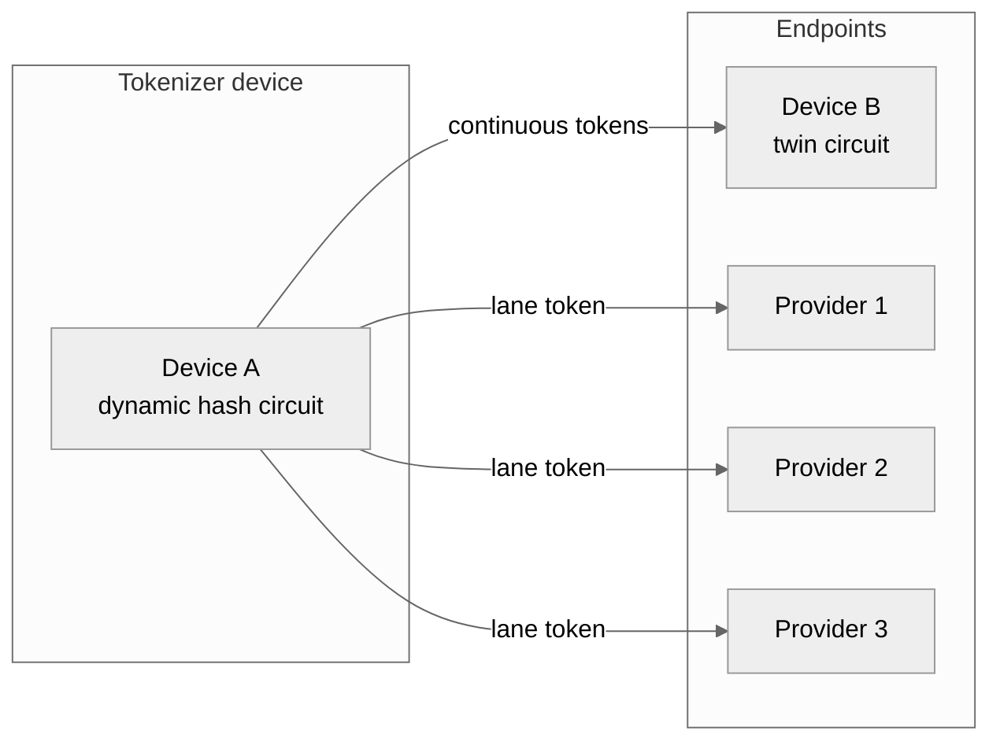
```mermaid
%%{init: {"theme":"neutral","flowchart":{"curve":"basis"}} }%%
flowchart LR
  subgraph Device["Tokenizer device"]
    A["Device A<br/>dynamic hash circuit"]
  end

  subgraph Endpoints["Endpoints"]
    B["Device B<br/>twin circuit"]
    P1["Provider 1"]
    P2["Provider 2"]
    P3["Provider 3"]
  end

  A -- "continuous tokens" --> B
  A -- "lane token" --> P1
  A -- "lane token" --> P2
  A -- "lane token" --> P3
```

## 2. System model and goals

PCPL is designed for:

- no runtime challenge/response or synchronization negotiation after provisioning,
- one token per cycle, routed to exactly one provider out of $x$,
- provider-side validation by local recomputation.

Threat model (minimal):

- a provider must not be able to compute tokens for other providers,
- observing accepted tokens must not reveal other lanes,
- public time/phase information must not enable cross-lane forgery.

The prime-compound approach should be read as the simplest integer-only construction for the modular product layer, not as a replacement for standardized hashing or KDFs. Its security depends on parameter selection, bouquet secrecy, and the surrounding hash/KDF schedule. [20][30][1][2][5]

## 3. Notation and public parameters

Let:

- $x$ be the number of providers (lanes),
- $P, Q, R$ be pairwise coprime primes (also coprime with $x$),
- $M$ be a prime modulus for multiplicative-group arithmetic,
- $H(\cdot)$ be a cryptographic hash or standardized PRF/KDF primitive, depending on the role being instantiated, [1][2][3][4][5][22]
- $\mathrm{Trunc}_k(\cdot)$ be truncation to $k$ bits,
- $t$ be the cycle counter,
- $\|$ denote byte-string concatenation.

Each provider $i$ has three secret bouquets: $\mathrm{BouquetA}_i, \mathrm{BouquetB}_i, \mathrm{BouquetC}_i$, each a list of prime compounds.

### 3.1 Glossary and domain tags

- **CRT clock:** the public schedule formed by the three residues mod $P,Q,R$. [20]
- **Lane / provider:** one of $x$ independent validators that each own distinct secrets.
- **Bouquet:** a per-lane list of modular bases (typically composite "prime compounds") used in the modular product.
- **QFT:** quantum Fourier transform (period finding [18][19]) — an optional analysis tool that can reveal *public* periods.

To avoid accidental cross-use of hashes ("domain confusion"), **every hash that serves a distinct role appends a distinct domain tag**. Tuple-style encodings, cSHAKE/KMAC customization strings, and explicit domain separation tags are the closest standardized analogues. [9][21][5]

Domain tags (constants) used in this paper:

| tag | derives |
|---|---|
| `SEED` | initial evolving state $S_0$ |
| `W` | per-lane memory words $W_i^{(0)}$ |
| `PRIME` | candidate primes for $P,Q,R$ (and optionally $M$) |
| `A0`, `B0`, `C0` | **public** phase offsets $a_0,b_0,c_0$ |
| `PERMKEY` | device-only permutation key `perm_key` |
| `PERMSEED` | per-block shuffle seed used by $\pi_B$ |
| `PHASE` | phase digest $\Phi_t$ |
| `EXP` | bouquet exponents $e_j$ |
| `KDF` | per-lane key material $K_i(t)$ [10][22][5] |
| `TOK` | final emitted token $T_i(t)$ |
| `EVOLVE` | state evolution $S_{t+1}$ |

### 3.2 Seed construction and coprime extraction

The device bootstraps a root seed $Z$ from device-local entropy and context (for example: device secret, serial, provider list, and a boot nonce). Production deployments should separate entropy-source validation from deterministic expansion: entropy belongs to the SP 800-90B / RFC 4086 layer, while deterministic replayable streams belong to an approved DRBG or a clearly specified PRF expansion. [23][7][6] In the demo, $Z$ is produced by a deterministic RNG seeded with `--seed`, then bound to labels with $H(\cdot)$:

- $\mathrm{perm\_key} = H(Z \| \text{PERMKEY})$
- $S_0 = H(Z \| \text{SEED})$
- $W_i = \mathrm{Trunc}_k(H(Z \| \text{W} \| i))$

To extract coprimes for $P,Q,R$ (and optionally $M$), derive candidates from a seeded stream and select the first primes that are distinct and coprime with $x$:

1. $c_k \leftarrow \mathrm{next\_prime}(H(Z \| \text{PRIME} \| k) \bmod 2^b)$
2. accept $c_k$ if $\gcd(c_k, x)=1$ and $c_k \notin \{P,Q,R,M\}$
3. continue until $P,Q,R$ (and $M$ if generated) are assigned

### 3.3 Public phase offsets

The phase clock in §6.2 uses **public offsets** $a_0\in[0,P)$, $b_0\in[0,Q)$, $c_0\in[0,R)$. They are **not** lane secrets: every validator must be able to recompute $(a_t,b_t,c_t)$ from the same public schedule.

A simple deterministic derivation (used in the demo) is:

- $a_0 = H(Z \| \text{A0}) \bmod P$
- $b_0 = H(Z \| \text{B0}) \bmod Q$
- $c_0 = H(Z \| \text{C0}) \bmod R$

Even if derived from the device root seed $Z$, these offsets are treated as **published configuration**, together with $x, P, Q, R$ (and $M$ if used). Equivalently, they can be derived from a separate *public* setup seed $Z_{\text{pub}}$.

### 3.4 Provisioning contract (who knows what)

PCPL is "no-handshake" at runtime, but it still needs a provisioning step (manufacture, enrollment, or out-of-band setup). The clean separation is:

- **Public configuration (shared with everyone):** $x$, $P,Q,R$, $M$, $a_0,b_0,c_0$, the permutation algorithm description (but not the key), and the canonical byte-encoding rules (§6.1).
- **Device-only secrets:** $Z$, `perm_key`, $S_t$, the full bouquet set for all providers, and the lane-memory vector $W[0..x-1]$.
- **Provider-$i$ secrets:** $(\mathrm{BouquetA}_i, \mathrm{BouquetB}_i, \mathrm{BouquetC}_i)$ and its stable identifier $i$ (or `provider_id`).

Providers never see — and never need — `perm_key`, $S_t$, other providers' bouquets, or the $W$ vector. The device computes only the current lane's token; each provider computes only its own lane's token.

The runtime cycle counter $t$ must be common to device and providers. In practice, either:

1. $t$ is derived from a shared epoch and fixed cycle duration, or
2. the device includes $t$ alongside the emitted token (recommended for robustness).

### 3.5 Parameter and bouquet selection

Parameter and key selection should scale with the peer count and keep strict domain separation between device-only and provider-only secrets. The cryptographic part should be treated as a KDF/PRF schedule, not as ad-hoc string hashing. [5][22][9]

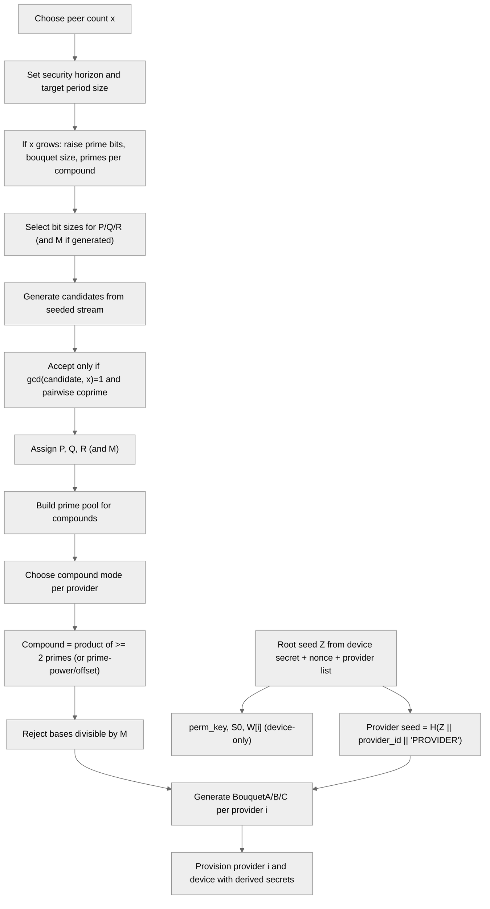
```mermaid
%%{init: {"theme":"neutral","flowchart":{"curve":"basis"}} }%%
flowchart TD
  Start["Choose peer count x"] --> Scale["Set security horizon and target period size"]
  Scale --> Adjust["If x grows: raise prime bits, bouquet size, primes per compound"]
  Adjust --> Bits["Select bit sizes for P/Q/R (and M if generated)"]
  Bits --> Gen["Generate candidates from seeded stream"]
  Gen --> Coprime["Accept only if gcd(candidate, x)=1 and pairwise coprime"]
  Coprime --> Assign["Assign P, Q, R (and M)"]
  Assign --> Pool["Build prime pool for compounds"]
  Pool --> Mode["Choose compound mode per provider"]
  Mode --> Comp["Compound = product of >= 2 primes (or prime-power/offset)"]
  Comp --> Check["Reject bases divisible by M"]
  Check --> Bouquets["Generate BouquetA/B/C per provider i"]
  SeedRoot["Root seed Z from device secret + nonce + provider list"] --> Keys["perm_key, S0, W[i] (device-only)"]
  SeedRoot --> ProvSeed["Provider seed = H(Z || provider_id || 'PROVIDER')"]
  ProvSeed --> Bouquets
  Bouquets --> Provision["Provision provider i and device with derived secrets"]
```

**Important:** the schedule/modulus primes ($P, Q, R$ and $M$) are chosen for the public clock period and modular arithmetic. They are **not** meant to appear as factors inside bouquet compounds. Bouquets are built from a separate prime pool (small in the demo, larger in production), because the protocol only uses each compound as a *base modulo* $M$ in `pow(compound % M, exponent, M)`. The only required constraint is `compound % M != 0` (equivalently $\gcd(\text{compound}, M)=1$).

#### 3.5.1 Seeded example flows (real values)

The demo can be run with small bit sizes so prime-factor detail fits on the page. The examples below use `prime_mode=generated`, `prime_bits=12`, `modulus_bits=16`, `compound_mode=classic`, `compound_primes=3`, `compound_count=4`, and the built-in prime pool; the compound example uses provider 0's BouquetA[0..1]. Each node shows the integer value and its prime-power factorization.

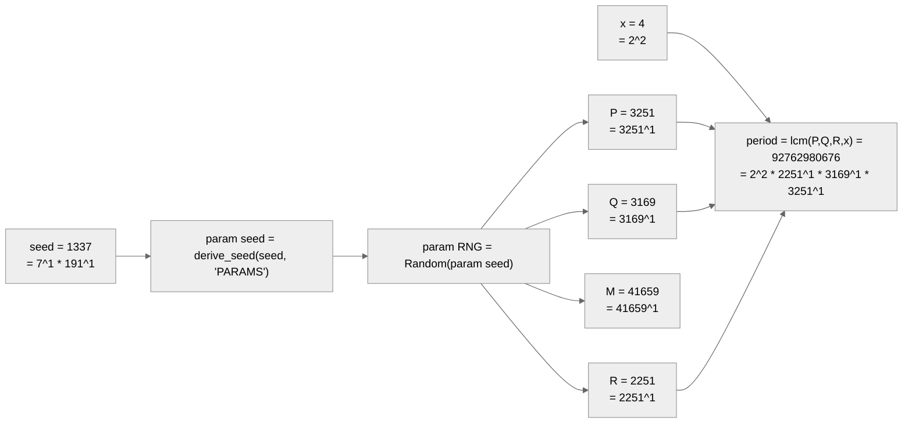
```mermaid
%%{init: {"theme":"neutral","flowchart":{"curve":"basis"}} }%%
flowchart LR
  Seed1337["seed = 1337<br/>= 7^1 * 191^1"] --> ParamSeed1337["param seed = derive_seed(seed, 'PARAMS')"]
  ParamSeed1337 --> ParamRng1337["param RNG = Random(param seed)"]
  ParamRng1337 --> P1337["P = 3251<br/>= 3251^1"]
  ParamRng1337 --> Q1337["Q = 3169<br/>= 3169^1"]
  ParamRng1337 --> R1337["R = 2251<br/>= 2251^1"]
  ParamRng1337 --> M1337["M = 41659<br/>= 41659^1"]
  X1337["x = 4<br/>= 2^2"] --> Period1337["period = lcm(P,Q,R,x) = 92762980676<br/>= 2^2 * 2251^1 * 3169^1 * 3251^1"]
  P1337 --> Period1337
  Q1337 --> Period1337
  R1337 --> Period1337
```

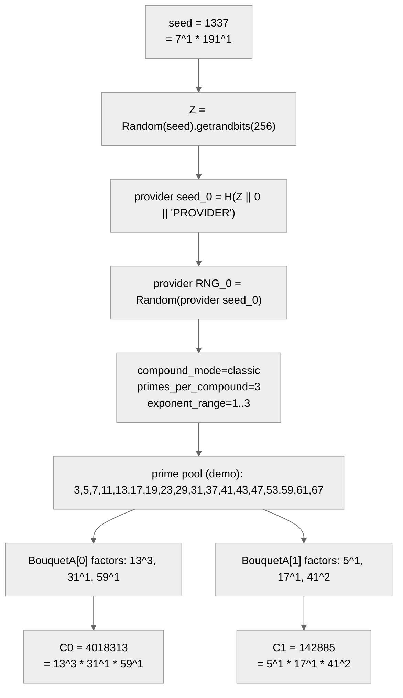
```mermaid
%%{init: {"theme":"neutral","flowchart":{"curve":"basis"}} }%%
flowchart TD
  Seed1337b["seed = 1337<br/>= 7^1 * 191^1"] --> Root1337["Z = Random(seed).getrandbits(256)"]
  Root1337 --> ProvSeed1337["provider seed_0 = H(Z || 0 || 'PROVIDER')"]
  ProvSeed1337 --> FixRng1337["provider RNG_0 = Random(provider seed_0)"]
  FixRng1337 --> Cfg1337["compound_mode=classic<br/>primes_per_compound=3<br/>exponent_range=1..3"]
  Cfg1337 --> Pool1337["prime pool (demo): 3,5,7,11,13,17,19,23,29,31,37,41,43,47,53,59,61,67"]
  Pool1337 --> PicksA0["BouquetA[0] factors: 13^3, 31^1, 59^1"]
  PicksA0 --> C0["C0 = 4018313<br/>= 13^3 * 31^1 * 59^1"]
  Pool1337 --> PicksA1["BouquetA[1] factors: 5^1, 17^1, 41^2"]
  PicksA1 --> C1["C1 = 142885<br/>= 5^1 * 17^1 * 41^2"]
```

## 4. Mathematical foundations: why this works

PCPL is built from three elementary, independently checkable mathematical facts — coprime counters realign slowly (Chinese Remainder Theorem), prime-field exponentiation is a one-way walk (discrete logarithm), and permutations are exact-fairness objects — glued together by standard hash/KDF constructions. This section builds the intuition behind each choice, so that the algorithm in §6 reads as engineering rather than magic.

### 4.1 The CRT clock: coprime wheels realign slowly

A single counter $a_t=(a_0+t)\bmod P$ repeats every $P$ cycles — on its own, a uselessly short and perfectly predictable clock. PCPL runs *three* counters whose moduli share no common factor. They behave like three gears whose tooth counts are pairwise coprime: each gear turns one tooth per cycle, and the *combination* of gear positions realigns only after $\mathrm{lcm}(P,Q,R)=PQR$ cycles.

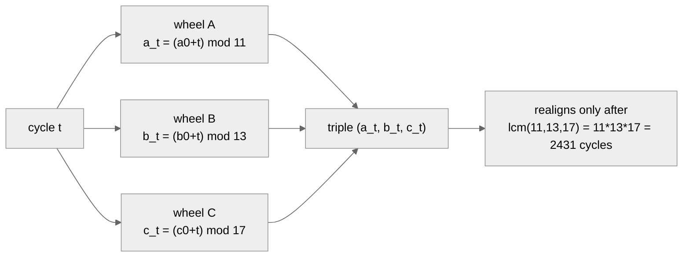
```mermaid
%%{init: {"theme":"neutral","flowchart":{"curve":"basis"}} }%%
flowchart LR
  T["cycle t"] --> WA["wheel A<br/>a_t = (a0+t) mod 11"]
  T --> WB["wheel B<br/>b_t = (b0+t) mod 13"]
  T --> WC["wheel C<br/>c_t = (c0+t) mod 17"]
  WA --> TR["triple (a_t, b_t, c_t)"]
  WB --> TR
  WC --> TR
  TR --> L["realigns only after<br/>lcm(11,13,17) = 11*13*17 = 2431 cycles"]
```

The Chinese Remainder Theorem [20] makes this precise: because $P,Q,R$ are pairwise coprime, the map

$$
t \bmod PQR \;\longleftrightarrow\; (a_t,\, b_t,\, c_t)
$$

is a **bijection**. Within one grand period, every combination of residues occurs exactly once, and no shorter realignment exists. A tiny example with $P=3, Q=5, R=7$ (offsets 0) shows the wheels drifting apart and meeting again only at $t=105=3\cdot5\cdot7$:

| $t$ | 0 | 1 | 2 | 3 | 4 | 5 | 6 | 7 | … | 104 | 105 |
|---|---|---|---|---|---|---|---|---|---|---|---|
| $a_t \bmod 3$ | 0 | 1 | 2 | 0 | 1 | 2 | 0 | 1 | … | 2 | **0** |
| $b_t \bmod 5$ | 0 | 1 | 2 | 3 | 4 | 0 | 1 | 2 | … | 4 | **0** |
| $c_t \bmod 7$ | 0 | 1 | 2 | 3 | 4 | 5 | 6 | 0 | … | 6 | **0** |

Each of the $105$ possible triples appears exactly once per period — the clock is maximally long for its size.

**Why coprimality with $x$ matters too.** The schedule partitions time into blocks of $x$ slots (§6.3), so slot $s$ only ever sees the cycles $t \equiv s \pmod x$. If a phase modulus shared a factor with $x$ — say $P=x=3$ — then inside slot $s$ the residue $a_t=(a_0+s)\bmod 3$ would be **frozen**: the same slot would always see the same wheel position, gluing schedule structure to phase structure and collapsing the effective period. With $\gcd(P,x)=1$, each slot walks through *all* $P$ residues over successive blocks:

| slot $s=0$ sees cycles $t$ | 0 | 3 | 6 | 9 | 12 | … |
|---|---|---|---|---|---|---|
| $a_t$ with $P=3$ (shared factor — frozen) | 0 | 0 | 0 | 0 | 0 | … |
| $a_t$ with $P=5$ (coprime — walks all residues) | 0 | 3 | 1 | 4 | 2 | … |

This is the entire reason for the "$\gcd(c_k,x)=1$" acceptance rule in the extraction loop of §3.2.

### 4.2 Prime-field arithmetic: units, Fermat, and one-way exponentiation

The modulus $M$ is prime so that the nonzero residues $\{1,\ldots,M-1\}$ form the multiplicative group $\mathbb{F}_M^{\ast}$. [20] Two consequences of this group structure do real work in PCPL:

- **No collapse.** Every element is invertible, and a product of nonzero elements is never zero — a chain of multiplications can never destroy information by hitting 0. The only bad base is a multiple of $M$ (which is $\equiv 0$ and absorbs the whole product forever); that is the entire content of the $\gcd(C,M)=1$ rule in §6.4.1.
- **Fermat's little theorem.** $C^{M-1}\equiv 1 \pmod M$ for every unit $C$, so exponentiation wraps around with period dividing $M-1$. This is why the exponents $e_j$ can be reduced modulo $M-1$ (§6.4) without changing any result — nothing is lost, the walk simply completed full laps.

Concretely, in the worked example's field $\mathbb{F}_{19}$ (§6.5.1), the element 2 generates the entire group of order $M-1=18$:

| $e$ | 1 | 2 | 3 | 4 | 5 | 6 | 7 | 8 | 9 | 10 | 11 | 12 | 13 | 14 | 15 | 16 | 17 | 18 |
|---|---|---|---|---|---|---|---|---|---|---|---|---|---|---|---|---|---|---|
| $2^e \bmod 19$ | 2 | 4 | 8 | 16 | 13 | 7 | 14 | 9 | 18 | 17 | 15 | 11 | 3 | 6 | 12 | 5 | 10 | 1 |

Exponentiation is a walk around this cycle. Walking forward is cheap (square-and-multiply [30]), but *given a landing point, recovering how many steps were taken* is the **discrete logarithm problem** [31][33] — easy to state, believed hard for well-chosen fields. Note how the values scatter with no visible order: adjacent exponents land far apart ($2^9=18$, $2^{10}=17$, $2^{13}=3$). The bouquet evaluation $\prod_j C_j^{e_j} \bmod M$ compounds several such walks into a single group element.

**Compounds are group elements, not factorable clues.** Modulo $M$, the base $15=3\cdot 5$ is simply "the element 15": the group operation never exposes its factors. The prime-compound structure of §6.4.1 is a *provisioning* device — a cheap, tunable, quasi-continuous family of bases — not an algebraic backdoor. Once reduced mod $M$, a compound is as opaque as any other unit.

### 4.3 Three walls between the wire and the secrets

What can an eavesdropper actually reach? The construction stacks three layers, and only the outermost is ever transmitted:

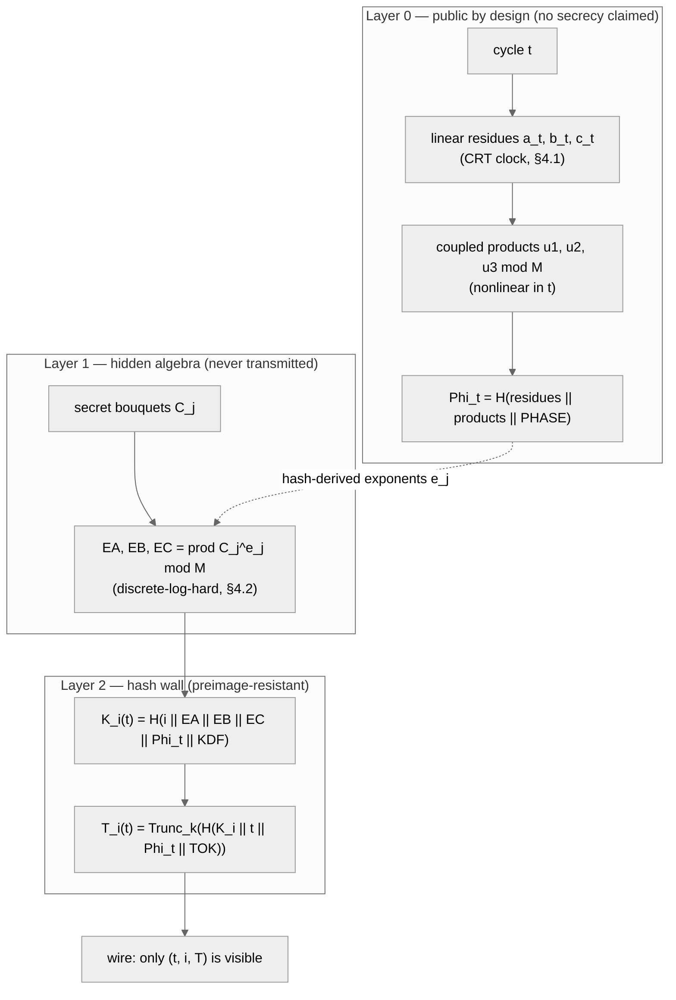
```mermaid
%%{init: {"theme":"neutral","flowchart":{"curve":"basis"}} }%%
flowchart TB
  subgraph L0["Layer 0 — public by design (no secrecy claimed)"]
    T["cycle t"] --> RES["linear residues a_t, b_t, c_t<br/>(CRT clock, §4.1)"]
    RES --> U["coupled products u1, u2, u3 mod M<br/>(nonlinear in t)"]
    U --> PHI["Phi_t = H(residues || products || PHASE)"]
  end
  subgraph L1["Layer 1 — hidden algebra (never transmitted)"]
    BQ["secret bouquets C_j"] --> E["EA, EB, EC = prod C_j^e_j mod M<br/>(discrete-log-hard, §4.2)"]
    PHI -. "hash-derived exponents e_j" .-> E
  end
  subgraph L2["Layer 2 — hash wall (preimage-resistant)"]
    E --> K["K_i(t) = H(i || EA || EB || EC || Phi_t || KDF)"]
    K --> TOK["T_i(t) = Trunc_k(H(K_i || t || Phi_t || TOK))"]
  end
  TOK --> WIRE["wire: only (t, i, T) is visible"]
```

- **Layer 0 — public by design.** The residues $a_t,b_t,c_t$ are linear in $t$; nobody claims they are secret. Alone they would be dangerously predictable, so they are first coupled pairwise ($u_1=a_t b_t \bmod M$, …): a product of two counters running with incommensurate periods, reduced by an unrelated modulus, is no longer linear in $t$, so no linear-algebra shortcut extrapolates its future from its past. The linear-rank reports of §10.2 measure exactly this (the exponent-vector matrix reaches full rank over the sample window). Hashing everything into $\Phi_t$ then removes whatever algebraic structure remains. This layer contributes *freshness and domain separation*, not secrecy.
- **Layer 1 — hidden algebra.** The bouquet evaluations $EA,EB,EC$ combine secret bases with hash-derived exponents. These group elements never leave the device or the provider. Even if one leaked, recovering the fixed bases $C_j$ (or the exponents) is a discrete-log-type problem [31][33] — and on top of being hard, the system is underdetermined: many $(C_j,e_j)$ combinations explain the same product. The caveat: discrete-log hardness holds only for well-chosen $M$ — see §7.3 for the Pohlig–Hellman [32] and sizing [34][36] requirements. The demo modulus is a toy in this respect.
- **Layer 2 — the hash wall.** Only $T_i(t)=\mathrm{Trunc}_k(H(K_i(t)\|\cdots))$ reaches the wire, and $K_i(t)$ is itself a hash. An observer holds truncated digests; walking backwards through them is the preimage resistance of $H$. [1][2][3]

The design intent is defense in depth: an attacker must breach the hash wall even to *see* the algebra, and must solve discrete-log-type recovery even to see the bouquets — while the public layer was never load-bearing for secrecy at all.

### 4.4 Fair by counting, unpredictable by keying

The schedule guarantee splits into two independent facts, and it is worth seeing that they rest on different foundations:

- **Fairness is combinatorial, not cryptographic.** A permutation of $\{0,\ldots,x-1\}$ contains each symbol exactly once — that is what "permutation" means. So "each provider is matched exactly once per block" (§7.1) needs no hardness assumption; it is a counting fact that holds even against a computationally unbounded adversary.
- **Unpredictability is keyed.** *Which* of the $x!$ possible permutations governs block $B$ is drawn by a PRF stream seeded from the device-only `perm_key` [14][26]. Without the key, every block looks like a fresh uniform draw among the $x!$ options, so the best per-cycle guess of the active lane stays at $1/x$. Re-drawing the permutation per block prevents long-run frequency analysis from ever doing better than the guaranteed $1/x$ duty cycle (the route-leakage caveats of §10.4 concern *side information* such as timing features, not the permutation itself).

Separating the two is what lets PCPL promise an exact service pattern (1-of-$x$, always) while keeping the routing sequence secret.

## 5. PCPL protocol overview

The protocol uses:

1. a public phase clock (CRT residues and coupled products),
2. a per-block permutation schedule to enforce "returns every $x$",
3. hidden bouquets to derive lane-specific tokens,
4. device-only seed evolution that chains all lanes,
5. a practical control split between a deterministic hot token core and slower supervisory layers (§8).

The mathematical rationale for choices 1–4 is developed in §4; this section shows how they compose into the two circuits.

### 5.1 User device circuit (emitter)

The device knows the full schedule and all lane secrets, so it computes only the active lane per cycle and emits exactly one token.

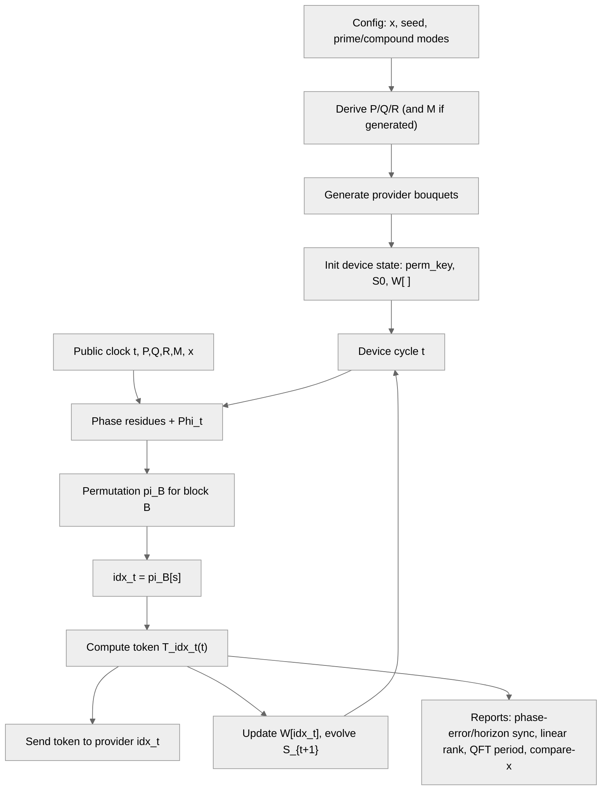
```mermaid
%%{init: {"theme":"neutral","flowchart":{"curve":"basis"}} }%%
flowchart TD
  Cfg["Config: x, seed, prime/compound modes"] --> Primes["Derive P/Q/R (and M if generated)"]
  Primes --> Bouquets["Generate provider bouquets"]
  Bouquets --> Init["Init device state: perm_key, S0, W[ ]"]
  Init --> Loop["Device cycle t"]
  Public["Public clock t, P,Q,R,M, x"] --> Phase["Phase residues + Phi_t"]
  Loop --> Phase
  Phase --> Perm["Permutation pi_B for block B"]
  Perm --> Pick["idx_t = pi_B[s]"]
  Pick --> Tok["Compute token T_idx_t(t)"]
  Tok --> Send["Send token to provider idx_t"]
  Tok --> Evolve["Update W[idx_t], evolve S_{t+1}"]
  Evolve --> Loop
  Tok --> Report["Reports: phase-error/horizon sync, linear rank, QFT period, compare-x"]
```

### 5.2 Blind provider circuit (validator)

Each provider knows only its own bouquets. Every cycle it recomputes its own expected token $T_i(t)$ (using the derivation of §6.4–6.5) and compares it against whatever it receives. The received token matches only once per block of $x$ cycles; the other $x-1$ cycles are expected mismatches, because the device emitted a different lane.

**Why exactly 1-of-$x$:** the provider computes the *same* lane-token formula as the device, but with a fixed lane index $i$. The device emits $T_{\mathrm{idx}_t}(t)$, where $\mathrm{idx}_t = \pi_B[s]$ is hidden by `perm_key`. The provider is therefore correct iff $i = \mathrm{idx}_t$, and since $\pi_B$ is a permutation, this happens exactly once per block of $x$ cycles (§7.1). The device is "always right" because it emits the scheduled lane token; the provider is "blind" because it cannot predict which cycle is its match.

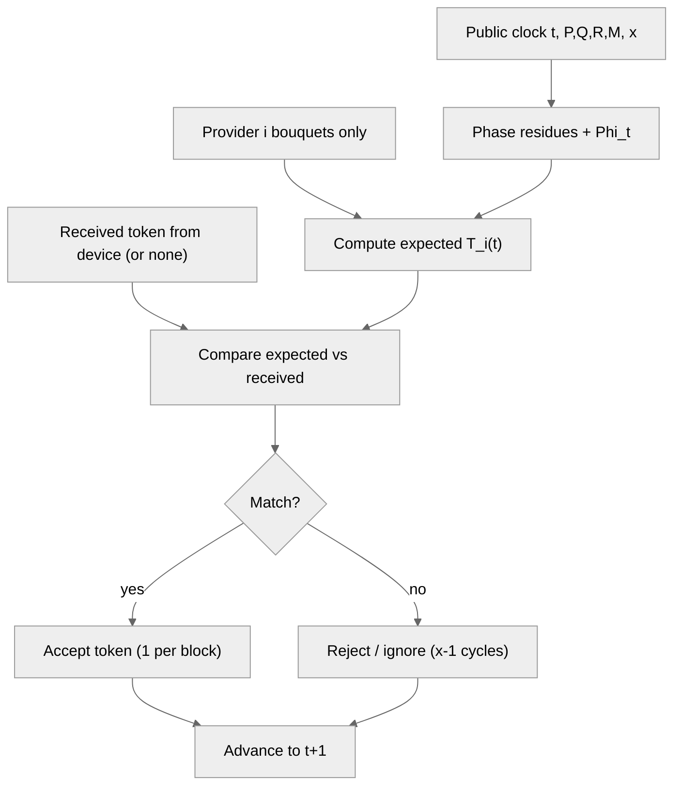
```mermaid
%%{init: {"theme":"neutral","flowchart":{"curve":"basis"}} }%%
flowchart TD
  Public["Public clock t, P,Q,R,M, x"] --> Phase["Phase residues + Phi_t"]
  Bouquets["Provider i bouquets only"] --> Expect["Compute expected T_i(t)"]
  Phase --> Expect
  Rx["Received token from device (or none)"] --> Compare["Compare expected vs received"]
  Expect --> Compare
  Compare --> Match{"Match?"}
  Match -->|yes| Accept["Accept token (1 per block)"]
  Match -->|no| Reject["Reject / ignore (x-1 cycles)"]
  Accept --> Next["Advance to t+1"]
  Reject --> Next
```

### 5.3 Shared vs distinct per-cycle logic

The device and each provider run the same synchronized per-cycle hash pipeline; they differ only in which lane index is used and whether device-only state is updated.

- **Shared pipeline (device + provider):** for a lane index $i$ and cycle $t$, compute $\Phi_t$, then $EA_i(t), EB_i(t), EC_i(t)$, then $K_i(t)$ and $T_i(t)$, using the canonical encoding and domain tags.
- **Device-only additions:** compute $\mathrm{idx}_t$ from `perm_key`, evaluate only that lane, emit $T_{\mathrm{idx}_t}(t)$, update $W[\mathrm{idx}_t]$, and evolve $S_{t+1}$ from all $W$ and chain products — so every emitted token influences future cycles.
- **Provider-only behavior:** for its fixed lane $i$, compute $T_i(t)$ every cycle and compare against any received token. Providers hold no `perm_key`, $S_t$, or $W[\,]$.

## 6. Step-by-step algorithm

### 6.1 Canonical encoding and concatenation (unambiguous hash inputs)

The operator $\|$ in the formulas means **byte-string concatenation**. Implementations **MUST** use a canonical serialization so that different tuples cannot map to the same byte string (the classic "`1|23` vs `12|3`" bug).

Use fixed-length big-endian integer encoding (**I2OSP [8]**) with lengths derived from the public moduli:

- $\ell_P=\lceil\log_2(P)/8\rceil$, and $\ell_Q$, $\ell_R$, $\ell_M$ similarly
- lane identifier: $\ell_i=4$ bytes (`enc_i(i) = I2OSP(i,4)`) unless a larger ID space is needed
- cycle counter: $\ell_t=8$ bytes (`enc_t(t) = I2OSP(t,8)`) unless more than $2^{64}$ cycles are expected
- small indices (bouquet element index $j$, prime-candidate index $k$, …): `encU32(n) = I2OSP(n,4)`

Encoding functions:

- `encP(a) = I2OSP(a, ℓP)`, and similarly `encQ`, `encR`, `encM`
- `enc_i(i) = I2OSP(i, ℓi)`, `enc_t(t) = I2OSP(t, ℓt)`

Domain tags (`PHASE`, `EXP`, `KDF`, `TOK`, …) are fixed byte strings as defined in §3.1 and are appended **as-is**. Numeric tags are also fine if serialized with a fixed width (e.g., `I2OSP(tag, 4)`) — the only requirement is uniqueness.

`Trunc_k` can mean "take the first $k$ bits" (most common) or "interpret as an integer and reduce mod $2^k$". The demo uses byte truncation.

**Rule of thumb:** never concatenate decimal strings, and never concatenate variable-length integers without fixed widths, length prefixes, or a tuple-hash construction. [8][9][21]

Every digest in §§6.2–6.6 uses these encoders. Demo note: the Python demo uses BLAKE2b [3] and a typed, length-prefixed encoding for each hash part (tag + 4-byte length) instead of fixed-width I2OSP. Older demo runs omitted `enc_i(i)` in the KDF; the current demo includes it to match the spec, so token traces differ from earlier runs.

### 6.2 Phase clock

Public offsets $a_0,b_0,c_0$ are part of the public configuration (§3.3). For cycle $t$:

$$
\begin{aligned}
a_t &= (a_0 + t) \bmod P, \\
b_t &= (b_0 + t) \bmod Q, \\
c_t &= (c_0 + t) \bmod R.
\end{aligned}
$$

Coupled products:

$$
\begin{aligned}
u_1 &= (a_t\, b_t) \bmod M, \\
u_2 &= (b_t\, c_t) \bmod M, \\
u_3 &= (c_t\, a_t) \bmod M.
\end{aligned}
$$

Phase digest:

$$
\Phi_t = H\!\left(
\mathrm{encP}(a_t)\|\mathrm{encQ}(b_t)\|\mathrm{encR}(c_t)\|
\mathrm{encM}(u_1)\|\mathrm{encM}(u_2)\|\mathrm{encM}(u_3)\|
\mathrm{PHASE}
\right).
$$

### 6.3 Permutation schedule ("returns every x")

The **schedule** — which provider is selected at each cycle — is driven only by the public cycle counter and the device's private permutation key. It is independent of the hashed token bytes.

Define a block index and a slot inside that block:

$$
B = \left\lfloor \frac{t}{x} \right\rfloor,\qquad s = t \bmod x.
$$

For each block $B$, the device derives a permutation $\pi_B$ of $\{0,\ldots,x-1\}$ from a deterministic PRNG seeded with:

- the device-only `perm_key`,
- the block index $B$,
- the public digest $\Phi_{B\cdot x}$ (fixed for the block start),
- the domain tag `PERMSEED`,

and selects the lane for cycle $t$ as:

$$
\mathrm{idx}_t = \pi_B[s].
$$

Because $\pi_B$ is a permutation, each lane appears **exactly once** per block of length $x$ ("returns every $x$"). Hashing and truncation happen *after* this selection, so they cannot break the 1-of-$x$ property. Providers do **not** know `perm_key`, so they cannot predict $\mathrm{idx}_t$, even though $t$ and $\Phi_t$ are public.

In implementation terms, `PermuteBlock` should be a deterministic Durstenfeld/Fisher–Yates shuffle over a PRF/DRBG byte stream, not a random-sort shortcut. [14][26][27]

### 6.4 Bouquet evaluation

Each bouquet is a list of compounds $C_j$, each a modular base (typically a product of primes). For a residue value $\mathrm{res}$ (one of $a_t, b_t, c_t$) and coupling $u$, define the per-element exponent:

$$
e_j = H\!\left(
\mathrm{encRes}(\mathrm{res})\|\mathrm{encM}(u)\|\mathrm{encU32}(j)\|\mathrm{EXP}
\right) \bmod (M-1),
$$

where `encRes` is `encP`, `encQ`, or `encR` depending on which residue is in scope. Bouquet evaluation is the modular product:

$$
\mathrm{Eval}(\mathrm{Bouquet}, \mathrm{res}, u) = \prod_j C_j^{e_j} \bmod M.
$$

For provider $i$:

$$
\begin{aligned}
EA_i(t) &= \mathrm{Eval}(\mathrm{BouquetA}_i, a_t, u_1), \\
EB_i(t) &= \mathrm{Eval}(\mathrm{BouquetB}_i, b_t, u_2), \\
EC_i(t) &= \mathrm{Eval}(\mathrm{BouquetC}_i, c_t, u_3).
\end{aligned}
$$

#### 6.4.1 Prime-compound construction variants

Compounds do not need to be prime: any base coprime with $M$ is valid. Here, "prime compound" means a composite base built from two or more primes. This expands the base space and lets you tune complexity by increasing the number of factors and exponents, while preserving continuity. The only hard requirement is $\gcd(C, M)=1$ (no factor of $M$). This coprimality is **with respect to the modulus $M$**, not with respect to $P,Q,R$ or $x$: compounds may share factors with each other, but they must not share factors with $M$, to stay in $\mathbb{F}_M^{\ast}$.

- **Multi-prime compounds:** $C = \prod_{i=1}^{r} p_i^{e_i}$ with $r \ge 2$ (the general case).
- **Prime powers:** $C = p^k$ (smooth but non-prime bases).
- **Semiprimes:** $C = p q$ (a 2-prime special case).
- **Offset compounds:** $C = \left(\prod p_i^{e_i}\right) + \delta$ with small $\delta$, creating a quasi-continuous family.
- **Quantized reals:** map a real parameter $\rho$ to $C = \lfloor \alpha \rho \rfloor$ for a fixed scale $\alpha$, then ensure $\gcd(C, M)=1$.

The demo exposes these families via compound generation modes while keeping the exponent schedule unchanged; the "blend" mode simply mixes the families and does not change the phase periodicity, which is driven solely by $P,Q,R$ and $x$.

### 6.5 Token derivation

Key derivation (domain-separated by lane identifier $i$):

$$
K_i(t) = H\!\left(
\mathrm{enc\_i}(i)\|\mathrm{encM}(EA_i(t))\|\mathrm{encM}(EB_i(t))\|\mathrm{encM}(EC_i(t))\|
\Phi_t\|\mathrm{KDF}
\right).
$$

Token:

$$
T_i(t) = \mathrm{Trunc}_k\!\left(
H\!\left(K_i(t)\|\mathrm{enc\_t}(t)\|\Phi_t\|\mathrm{TOK}\right)
\right).
$$

Implementation notes:

- In code, $K_i(t)$ is the **hash digest bytes** (not an integer).
- When concatenating integers, always use the canonical fixed-length encoding (§6.1).
- Including $i$ inside the KDF provides explicit lane domain-separation even if two providers were accidentally provisioned with identical bouquets.
- For a standardized PRF/KDF wrapper, use HMAC, HKDF, or an SP 800-108 KDF mode with explicit context labels. [4][5][10][22]

#### 6.5.1 Worked example with real integers (toy parameters, SHA-256 [1])

This example is **not** meant to be secure (the primes are tiny); it only shows the math and key composition end-to-end with concrete numbers.

Parameters:

- $x=4$
- $P=11$, $Q=13$, $R=17$ (pairwise coprime and coprime with $x$)
- $M=19$ (prime modulus, so $\lvert\mathbb{F}_M^{\ast}\rvert=M-1=18$)
- public offsets: $a_0=2$, $b_0=3$, $c_0=5$
- lane: $i=2$; cycle: $t=7$
- encoding: fixed-length big-endian as in §6.1 (here every modulus fits in 1 byte)
- hash: SHA-256, $k=64$ (token is the first 64 bits of the final hash)

Provider $i=2$ bouquets (each base coprime with $M$):

- $\mathrm{BouquetA}_2=[15,\,77]$ (compounds: $3\cdot 5$ and $7\cdot 11$)
- $\mathrm{BouquetB}_2=[91,\,143]$ (compounds: $7\cdot 13$ and $11\cdot 13$)
- $\mathrm{BouquetC}_2=[85,\,187]$ (compounds: $5\cdot 17$ and $11\cdot 17$)

Computed public phase values:

- $a_t=9$, $b_t=10$, $c_t=12$
- $u_1=14$, $u_2=6$, $u_3=13$
- $\Phi_t = \mathrm{SHA256}(\texttt{09 0a 0c 0e 06 0d} \| \text{PHASE}) = \texttt{0x809eec62…}$

Computed bouquet exponents and evaluations (all exponents reduced mod $18$):

- $e^A=[2,17] \Rightarrow EA_2(t)=16$
- $e^B=[7,5] \Rightarrow EB_2(t)=1$
- $e^C=[0,14] \Rightarrow EC_2(t)=4$

Final key and token:

- $K_2(t)=\mathrm{SHA256}(i\|EA\|EB\|EC\|\Phi_t\|\text{KDF})=\texttt{0x4ca0cd19…}$
- $T_2(t)=\mathrm{Trunc}_{64}(\mathrm{SHA256}(K_2(t)\|t\|\Phi_t\|\text{TOK}))=\texttt{0x548c40b9091d8ed7}$

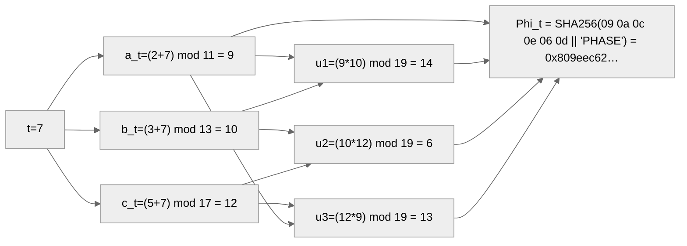
```mermaid
%%{init: {"theme":"neutral","flowchart":{"curve":"basis"}} }%%
flowchart LR
  T["t=7"] --> A["a_t=(2+7) mod 11 = 9"]
  T --> B["b_t=(3+7) mod 13 = 10"]
  T --> C["c_t=(5+7) mod 17 = 12"]

  A --> U1["u1=(9*10) mod 19 = 14"]
  B --> U1
  B --> U2["u2=(10*12) mod 19 = 6"]
  C --> U2
  C --> U3["u3=(12*9) mod 19 = 13"]
  A --> U3

  A --> PHI["Phi_t = SHA256(09 0a 0c 0e 06 0d || 'PHASE') = 0x809eec62…"]
  U1 --> PHI
  U2 --> PHI
  U3 --> PHI
```

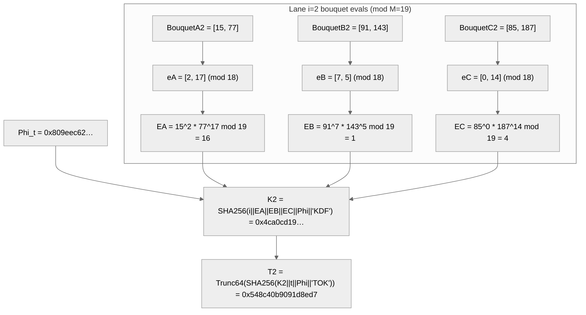
```mermaid
%%{init: {"theme":"neutral","flowchart":{"curve":"basis"}} }%%
flowchart TD
  subgraph A2["Lane i=2 bouquet evals (mod M=19)"]
    AIn["BouquetA2 = [15, 77]"] --> EAExp["eA = [2, 17] (mod 18)"]
    EAExp --> EA["EA = 15^2 * 77^17 mod 19 = 16"]

    BIn["BouquetB2 = [91, 143]"] --> EBExp["eB = [7, 5] (mod 18)"]
    EBExp --> EB["EB = 91^7 * 143^5 mod 19 = 1"]

    CIn["BouquetC2 = [85, 187]"] --> ECExp["eC = [0, 14] (mod 18)"]
    ECExp --> EC["EC = 85^0 * 187^14 mod 19 = 4"]
  end

  PHI2["Phi_t = 0x809eec62…"] --> K2["K2 = SHA256(i||EA||EB||EC||Phi||'KDF') = 0x4ca0cd19…"]
  EA --> K2
  EB --> K2
  EC --> K2

  K2 --> TOK["T2 = Trunc64(SHA256(K2||t||Phi||'TOK')) = 0x548c40b9091d8ed7"]
```

This is exactly the structure a provider uses: it cannot predict **which** lane the device will emit on a given cycle, but it can always recompute its own lane's expected $T_i(t)$ and accept only on a match.

### 6.6 Device emission and state evolution

The device computes only $T_{\mathrm{idx}_t}(t)$ for the scheduled lane and updates internal state:

- $W[i]$ is a per-lane **memory word**. Initialize as $W_i^{(0)}$ (§3.2), then update only when lane $i$ is active (e.g., store `Int(T) mod M`, or store raw token bytes — choose one representation and encode it canonically in the hash below).
- The seed $S_t$ evolves using **all lanes** and adjacent products, so "inactive" lanes still influence the future through their last stored $W[i]$.

For $x$ lanes, define (non-cyclic adjacency):

$$
m_\ell = (W_\ell \cdot W_{\ell+1}) \bmod M, \quad \ell = 0,\ldots,x-2.
$$

Seed evolution:

$$
S_{t+1} = H\!\left(
S_t \| W_0 \| \cdots \| W_{x-1} \| m_0 \| \cdots \| m_{x-2} \| \Phi_t \| \mathrm{EVOLVE}
\right).
$$

Implementation note: if $W[i]$ and $m_\ell$ are stored as integers, serialize them with `encM(·)` (or another fixed-width encoder) before hashing.

### 6.7 Provider verification (continuous validation, no coordination channel)

A provider is **not** a passive checker that wakes up at the right permutation time. To validate in constant time (and to match the intended hardware model), provider $i$ runs the same per-cycle pipeline as the device — for its own lane only — and continuously derives its current expected token.

Three properties make this work:

1. **Determinism.** For a fixed lane $i$ and cycle $t$, the derivation in §§6.2–6.5 is a pure function of public parameters, the cycle counter, and the lane's provisioned bouquets. A provider can therefore recompute its expected $T_i(t)$ for *any* $t$, even without having seen recent traffic.
2. **Truncation is harmless to correctness.** Device and provider compute the same full hash and apply the same deterministic truncation, so truncation cannot break synchronization — it only trades bandwidth against collision probability in $k$ bits. Choose $k$ for the threat model (64 bits is already far beyond typical OTP sizes).
3. **No coordination channel.** Nothing tells a provider *when* it will be selected. It simply computes every cycle and compares if a message arrives — this is what "async, no-handshake" means here.

Minimal runtime behavior:

1. **Clock discipline / epoch mapping.** Maintain a local view of the public cycle counter $t$ (e.g., from NTP [13], GPS-grade time, a block height, or any agreed public epoch-to-$t$ mapping); conceptually similar to the moving factor in HOTP/TOTP. [11][12][24]
2. **Per-cycle update.** For each cycle $t$, compute $\Phi_t$, then $EA_i(t), EB_i(t), EC_i(t) \rightarrow K_i(t) \rightarrow T_i(t)$.
3. **Small validation window (optional).** Keep $T_i(t)$ plus a small $\pm\Delta$ window of adjacent cycles to tolerate network delay and clock skew.
4. **On receive** of $(t, i, T)$:
   - reject if $i$ is not this provider's identifier,
   - reject if $t$ is outside the allowed window,
   - compare $T$ with the buffered expected token(s) in constant time, avoiding early-exit comparisons for secret-bearing material, [17][25]
   - accept at most once per cycle (track recently accepted $(i,t)$ to prevent replay inside the skew window).

**Acceptance frequency:** because the device selects each provider exactly once per block of length $x$, provider $i$ sees a valid match about **1 time in $x$ cycles**; all other cycles either carry no message or mismatch by construction.

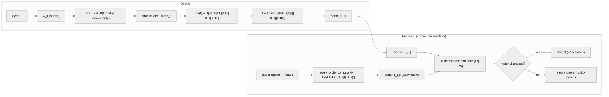
```mermaid
%%{init: {"theme":"neutral","flowchart":{"curve":"basis"}} }%%
flowchart LR
  subgraph Device
    t["cycle t"] --> Phi["Φ_t (public)"]
    Phi --> Perm["idx_t = π_B[t mod x] (device-only)"]
    Perm --> Lane["choose lane i = idx_t"]
    Lane --> Ki["K_i(t) = H(i||EA||EB||EC||Φ_t||KDF)"]
    Ki --> Tok["T = Trunc_k(H(K_i(t)||t||Φ_t||TOK))"]
    Tok --> Send["send (t,i,T)"]
  end

  subgraph Provider_i["Provider i (continuous validator)"]
    Clock["public epoch → local t"] --> Loop["every cycle: compute Φ_t, EA/EB/EC, K_i(t), T_i(t)"]
    Loop --> Buf["buffer T_i(t) (±Δ window)"]
    Rx["receive (t,i,T)"] --> Cmp["constant-time compare [17][25]"]
    Buf --> Cmp
    Cmp --> Match{"match & unused?"}
    Match -->|yes| Accept["accept (≈1/x cycles)"]
    Match -->|no| Reject["reject / ignore (≈x-1/x cycles)"]
  end

  Send --> Rx
```

### 6.8 Reference pseudocode (implementation-oriented)

The following pseudocode matches the specification above (not optimized).

```text
# Public parameters (shared):
#   x, P, Q, R, M, a0, b0, c0
# Hash function H(·) and Trunc_k(·) agreed by all parties
# Canonical encoders: encP, encQ, encR, encM, enc_i, enc_t, encU32
# Domain tags: PHASE, EXP, KDF, TOK, EVOLVE, PERMSEED

function Phase(t):
    a = (a0 + t) mod P
    b = (b0 + t) mod Q
    c = (c0 + t) mod R
    u1 = (a * b) mod M
    u2 = (b * c) mod M
    u3 = (c * a) mod M

    Phi = H( encP(a) || encQ(b) || encR(c) ||
             encM(u1) || encM(u2) || encM(u3) ||
             PHASE )
    return (a,b,c,u1,u2,u3,Phi)

function PermuteBlock(perm_key, B, Phi_block, x):
    # Deterministic Fisher–Yates / Durstenfeld shuffle [14][26] over a hash-derived byte stream. [6][7][23]
    # Stable for the whole block B.
    seed = H( perm_key || encU32(B) || Phi_block || PERMSEED )
    L = [0,1,2,...,x-1]
    stream = Expand(seed)      # e.g., seed || H(seed||0) || H(seed||1) || ...
    for i from x-1 downto 1:
        r = NextU32(stream)    # pull 32 bits from stream
        j = r mod (i+1)
        swap L[i], L[j]
    return L   # permutation π_B

function EvalBouquet(bouquet, res_encoder, res, u, M):
    acc = 1 mod M
    for j from 0 to len(bouquet)-1:
        Cj = bouquet[j] mod M
        ej = H( res_encoder(res) || encM(u) || encU32(j) || EXP ) mod (M-1)
        acc = (acc * pow(Cj, ej, M)) mod M
    return acc

function LaneToken(i, t, bouquets_i):
    (a,b,c,u1,u2,u3,Phi) = Phase(t)
    EA = EvalBouquet(bouquets_i.A, encP, a, u1, M)
    EB = EvalBouquet(bouquets_i.B, encQ, b, u2, M)
    EC = EvalBouquet(bouquets_i.C, encR, c, u3, M)

    K  = H( enc_i(i) || encM(EA) || encM(EB) || encM(EC) || Phi || KDF )
    T  = Trunc_k( H( K || enc_t(t) || Phi || TOK ) )
    return T

# DEVICE (emitter)
state: perm_key (secret), S, W[0..x-1] (secret per-lane memory), bouquets_all
for each cycle t = 0,1,2,...:
    (a,b,c,u1,u2,u3,Phi) = Phase(t)

    B = floor(t / x)
    s = t mod x
    Phi_block = Phase(B*x).Phi
    pi = PermuteBlock(perm_key, B, Phi_block, x)
    idx = pi[s]

    T = LaneToken(idx, t, bouquets_all[idx])
    send (t, idx, T) to provider idx

    W[idx] = Int(T) mod M   # or store raw bytes; if bytes, encode consistently in EVOLVE
    m[ℓ] = (W[ℓ] * W[ℓ+1]) mod M for ℓ = 0..x-2
    S = H( S || W[0] || ... || W[x-1] || m[0] || ... || m[x-2] || Phi || EVOLVE )

# PROVIDER i (validator)
state: bouquets_i (secret), i (public identifier)
on receive (t, i, T_rx):
    T_exp = LaneToken(i, t, bouquets_i)
    accept iff (T_rx == T_exp)
```

Notes:

- `Expand(seed)` is any deterministic method to obtain enough pseudorandom bytes from `seed` (e.g., `H(seed||0)`, `H(seed||1)`, …). Every party that recomputes `π_B` must use the **same** expansion — in practice only the device needs it.
- Providers do **not** need `perm_key` or `π_B` to validate: they run the per-cycle pipeline continuously (§6.7) and compare when contacted.

### 6.9 Policy-controlled sparse bouquet evaluation

The reference pseudocode evaluates every compound in a bouquet. That is the simplest specification, but not the only practical circuit profile. The design-search campaigns (§10.4) repeatedly favored **sparse bouquet activation**: keep a larger hidden bouquet inventory, but activate only a small deterministic subset per cycle. This is not a claim that the secret inventory should be small — it is a claim that the *active arithmetic fan-in of the hot path* should be small, measurable, and explicitly specified.

The evolved programs are not copied into the protocol. They reduce to four specification changes:

1. `inventory_size` and `active_count` become explicit deployment parameters, so cost, leakage surface, and hardware fan-in are auditable.
2. The primary production profile uses one active compound per bouquet per cycle; two active compounds is a robustness profile, not the default.
3. Policy inputs are limited to public phase/time/lane data, explicit public epochs, and lane-local state that the provider can recompute and the device can mirror.
4. Route pressure and long-horizon drift change only public profile limits or fail-closed behavior; they never change token formulas through hidden state.

Current profiles:

| profile | bouquet inventory | active count | intended use |
| --- | ---: | ---: | --- |
| `PCPL-S1` | $n \ge 5$ | 1 | default sparse hot path |
| `PCPL-S2` | $n \ge 5$ | 2 | robustness comparison for route-hardening tests |
| `PCPL-Sk` | deployment-specific | fixed small $k$ | only after beating `S1`/`S2` on route and sync metrics |

**Provider-observable input contract.** Every value that changes provider token derivation must come from one of four places:

- public configuration fixed at provisioning,
- public time/phase data,
- the provider's own lane-local secret material,
- explicit public fields carried with the emitted token.

The following are forbidden as token-derivation inputs:

- device-only seed or permutation state,
- other providers' bouquets or lane memory,
- tokens emitted to other lanes,
- evaluator-only global history,
- any runtime challenge/response output after initial provisioning.

This rule is stronger than a coding guideline: it is what makes sparse policy control compatible with blind provider recomputation. A policy can select a smaller active set or a different public salt epoch, but the provider must be able to derive the same choice without asking the device. Provider-local replay bookkeeping is still useful, but it belongs outside token derivation unless it is mirrored by the device or encoded as an explicit public hint.

#### 6.9.1 Public policy and sparse evaluator

In production the policy reduces to fixed profile choices plus bounded public selectors:

```text
PublicPolicy(t, lane_id, public_epoch):
    phase = PublicPhase(t, P, Q, R)
    profile = published_profile(public_epoch)

    active_count = profile.active_count          # PCPL-S1: 1, PCPL-S2: 2
    kernel_id = profile.kernel_id                # small native-friendly mixer set
    stride_seed = H(PHASE || phase.Phi || lane_id || profile.stride_seed)
    salt_epoch = profile.salt_epoch
    jitter = bounded_public_jitter(phase, lane_id, profile.jitter_bound)
    hash_round_limit = profile.hash_round_limit  # fixed small upper bound

    return {
        active_count,
        kernel_id,
        stride_seed,
        salt_epoch,
        jitter,
        hash_round_limit,
        exponent_bias: profile.exponent_bias,
    }
```

The supervisory layers (§8) may publish a later `public_epoch`, but the provider must be able to derive the same policy before checking the token. If the required policy cannot be derived from public or provider-local inputs, the correct behavior is to fail closed, not to negotiate.

The sparse evaluator itself is a bounded datapath with no data-dependent loop count after policy resolution:

```text
SparseBouquetEval(B, residue, phase, lane_id, t, policy):
    n = len(B)
    require n > 0
    r = clamp(policy.active_count, 1, n)
    start = H(PHASE || phase || lane_id || policy.salt_epoch) mod n
    stride = 1 + (H(PHASE || t || lane_id || policy.stride_seed) mod max(1, n - 1))
    acc = 1 mod M

    for k in 0 .. r-1:
        j = (start + k * stride) mod n
        e = EXP(residue, phase, lane_id, j)
        e = bounded_exponent_bias(e, policy.exponent_bias)
        acc = (acc * powmod(B[j], e, M)) mod M

    return acc
```

The selected indices must be reproducible by the provider for its own lane: the device may know all lanes and bouquets, but the provider only needs the public phase, its lane identifier, its own bouquet, and the public policy.

#### 6.9.2 Sparse hot core (shared by device and provider)

The hot core is specified once and used by both sides: the device calls it for the scheduled lane, the provider for its own lane.

```text
LaneTokenSparse(i, t, bouquets_i, policy):
    phase = PublicPhase(t, P, Q, R)

    EA = SparseBouquetEval(bouquets_i.A, phase.a, phase, i, t, policy)
    EB = SparseBouquetEval(bouquets_i.B, phase.b, phase, i, t, policy)
    EC = SparseBouquetEval(bouquets_i.C, phase.c, phase, i, t, policy)

    mix = BoundedKernel(policy.kernel_id, EA, EB, EC, phase.Phi, i)
    K_i = H(KDF || enc_i(i) || enc_t(t) || encM(mix) || phase.Phi)
    T_i = Trunc_k(H(TOK || K_i || enc_t(t) || phase.Phi))
    return T_i

DeviceCycle(t):
    B = floor(t / x)
    s = t mod x
    idx = PermuteBlock(perm_key, B)[s]
    public_epoch = CurrentPublicEpoch(t)
    policy = PublicPolicy(t, idx, public_epoch)
    phase = PublicPhase(t, P, Q, R)
    T = LaneTokenSparse(idx, t, bouquets_idx, policy)
    emit (t, idx, public_epoch, T)
    update_device_state(idx, T, phase)

ProviderCycle(i, message):
    (t, idx_hint, public_epoch, T_rx) = message
    policy = PublicPolicy(t, i, public_epoch)
    T_exp = LaneTokenSparse(i, t, bouquets_i, policy)
    accept iff T_rx == T_exp
```

`idx_hint` can be omitted if routing already identifies the destination provider. If present, it is neither a secret nor a proof of authenticity — only a transport hint; the authentication event remains the token match. A compact carry value may additionally be threaded through the modular products, provided it is public or lane-local (i.e., recomputable by the provider); device-only state can still update the device's internal chain after emission, but it can never be required for provider recomputation.

For circuit definition, the hot path is a fixed five-stage pipeline:

```text
HotCorePipeline:
    stage 1: phase registers        -> a_t, b_t, c_t, Phi_t
    stage 2: subset selectors       -> active indices for A/B/C
    stage 3: sparse modular product -> EA, EB, EC using active_count lanes
    stage 4: bounded mix + KDF      -> K_i(t), T_i(t)
    stage 5: writeback              -> W[idx], chain products, S_{t+1}
```

Stages 1–4 are shared by device and provider for a lane; stage 5 is device-only. There is no data-dependent loop count, no post-initialization handshake, and no hidden supervisory output inside token derivation.

## 7. Correctness and periodicity

### 7.1 Exact 1-of-x matching

Within each block of length $x$, the device computes a permutation $\pi_B$ of $\{0,\ldots,x-1\}$ and selects $\mathrm{idx}_t = \pi_B[t \bmod x]$. As the slot $s=t\bmod x$ runs through $0,1,\ldots,x-1$ inside block $B$, the permutation property guarantees that each lane identifier appears **exactly once**. Therefore:

- in every block of $x$ cycles, the device contacts each provider exactly once, and
- each provider sees a *matching* token only on its single scheduled cycle in that block (1 time out of $x$).

Hashing and truncation cannot affect this property, because they happen after lane selection.

### 7.2 Phase and schedule periodicity

The public phase triple $(a_t,b_t,c_t)$ of §6.2 repeats with period

$$
L = \mathrm{lcm}(P,Q,R),
$$

which equals $PQR$ when $P,Q,R$ are pairwise coprime. The derived values $u_1,u_2,u_3$ and the digest $\Phi_t$ are deterministic functions of the triple, so they repeat with the same period $L$.

The lane-selection schedule adds the block structure of length $x$. If the permutation were fixed, the overall cycle-period would be $\mathrm{lcm}(L,x)$. In PCPL the permutation is *re-derived per block* from $(\mathrm{perm\_key}, B, \Phi_{B\cdot x})$, so practical repetition is pushed out further and is dominated by:

- the phase period $L$ (public), and
- the block-counter wrap-around implied by the chosen encoding length for $B$ (e.g., $2^{32}$ blocks with `encU32(B)`).


```mermaid
%%{init: {"theme":"neutral","flowchart":{"curve":"basis"}} }%%
flowchart LR
  Public["Public clock<br/>t, P,Q,R, x"] --> Phase["Phase residues<br/>a_t,b_t,c_t,u_1,u_2,u_3"]
  Device["Device-only<br/>perm_key, S_t, all bouquets"] --> Select["idx_t = pi_B[s]"]
  Phase --> Select
  Select --> Token["Token T_idx_t(t)"]
  Token --> Provider["Provider i<br/>Bouquet_i only"]
  Phase --> Provider

  subgraph Repeat["Predictable repeats / exposure"]
    R1["Phase period = lcm(P,Q,R)"]
    R2["Permutation repeats per block"]
    R3["Provider sees 1/x duty cycle"]
  end

  Phase -.-> Repeat
  Select -.-> Repeat
```

### 7.3 Modular exponent correctness

The `Eval(·)` step uses modular exponentiation and products modulo $M$, in the usual finite-field setting. [20][30] To keep these operations well-defined and avoid degenerate values, enforce:

- **Coprime bases:** each base in a product must be coprime with $M$ (in particular, not divisible by $M$), otherwise terms collapse (e.g., $C\equiv 0\pmod M$).
- **Group arithmetic:** if $M$ is prime, the multiplicative group $\mathbb{F}_M^{\ast}$ has order $M-1$, so exponents can be reduced modulo $M-1$ without changing the result. (If $M$ is composite, use a group where the reduction rule is explicit, or keep full-width exponents.)
- **Subgroup structure and size:** the one-wayness of the algebraic layer (§4.3) collapses if $M-1$ has only small prime factors, because Pohlig–Hellman decomposes the discrete logarithm into the small subgroups. [32][33] Production parameters should choose $M$ with a large prime factor in $M-1$ — ideally a safe prime $M=2q+1$, as in standardized Diffie–Hellman groups [34] — and size $M$ against index-calculus attacks. [35][36] Demo moduli such as $2^{61}-1$ (whose $M-1$ is very smooth) are toys in this respect.

These checks belong in provisioning and bouquet generation, not at verification time.

### 7.4 Peer-count variations (x=2,3,4 and composite counts)

Changing $x$ changes the block size, the permutation space, and the chain width:

| x | block length | permutations | chain products | note |
|---:|---:|---:|---:|---|
| 2 | 2 | 2 | 1 | twin pairing (2 lanes) |
| 3 | 3 | 6 | 2 | prime lane count |
| 4 | 4 | 24 | 3 | $2^2$ prime power |
| 6 | 6 | 720 | 5 | composite ($2 \cdot 3$) |

In general: block length $= x$, permutation space $= x!$, chain width $= x-1$. For composite $x$ (e.g., $6=2\cdot 3$), choose $P,Q,R$ coprime with all prime factors of $x$ to avoid shrinking the phase/block interaction period. [20]

## 8. Deployment architecture: hot core and supervisors

PCPL should not be implemented as one large opaque controller. The design-search synthesis (§10.4) makes the circuit boundary sharp: a small token datapath with sparse bouquet activation, surrounded by slower supervisory circuits that may observe window-level facts but may **not** add runtime challenge/response handshakes. The four layers are:

- **Hot token core.** Every cycle: phase residues, profile-fixed sparse subset selection, modular products, $K_i(t)$, $T_i(t)$, and the device's local state update (§6.9.2). Deterministic, branch-light, provider-recomputable for the addressed lane, and friendly to fixed hardware or native GPU execution.
- **Synchronization supervisor.** Over a slower window: discipline the cycle counter from a precise external reference (a GPS-grade time source). Owns drift estimates, guard windows, recovery-mode limits, and dead-idle avoidance. Never negotiates with providers after provisioning.
- **Route-hardening monitor.** Tracks lane-prediction pressure, schedule decorrelation, lane-salt epochs, and bounded phase jitter. May change public or provider-observable policy limits, but never injects hidden state into provider token derivation.
- **Execution audit layer.** Measures timeout ratio, native-execution coverage, active-compound density, final-metric availability, attacker-panel breadth, and search-plateau indicators. Prevents a circuit from being promoted just because it scores well in a narrow simulated slice while being unstable on the intended backend.

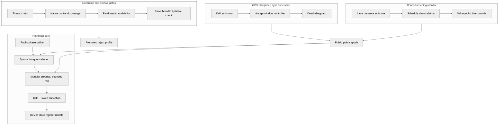
```mermaid
%%{init: {"theme":"neutral","flowchart":{"curve":"basis"}} }%%
flowchart TB
  subgraph Core["Hot token core"]
    C1["Public phase builder"]
    C2["Sparse bouquet selector"]
    C3["Modular product / bounded mix"]
    C4["KDF + token truncation"]
    C5["Device state register update"]
    C1 --> C2 --> C3 --> C4 --> C5
  end

  subgraph Sync["GPS-disciplined sync supervisor"]
    S1["Drift estimator"]
    S2["Accept-window controller"]
    S3["Dead-idle guard"]
    S1 --> S2 --> S3
  end

  subgraph Route["Route-hardening monitor"]
    R1["Lane pressure estimate"]
    R2["Schedule decorrelation"]
    R3["Salt epoch / jitter bounds"]
    R1 --> R2 --> R3
  end

  subgraph Audit["Execution and archive gates"]
    A1["Timeout ratio"]
    A2["Native backend coverage"]
    A3["Final metric availability"]
    A4["Panel breadth / plateau check"]
    A1 --> A2 --> A3 --> A4
  end

  Sync --> Policy["Public policy epoch"]
  Route --> Policy
  Audit --> Gate["Promote / reject profile"]
  Policy --> C2
  Policy --> C3
```

This split changes the implementation strategy, not the correctness argument: the exact 1-of-$x$ property still comes from the block permutation, and the token value still comes from deterministic lane recomputation. The supervisor may narrow a public acceptance window or rotate a public policy epoch, but it must never force a provider to ask the device which formula to use. The corresponding risk is also architectural: a vaguely specified supervisory layer can accidentally reintroduce handshake-like behavior under the name of "resynchronization" — and that would be a different protocol. In PCPL, all post-provisioning control that affects provider recomputation must be public, time-derived, provider-local, or explicitly carried in the emitted message (§6.9).

### 8.1 Synchronization supervisor

Long-horizon synchronization is the decisive unresolved weakness (§10.5), and the correct engineering answer is not a more complex token core — it is a precise timing supervisor that both sides can reason about:

```text
SyncSupervisor(window, precise_time_reference):
    expected_t = cycle_from_epoch(precise_time_reference)
    observed_accepts = count_accepts(window)
    observed_rejects = count_rejects(window)
    drift = estimate_drift(expected_t, window.local_cycle)

    if abs(drift) <= normal_bound:
        mode = STEADY
        accept_window = nominal_window

    else if abs(drift) <= recovery_bound:
        mode = RECOVERY
        accept_window = widened_public_window(drift)

    else:
        mode = FAIL_CLOSED
        accept_window = none

    publish mode and window for the next public policy epoch
```

The supervisor is allowed to fail closed. It is not allowed to perform a post-initialization challenge/response repair: if recovery requires private negotiation, it is outside this PCPL design.

### 8.2 Route-hardening monitor

The attacker model suggested by the synthesis is a public-feature lane predictor, so the defense must measure and harden route exposure, not only token inversion:

```text
RouteHardeningWindow(window):
    public_features = collect_phase_slot_epoch_features(window)
    lane_pressure = estimate_lane_predictability(public_features)
    repeated_bias = detect_schedule_bias(public_features)

    if lane_pressure > lane_pressure_bound:
        increase_schedule_decorrelation()
        rotate_public_lane_salt_epoch()

    if repeated_bias > bias_bound:
        change_public_stride_seed()
        tighten_phase_jitter_bound()

    emit next public route-hardening profile
```

This defense must stay conservative: excessive jitter damages recomputability, and excessive salt churn becomes an implicit handshake. The goal is bounded public decorrelation, not hidden adaptive routing.

### 8.3 Execution audit gates

Backend feasibility and archive evaluability are promotion criteria, not hidden terms inside token derivation. A candidate profile is promoted only if it passes:

- a bounded timeout ratio under the intended backend,
- sufficient native-execution (e.g., GPU) coverage per operation,
- availability of all final metrics (no missing-measurement promotions),
- enough attacker-panel breadth to avoid single-attacker selection artifacts,
- plateau checks that distinguish real gains from evaluator noise.

## 9. Security intuition (informal)

- **Lane isolation:** each provider uses distinct secret bouquets, so observing one lane does not reveal others.
- **Phase coupling:** public residues are mixed and hashed, preventing linear predictability from the CRT clock alone.
- **Device chaining:** even stale lanes influence future state, enforcing that "every token matters".
- **Route hardening:** attackers may still gain small lane-prediction advantages from public timing and phase features, so schedule decorrelation and lane-salt diversity should be tested directly.
- **Provider-observable control:** any practical policy controller must use only inputs that the intended provider can recompute; simulator-only global history can create a false sense of validity.
- **Quantum period-finding:** QFT can reveal the public period $\mathrm{lcm}(P,Q,R,x)$, but not the hidden bouquets or `perm_key`; use large coprimes and device-only chaining to avoid exploitable structure.

## 10. Experimental validation (deterministic simulation and offline search)

A cycle-by-cycle simulator validates protocol correctness. The demo verifies:

- each block yields a valid permutation,
- exactly one provider matches each cycle,
- each provider appears once per block,
- optional pre-hash difficulty metrics and QFT-visible period reports,
- optional prime/compound generation modes for non-arbitrary parameter testing.

Repository: [cekkr/phaselane-algorithm@github.com](https://github.com/cekkr/phaselane-algorithm). The reference implementation and traces are provided as supplementary software material.

For scientific interpretation, three distinctions matter. First, this section validates **protocol behavior** (schedule correctness, one-of-$x$, deterministic recomputation). Second, offline evolutionary experiments are only an **automatic search method** for candidate circuit policies under fixed objectives — they are not part of runtime protocol mechanics, and they follow the genetic-algorithm / genetic-programming lineage purely as a design-search instrument, not as a proof method. [28][29] Third, scoring is a **model-dependent lens**: when score components or weights change, absolute scores are comparable only within the same scoring family, while invariant-level correctness claims remain comparable across runs.

### 10.1 Sample token trace (x=4, seed=1337)

For PDF export, the original wide table was replaced with an A4-friendly summary table and a sequence diagram (tokens truncated for readability; the matched provider's recomputed token equals the device token by construction).

| t | block | slot | idx_t | device token (truncated) | matched provider |
|---:|---:|---:|---:|---|---:|
| 0 | 0 | 0 | 0 | `0xa30497f4…c90c11` | 0 |
| 1 | 0 | 1 | 2 | `0x2a387c5c…3593da` | 2 |
| 2 | 0 | 2 | 1 | `0x2bc18699…1d82b2` | 1 |
| 3 | 0 | 3 | 3 | `0x7b4d155d…bf1fcb` | 3 |
| 4 | 1 | 0 | 2 | `0xa3ff87a6…a27076` | 2 |
| 5 | 1 | 1 | 1 | `0x589b117f…9b345a` | 1 |
| 6 | 1 | 2 | 0 | `0xb95461b0…92d469` | 0 |
| 7 | 1 | 3 | 3 | `0x72df0d6f…3973e0` | 3 |

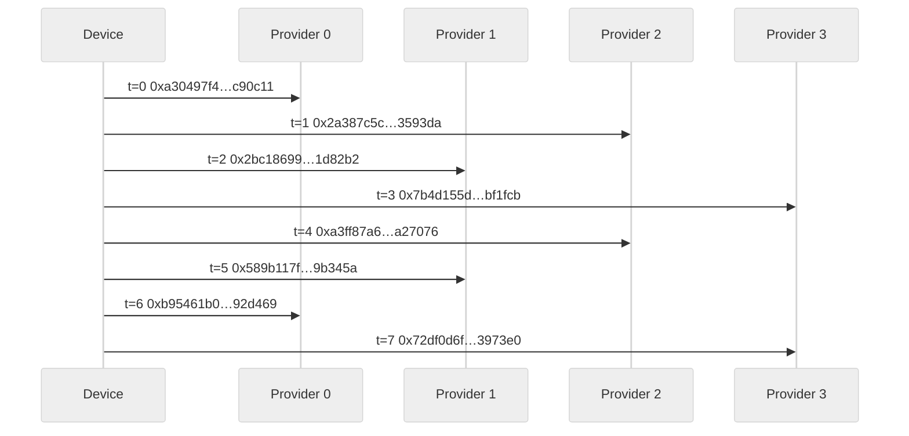
```mermaid
%%{init: {"theme":"neutral"} }%%
sequenceDiagram
  participant D as Device
  participant P0 as Provider 0
  participant P1 as Provider 1
  participant P2 as Provider 2
  participant P3 as Provider 3

  D->>P0: t=0  0xa30497f4…c90c11
  D->>P2: t=1  0x2a387c5c…3593da
  D->>P1: t=2  0x2bc18699…1d82b2
  D->>P3: t=3  0x7b4d155d…bf1fcb
  D->>P2: t=4  0xa3ff87a6…a27076
  D->>P1: t=5  0x589b117f…9b345a
  D->>P0: t=6  0xb95461b0…92d469
  D->>P3: t=7  0x72df0d6f…3973e0
```

The full deterministic trace (block permutations, schedule, device tokens, and per-lane tokens) is maintained as supplementary material to keep the main narrative A4-friendly; the exact filename/location depends on the publication bundle.

### 10.2 Pre-hash difficulty and period reporting

The reference implementation can emit linear pre-hash difficulty metrics (rank of exponent vectors modulo 2 and 65537), QFT-visible public period statistics, and compare-$x$ summaries over configurable prime/compound generation modes:

- `python3 demo/pcpl_cycle_test.py --active-count 1 --linear-report --analysis-window 64`
- `python3 demo/pcpl_cycle_test.py --active-count 1 --qft-report`
- `python3 demo/pcpl_cycle_test.py --active-count 1 --compare-x 2,3,4,5,6`
- `python3 demo/pcpl_cycle_test.py --active-count 1 --prime-mode generated --prime-bits 31 --compound-mode blend --compound-prime-bits 12`

### 10.3 Multi-configuration results snapshot

All runs below completed the full correctness checks (permutation, 1-of-$x$ matching, chaining).

Fixed primes ($P/Q/R$ near $10^6$, seed=1337) with compare-$x$ and a 64-cycle linear window:

| x | chain width (x-1) | QFT period bits | QFT period (decimal) |
|---:|---:|---:|---|
| 2 | 1 | 61 | 2000146002862007326 |
| 3 | 2 | 62 | 3000219004293010989 |
| 4 | 3 | 62 | 4000292005724014652 |
| 5 | 4 | 63 | 5000365007155018315 |
| 6 | 5 | 63 | 6000438008586021978 |

Across all $x$ above, the pre-hash exponent vectors reached full rank (4/4) modulo 2 and 65537, with 64/64 unique rows for A/B/C over the sample window. For $x=6$ (composite $2 \cdot 3$), the schedule still yields exactly one match per cycle, but the duty cycle per provider is $1/6$ and the permutation space grows to $6! = 720$; ensure $P,Q,R$ are coprime with both 2 and 3 to keep the public period large.

Generated primes ($x=4$, 64 cycles, 12-bit compound primes):

| seed | compound mode | P | Q | R | M | QFT period bits | QFT period (decimal) |
|---:|---|---:|---:|---:|---:|---:|---|
| 1337 | blend | 2096669299 | 1747608157 | 1866608729 | 1273159183829412833 | 95 | 27358185054648849675767961788 |
| 2024 | semiprime | 1423693267 | 1141001293 | 1348017509 | 2083707438551447381 | 93 | 8759071917926854366514362316 |

Additional multi-configuration outputs (other compound modes and seeds) are intended as supplementary material.

### 10.4 Design-search (Evolvo) conclusions

Evolutionary campaigns are used here as automated design-space exploration: they search for circuit policies under fixed objectives, but they do not redefine PCPL semantics and do not replace the correctness arguments in §7. The synthesis is therefore read as evidence about implementable circuit families, failure frontiers, and objective design. Its decisive conclusion is the architectural split of §8: token path, route hardening, long-horizon sync, and backend feasibility are separate concerns with separate acceptance gates.

The stable design constraints extracted from the runs are:

- **Core invariants are easy to preserve under search.** One-of-$x$, block fairness, permutation validity, replay rejection, and cross-lane separation remain saturated in the valid evidence family.
- **Token recovery is not the observed attacker mode.** It is zero in the complete valid evidence, but that is an empirical result, not an impossibility claim. The stronger signal is lane/route inference from public phase and schedule structure.
- **Sparse activation is a specification parameter, not a runtime trick.** The best observed defender shape is the one-active-compound profile, with score falling as active-compound density increases.
- **Evolved defenders have not beaten the hand-written sparse baselines.** The evolved result is architectural evidence, not a final optimum.
- **The token core does not solve long-horizon synchronization.** Projected horizon loss remains near saturation, so a precise external clock discipline and a separate supervisory layer are required.
- **Native execution feasibility and archive evaluability are not cryptographic correctness.** They must be measured and gated separately.

The table below gives the paper-facing semantics of the latest tracked conclusions in self-contained form:

| evidence signal | paper interpretation | design consequence |
| --- | --- | --- |
| Principle invariants at `1.0000` | the construction preserves exact validation semantics | keep the correctness proof tied to permutation and canonical recomputation |
| Token success at `0.0000` in complete valid evidence | token-material recovery is not the active attacker mode, but absolute zero should not be claimed | keep hash/KDF domain separation; preserve low-entropy stress-scenario attacker panels |
| Lane success nonzero while token success stays zero | route exposure is the useful adversarial pressure | add route-hardening objectives and schedule-decorrelation metrics |
| One-active-compound bucket is strongest | sparse activation is a specification parameter, not only a speed optimization | state bouquet inventory and active subset size separately |
| Projected sync loss near saturation | the long-window drift model remains the dominant weakness | do not claim the token core is a resynchronization solution |
| Best evolved defender below `minimal-cost` | evolution confirms the sparse shape but not a new score ceiling | keep `minimal-cost` as a benchmark to beat |
| Runtime and evaluability weak under native execution | hardware feasibility and archive promotion are separate bottlenecks | add native backend gates, final-metric gates, and attacker-panel breadth gates |

### 10.5 Open weaknesses and next steps

The remaining weak points are specific:

- **Long-horizon drift is open.** Local invariants can be perfect while projected sync loss is unacceptable; this is the main engineering frontier.
- **Route leakage is not eliminated.** Even when token guesses fail, attackers may learn small lane/route biases from public timing and phase structure.
- **Sparse activation can reduce mixing margin if misparameterized.** The inventory can be large, but the active-subset schedule must still provide enough domain separation and period diversity.
- **Policy complexity can break recomputability.** Any policy that depends on device-only state is invalid for blind providers.
- **Backend instability can distort search.** Timeout rescue and uneven native coverage can make a candidate look better than it actually is as a circuit.
- **Near-constant metrics can hide plateaus.** QFT, linear-rank, and compare-$x$ checks are useful constraints, but under fixed scenario families they may not provide enough gradient for search.
- **The evidence confirms a motif more than it discovers a controller.** Final selections stay close to initial candidates, and the hand-written sparse baseline is still unbeaten.

The corresponding next steps:

- **Parameterize sparse profiles.** Document concrete profiles (`inventory=5, active=1`; `inventory=5, active=2`; larger inventories with fixed active count) and compare security and route exposure, not only score.
- **Increase route-hardening pressure.** Add attacker panels specialized in lane prediction, schedule-bias detection, and public phase-feature learning.
- **Improve sync modeling.** Replace a single projected-loss pressure with bounded drift regimes, fail-closed behavior, and explicit recovery windows tied to the external timing reference.
- **Audit native execution separately.** Track per-operation backend coverage, CPU fallback, final sync overhead, and per-cycle budget consumption.
- **Stabilize attacker-panel evaluation.** Promote only candidates with final metrics, bounded timeout rescue, and enough panel breadth to avoid single-attacker selection artifacts.
- **Split reporting.** Separate token invariants, route/lane inference, supervisory horizon sync, and runtime backend behavior in future reports.
- **Keep `minimal-cost` as a hard baseline.** A new evolved profile is an improvement only if it beats `minimal-cost` or justifies a clear security tradeoff that `minimal-cost` lacks.

## 11. Discussion and limitations

**Parameters and primitives.** $P, Q, R, M$ must be prime and pairwise coprime, with the public period sized for the deployment horizon. The security of the scheme rests on the strength of $H(\cdot)$, strict domain separation, and bouquet secrecy — not on the hardness of factoring revealed integers. The public period $\mathrm{lcm}(P,Q,R,x)$ is visible and QFT-recoverable, so period size is a public engineering parameter, not a hidden defense. Leakage of the permutation key would reveal lane *order*, but not lane tokens by itself. For testing, primes and compound bases can be generated from a seeded stream to avoid arbitrary constants; production use still needs a real entropy-source story and a deterministic expansion contract. [6][7][23] The modulus $M$ for the algebraic layer should follow current discrete-logarithm parameter guidance — safe-prime or large-prime-order subgroups, sized against index-calculus attacks (§4.3, §7.3). [34][35][36][37]

**Scope of the evidence.** The co-evolution evidence supports a one-active-compound sparse selector over a fixed arithmetic PCPL core — not a dense universal controller — and sparse activation must not be confused with weak provisioning: the bouquet inventory can remain large while only the per-cycle active subset is small. Empirical scores are not absolute constants; they depend on the chosen objective set and weights, so cross-run comparisons need objective-version metadata. QFT, linear-rank, and compare-$x$ terms validate important constraints, but under fixed scenario families they can become near-constant and provide limited evolutionary gradient. Panel fragility, timeout rescue, missing final metrics, and generation-0 survival remain process weaknesses; archive acceptance needs the hard gates of §8.3. Evolutionary search is heuristic optimization, not a formal proof technique; correctness remains grounded in the protocol construction and invariants. [28][29]

**Design boundaries.** Post-initialization handshakes are excluded: a solution that needs runtime challenge/response repair is solving a different problem. Provider-side recomputation requires the strict input contract of §6.9. Long-horizon synchronization must be specified as a GPS-disciplined supervisory circuit with explicit drift bounds, recovery windows, and fail-closed rules. Because attacker evidence is stronger on lane inference than on token inversion, route hardening should be evaluated directly. Practical optimization should prioritize phase-error regulation, horizon-sync gating, lane hardening, and native execution coverage before further cost compression.

*This paper was developed and formatted with the help of OpenAI models.*

## 12. Conclusion

PCPL provides a deterministic, no-handshake token protocol with exact 1-of-$x$ matching and a device-only chaining mechanism. Combined with symmetric continuous tokenizer devices, it supports blind provider validation and peer-to-peer isolation with dynamic, evolving secrets.

The deterministic and evolutionary evidence makes the implementation direction precise. The core token protocol is stable — permutation validity, per-block fairness, one-of-$x$ matching, replay rejection, and cross-lane separation all hold in the valid evidence — while the strongest evolved shape (a one-active-compound sparse profile) still does not beat the hand-written sparse baseline. The practical circuit is therefore not a large opaque controller but the four-layer split of §8: a sparse feed-forward token core plus synchronization, route-hardening, and audit supervisors.

The main remaining challenge is not token correctness but long-horizon synchronization, provider-observable control inputs, native execution stability, and resistance to lane-prediction leakage. The decisive direction is conservative: keep the token core small, make the active compound count explicit, assume a precise external timing reference, reject post-initialization handshakes, and report route exposure, horizon sync, runtime headroom, and archive evaluability separately from token invariants. Under those constraints, PCPL remains a plausible no-handshake lane-token protocol that leaves its open engineering work visible instead of hiding it inside an overcomplicated circuit.

## References

1. [NIST FIPS 180-4 (Update 1), *Secure Hash Standard (SHS)*](https://csrc.nist.gov/pubs/fips/180-4/upd1/final)
2. [NIST FIPS 202, *SHA-3 Standard: Permutation-Based Hash and Extendable-Output Functions*](https://csrc.nist.gov/pubs/fips/202/final)
3. [RFC 7693, *The BLAKE2 Cryptographic Hash and Message Authentication Code*](https://www.rfc-editor.org/rfc/rfc7693.html)
4. [RFC 2104, *HMAC: Keyed-Hashing for Message Authentication*](https://www.rfc-editor.org/rfc/rfc2104.html)
5. [RFC 5869, *HMAC-based Extract-and-Expand Key Derivation Function (HKDF)*](https://datatracker.ietf.org/doc/html/rfc5869)
6. [NIST SP 800-90A Rev. 1, *Recommendation for Random Number Generation Using Deterministic Random Bit Generators*](https://csrc.nist.gov/pubs/sp/800/90/a/r1/final)
7. [RFC 4086, *Randomness Requirements for Security*](https://datatracker.ietf.org/doc/html/rfc4086)
8. [RFC 8017, *PKCS #1: RSA Cryptography Specifications Version 2.2* — I2OSP/OS2IP](https://www.rfc-editor.org/rfc/rfc8017.html)
9. [NIST SP 800-185, *SHA-3 Derived Functions: cSHAKE, KMAC, TupleHash, and ParallelHash*](https://csrc.nist.gov/pubs/sp/800/185/final)
10. [NIST SP 800-56C Rev. 2, *Recommendation for Key-Derivation Methods in Key-Establishment Schemes*](https://csrc.nist.gov/pubs/sp/800/56/c/r2/final)
11. [RFC 4226, *HOTP: An HMAC-Based One-Time Password Algorithm*](https://www.rfc-editor.org/rfc/rfc4226.html)
12. [RFC 6238, *TOTP: Time-Based One-Time Password Algorithm*](https://www.rfc-editor.org/rfc/rfc6238.html)
13. [RFC 5905, *Network Time Protocol Version 4: Protocol and Algorithms Specification*](https://datatracker.ietf.org/doc/html/rfc5905)
14. [R. Durstenfeld (1964), “Algorithm 235: Random permutation”, *Communications of the ACM* 7(7)](https://dl.acm.org/doi/10.1145/364520.364540)
15. [B. Gassend, D. Clarke, M. van Dijk, and S. Devadas (2002), “Controlled Physical Random Functions”, ACSAC ’02](https://people.csail.mit.edu/devadas/pubs/cpuf.pdf)
16. [G. E. Suh and S. Devadas (2007), “Physical Unclonable Functions for Device Authentication and Secret Key Generation”, DAC ’07](https://people.csail.mit.edu/devadas/pubs/puf-dac07.pdf)
17. [P. C. Kocher (1996), “Timing Attacks on Implementations of Diffie-Hellman, RSA, DSS, and Other Systems”, CRYPTO ’96](https://paulkocher.com/doc/TimingAttacks.pdf)
18. [P. W. Shor (1994), “Algorithms for Quantum Computation: Discrete Logarithms and Factoring”, FOCS ’94](https://dl.acm.org/doi/10.1109/SFCS.1994.365700)
19. [M. A. Nielsen and I. L. Chuang, *Quantum Computation and Quantum Information*, Cambridge University Press](https://www.cambridge.org/highereducation/books/quantum-computation-and-quantum-information/01E10196D0A682A6AEFFEA52D53BE9AE)
20. [A. Menezes, P. van Oorschot, and S. Vanstone, *Handbook of Applied Cryptography*, Chapter 2: Mathematical Background](https://cacr.uwaterloo.ca/hac/about/chap2.pdf)
21. [RFC 9380, *Hashing to Elliptic Curves* — domain separation tags and hash-to-field encodings](https://datatracker.ietf.org/doc/html/rfc9380)
22. [NIST SP 800-108 Rev. 1, *Recommendation for Key Derivation Using Pseudorandom Functions*](https://csrc.nist.gov/pubs/sp/800/108/r1/final)
23. [NIST SP 800-90B, *Recommendation for the Entropy Sources Used for Random Bit Generation*](https://csrc.nist.gov/pubs/sp/800/90/b/final)
24. [NIST SP 800-63B, *Digital Identity Guidelines: Authentication and Lifecycle Management*](https://pages.nist.gov/800-63-4/sp800-63b.html)
25. [RFC 7518, *JSON Web Algorithms (JWA)* — constant-time HMAC validation guidance](https://datatracker.ietf.org/doc/html/rfc7518)
26. [NIST Dictionary of Algorithms and Data Structures, “Fisher-Yates shuffle”](https://www.nist.gov/dads/HTML/fisherYatesShuffle.html)
27. [NIST IR 8318, *The On-Line Dictionary of Algorithms and Data Structures*](https://nvlpubs.nist.gov/nistpubs/ir/2020/NIST.IR.8318.pdf)
28. [J. H. Holland, *Adaptation in Natural and Artificial Systems*, MIT Press](https://mitpress.mit.edu/9780262082136/adaptation-in-natural-and-artificial-systems/)
29. [J. R. Koza, *Genetic Programming: On the Programming of Computers by Means of Natural Selection*, MIT Press](https://mitpress.mit.edu/9780262527910/genetic-programming/)
30. [A. Menezes, P. van Oorschot, and S. Vanstone, *Handbook of Applied Cryptography*, Chapter 14: Efficient Implementation](https://cacr.uwaterloo.ca/hac/about/chap14.pdf)
31. [W. Diffie and M. E. Hellman (1976), “New Directions in Cryptography”, *IEEE Transactions on Information Theory* 22(6)](https://ee.stanford.edu/~hellman/publications/24.pdf)
32. [S. C. Pohlig and M. E. Hellman (1978), “An Improved Algorithm for Computing Logarithms over GF(p) and Its Cryptographic Significance”, *IEEE Transactions on Information Theory* 24(1)](https://ee.stanford.edu/~hellman/publications/28.pdf)
33. [A. Menezes, P. van Oorschot, and S. Vanstone, *Handbook of Applied Cryptography*, Chapter 3: Number-Theoretic Reference Problems](https://cacr.uwaterloo.ca/hac/about/chap3.pdf)
34. [RFC 3526, *More Modular Exponential (MODP) Diffie-Hellman groups for Internet Key Exchange (IKE)* — standardized safe-prime groups](https://datatracker.ietf.org/doc/html/rfc3526)
35. [NIST SP 800-56A Rev. 3, *Recommendation for Pair-Wise Key-Establishment Schemes Using Discrete Logarithm Cryptography*](https://csrc.nist.gov/pubs/sp/800/56/a/r3/final)
36. [D. Adrian et al. (2015), “Imperfect Forward Secrecy: How Diffie-Hellman Fails in Practice”, CCS ’15](https://weakdh.org/imperfect-forward-secrecy-ccs15.pdf)
37. [NIST SP 800-57 Part 1 Rev. 5, *Recommendation for Key Management: General* — comparable security strengths](https://csrc.nist.gov/pubs/sp/800/57/pt1/r5/final)

[1]: https://csrc.nist.gov/pubs/fips/180-4/upd1/final
[2]: https://csrc.nist.gov/pubs/fips/202/final
[3]: https://www.rfc-editor.org/rfc/rfc7693.html
[4]: https://www.rfc-editor.org/rfc/rfc2104.html
[5]: https://datatracker.ietf.org/doc/html/rfc5869
[6]: https://csrc.nist.gov/pubs/sp/800/90/a/r1/final
[7]: https://datatracker.ietf.org/doc/html/rfc4086
[8]: https://www.rfc-editor.org/rfc/rfc8017.html
[9]: https://csrc.nist.gov/pubs/sp/800/185/final
[10]: https://csrc.nist.gov/pubs/sp/800/56/c/r2/final
[11]: https://www.rfc-editor.org/rfc/rfc4226.html
[12]: https://www.rfc-editor.org/rfc/rfc6238.html
[13]: https://datatracker.ietf.org/doc/html/rfc5905
[14]: https://dl.acm.org/doi/10.1145/364520.364540
[15]: https://people.csail.mit.edu/devadas/pubs/cpuf.pdf
[16]: https://people.csail.mit.edu/devadas/pubs/puf-dac07.pdf
[17]: https://paulkocher.com/doc/TimingAttacks.pdf
[18]: https://dl.acm.org/doi/10.1109/SFCS.1994.365700
[19]: https://www.cambridge.org/highereducation/books/quantum-computation-and-quantum-information/01E10196D0A682A6AEFFEA52D53BE9AE
[20]: https://cacr.uwaterloo.ca/hac/about/chap2.pdf
[21]: https://datatracker.ietf.org/doc/html/rfc9380
[22]: https://csrc.nist.gov/pubs/sp/800/108/r1/final
[23]: https://csrc.nist.gov/pubs/sp/800/90/b/final
[24]: https://pages.nist.gov/800-63-4/sp800-63b.html
[25]: https://datatracker.ietf.org/doc/html/rfc7518
[26]: https://www.nist.gov/dads/HTML/fisherYatesShuffle.html
[27]: https://nvlpubs.nist.gov/nistpubs/ir/2020/NIST.IR.8318.pdf
[28]: https://mitpress.mit.edu/9780262082136/adaptation-in-natural-and-artificial-systems/
[29]: https://mitpress.mit.edu/9780262527910/genetic-programming/
[30]: https://cacr.uwaterloo.ca/hac/about/chap14.pdf
[31]: https://ee.stanford.edu/~hellman/publications/24.pdf
[32]: https://ee.stanford.edu/~hellman/publications/28.pdf
[33]: https://cacr.uwaterloo.ca/hac/about/chap3.pdf
[34]: https://datatracker.ietf.org/doc/html/rfc3526
[35]: https://csrc.nist.gov/pubs/sp/800/56/a/r3/final
[36]: https://weakdh.org/imperfect-forward-secrecy-ccs15.pdf
[37]: https://csrc.nist.gov/pubs/sp/800/57/pt1/r5/final
