| Author | Contact | Date |
|---|---|---|
| Riccardo Cecchini | rcecchini.ds[at]gmail.com | 25 December 2025 |

# Prime-Compound Phase-Lane Token Protocol (PCPL) for Symmetric Continuous Tokenizer Devices

### (Continuous symmetric encryption starting from asymmetric keys)

Version 1.8 - 13 May 2026

## Abstract
I present the Prime-Compound Phase-Lane Token Protocol (PCPL), a no-handshake token system where a device emits one token per cycle and exactly one provider can validate it. PCPL combines (1) a public phase clock derived from coprime residues, (2) hidden prime-compound bouquets per provider, (3) a private per-block lane permutation, and (4) device-side state evolution that chains all lanes. The latest repository-local co-evolution synthesis confirms a conservative implementation direction: the protocol invariants are stable, while deployable circuits should be split into a sparse feed-forward token core, a GPS-disciplined synchronization supervisor, a route-hardening monitor, and a native-execution audit layer. Evolved candidates confirm sparse activation but remain below the hand sparse baseline family, so the evidence is architectural rather than a final-controller proof. The observed attacker pressure is primarily lane/route inference from public timing structure, not token material recovery; the decisive unresolved weakness is long-horizon drift and route leakage, not the one-of-$x$ validation rule. I also introduce the symmetric continuous tokenizer device model, motivated by FPGA-based dynamic hash circuits and twin circuits for peer validation. A step-by-step algorithm description, correctness properties, deterministic traces, circuit-level guidance, and offline design-search conclusions are provided. [1][2][3][4][5][15][16][28][29]

## 1. Symmetric continuous tokenizer devices
PCPL runs on a “symmetric continuous tokenizer” device designed for consumer computing. The device is envisioned as a reconfigurable hardware unit (for example, an FPGA-based key) that can:

- Acquire unique, device-specific hashing circuits or internal start variables. [15][16]
- Continuously generate short-lived tokens or keys.
- Be validated only by its twin circuit(s), which share the same circuit family or seed lineage.

The symmetry comes from pairing: two devices can load the same dynamic hash circuit and evolve internal state in the same way, enabling mutual validation without exposing the evolving secrets.

### 1.1 Forks by variable alternation
Beyond PCPL, the same circuit can be “forked” by alternating variable sets over time windows. Let a device maintain a base circuit $C$ and a family of variables $V_k$ selected by time window $W_k$. Each fork evolves as:

$$
\begin{aligned}
S_{t+1}^{(k)} &= H\!\left(C,\, S_t^{(k)},\, V_k,\, t\right), \\
T^{(k)}(t) &= \mathrm{Trunc}_k\!\left(
H\!\left(K^{(k)}(t)\|\mathrm{enc\_t}(t)\|\Phi_t\|\mathrm{TOK}\right)
\right),\quad t\in W_k.
\end{aligned}
$$

This creates multiple parallel token streams sharing the same circuit but with distinct, time-delimited variable schedules. Such forks can be used for provider lanes (as in PCPL) or for isolated peer-to-peer sessions that are difficult to parallelize or replay.

### 1.2 Peer-to-peer continuity
The device model also targets in loco connections among peers. Two devices that share a circuit family and seed lineage can establish an isolated encryption context by evolving state in lockstep without querying a central provider.

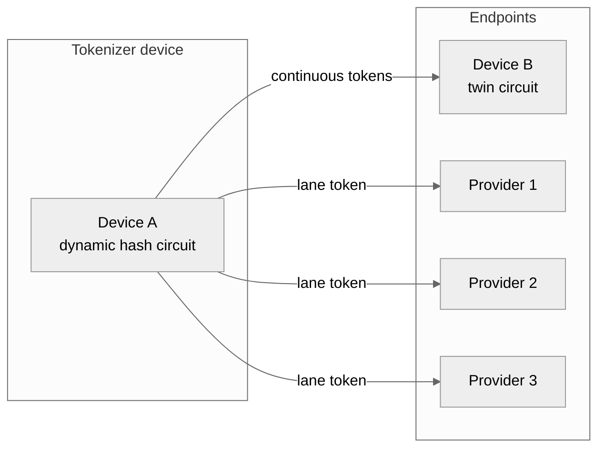
```mermaid
%%{init: {"theme":"neutral","flowchart":{"curve":"basis"}} }%%
flowchart LR
  subgraph Device["Tokenizer device"]
    A["Device A<br/>dynamic hash circuit"]
  end

  subgraph Endpoints["Endpoints"]
    B["Device B<br/>twin circuit"]
    P1["Provider 1"]
    P2["Provider 2"]
    P3["Provider 3"]
  end

  A -- "continuous tokens" --> B
  A -- "lane token" --> P1
  A -- "lane token" --> P2
  A -- "lane token" --> P3
```

## 2. System model and goals
PCPL is designed for:
- No runtime challenge/response or synchronization negotiation.
- One token per cycle, routed to exactly one provider out of $x$.
- Provider-side validation by local recomputation.

Threat model (minimal):

- A provider should not compute tokens for other providers.
- Observing accepted tokens should not reveal other lanes.
- Public time/phase information should not enable cross-lane forgery.

The prime-compound approach should be read as the simplest integer-only construction for the modular product layer, not as a replacement for standardized hashing or KDFs. Its security depends on parameter selection, bouquet secrecy, and the surrounding hash/KDF schedule. [20][30][1][2][5]

## 3. Notation and public parameters
Let:

- $x$ be the number of providers (lanes).
- $P, Q, R$ be pairwise coprime primes (also coprime with $x$).
- $M$ be a prime modulus for multiplicative-group arithmetic.
- $H(\cdot)$ be a cryptographic hash or standardized PRF/KDF primitive, depending on the role being instantiated. [1][2][3][4][5][22]
- $\mathrm{Trunc}_k(\cdot)$ be truncation to $k$ bits.
- $t$ be the cycle counter.
- $\|$ denote byte/bit-string concatenation.

Each provider $i$ has three secret bouquets: $\mathrm{BouquetA}_i, \mathrm{BouquetB}_i, \mathrm{BouquetC}_i$, each a list of prime compounds.

### 3.0 Symbols and domain tags

To avoid accidental cross-use of hashes (“domain confusion”), **every hash that serves a distinct role appends a distinct domain tag or context string**. Tuple-style encodings, cSHAKE/KMAC customization strings, and explicit domain separation tags are the closest standardized analogues. [9][21][5]

Glossary:
- **CRT clock:** the public schedule formed by the three residues mod $P,Q,R$. [20]
- **Lane / provider:** one of $x$ independent validators that each own distinct secrets.
- **Bouquet:** a per-lane list of modular bases (typically composite “prime compounds”) used in the modular product.
- **QFT:** quantum Fourier transform (period finding [18][19]) — optional analysis tool that can reveal *public* periods. [18][19]

Domain tags (constants) used in this paper:
- `SEED` — derive the initial evolving state $S_0$
- `W` — derive per-lane memory words $W_i^{(0)}$
- `PRIME` — derive candidate primes for $P,Q,R$ (and optionally $M$)
- `A0`, `B0`, `C0` — derive **public** phase offsets $a_0,b_0,c_0$
- `PERMKEY` — derive the device-only permutation key `perm_key`
- `PERMSEED` — derive the per-block shuffle seed used by $\pi_B$
- `PHASE` — domain tag for the phase digest $\Phi_t$
- `EXP` — domain tag for bouquet exponent derivation $e_j$
- `KDF` — domain tag for per-lane key material $K_i(t)$ [10][22][5]
- `TOK` — domain tag for the final emitted token $T_i(t)$
- `EVOLVE` — domain tag for state evolution $S_{t+1}$

### 3.1 Seed construction and coprime extraction
The device bootstraps a root seed $Z$ from device-local entropy and context (for example: device secret, serial, provider list, and a boot nonce). Production deployments should separate entropy-source validation from deterministic expansion: entropy belongs to the SP 800-90B / RFC 4086 layer, while deterministic replayable streams belong to an approved DRBG or a clearly specified PRF expansion. [23][7][6] In the demo, $Z$ is produced by a deterministic RNG seeded with `--seed`, then bound to labels with $H(\cdot)$:

- $\mathrm{perm\_key} = H(Z \| \text{PERMKEY})$
- $S_0 = H(Z \| \text{SEED})$
- $W_i = \mathrm{Trunc}_k(H(Z \| \text{W} \| i))$

To extrapolate coprimes for $P,Q,R$ (and optionally $M$), derive candidates from a seeded stream and select the first primes that are distinct and coprime with $x$:

1. $c_k \leftarrow \mathrm{next\_prime}(H(Z \| \text{PRIME} \| k) \bmod 2^b)$
2. accept $c_k$ if $\gcd(c_k, x)=1$ and $c_k \notin \{P,Q,R,M\}$
3. continue until $P,Q,R$ (and $M$ if generated) are assigned


### 3.1.1 Public phase offsets and public parameter publication
The phase clock in §5.1 uses **public offsets** $a_0\in[0,P)$, $b_0\in[0,Q)$, $c_0\in[0,R)$. They are **not** lane secrets: every validator must be able to recompute $(a_t,b_t,c_t)$ from the same public schedule.

A simple deterministic derivation (used in the demo) is:

- $a_0 = H(Z \| \text{A0}) \bmod P$
- $b_0 = H(Z \| \text{B0}) \bmod Q$
- $c_0 = H(Z \| \text{C0}) \bmod R$

Even if derived from the device root seed $Z$, these offsets are treated as **published configuration**, together with $x, P, Q, R$ (and $M$ if used). Equivalently, you can derive them from a separate *public* setup seed $Z_{\text{pub}}$.

### 3.1.2 Provisioning contract (who knows what)
PCPL is “no-handshake” at runtime, but it still needs a provisioning step (manufacture, enrollment, or out-of-band setup). The clean separation is:

- **Public configuration (shared with everyone):** $x$, $P,Q,R$, $M$, $a_0,b_0,c_0$, the permutation algorithm description, and the canonical byte encoding rules (§5.0).
- **Device-only secrets:** $Z$, `perm_key`, $S_t$, the full bouquet set for all providers, and the lane-memory vector $W[0..x-1]$.
- **Provider-$i$ secrets:** $(\mathrm{BouquetA}_i, \mathrm{BouquetB}_i, \mathrm{BouquetC}_i)$ and its stable identifier $i$ (or `provider_id`).

The runtime cycle counter $t$ must be common to device and providers. In practice, either:
1) $t$ is derived from a shared epoch and fixed cycle duration, or  
2) the device includes $t$ alongside the emitted token (recommended for robustness).


### 3.2 Best-practice coprimes, compounds, and key selection
Parameter and key selection should scale with the peer count and keep strict domain separation between device-only and provider-only secrets. The cryptographic part should be treated as a KDF/PRF schedule, not as ad-hoc string hashing. [5][22][9]

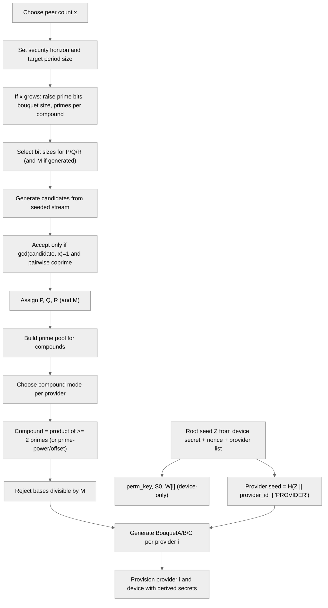
```mermaid
%%{init: {"theme":"neutral","flowchart":{"curve":"basis"}} }%%
flowchart TD
  Start["Choose peer count x"] --> Scale["Set security horizon and target period size"]
  Scale --> Adjust["If x grows: raise prime bits, bouquet size, primes per compound"]
  Adjust --> Bits["Select bit sizes for P/Q/R (and M if generated)"]
  Bits --> Gen["Generate candidates from seeded stream"]
  Gen --> Coprime["Accept only if gcd(candidate, x)=1 and pairwise coprime"]
  Coprime --> Assign["Assign P, Q, R (and M)"]
  Assign --> Pool["Build prime pool for compounds"]
  Pool --> Mode["Choose compound mode per provider"]
  Mode --> Comp["Compound = product of >= 2 primes (or prime-power/offset)"]
  Comp --> Check["Reject bases divisible by M"]
  Check --> Bouquets["Generate BouquetA/B/C per provider i"]
  SeedRoot["Root seed Z from device secret + nonce + provider list"] --> Keys["perm_key, S0, W[i] (device-only)"]
  SeedRoot --> ProvSeed["Provider seed = H(Z || provider_id || 'PROVIDER')"]
  ProvSeed --> Bouquets
  Bouquets --> Provision["Provision provider i and device with derived secrets"]
```

### 3.2.1 Seeded example flows (real values)
The demo can be run with small bit sizes so prime-factor detail fits on the page. The examples below use `prime_mode=generated`, `prime_bits=12`, `modulus_bits=16`, `compound_mode=classic`, `compound_primes=3`, `compound_count=4`, and the built-in prime pool; the compound example uses provider 0's BouquetA[0..1]. Each node shows the integer value and its prime-power factorization.

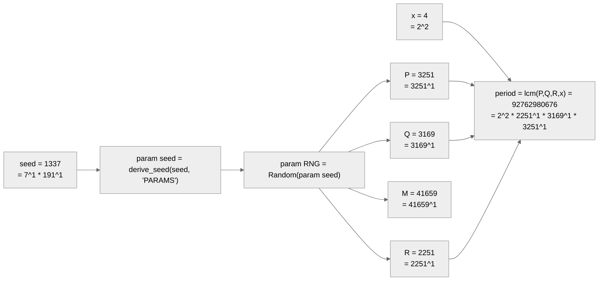
```mermaid
%%{init: {"theme":"neutral","flowchart":{"curve":"basis"}} }%%
flowchart LR
  Seed1337["seed = 1337<br/>= 7^1 * 191^1"] --> ParamSeed1337["param seed = derive_seed(seed, 'PARAMS')"]
  ParamSeed1337 --> ParamRng1337["param RNG = Random(param seed)"]
  ParamRng1337 --> P1337["P = 3251<br/>= 3251^1"]
  ParamRng1337 --> Q1337["Q = 3169<br/>= 3169^1"]
  ParamRng1337 --> R1337["R = 2251<br/>= 2251^1"]
  ParamRng1337 --> M1337["M = 41659<br/>= 41659^1"]
  X1337["x = 4<br/>= 2^2"] --> Period1337["period = lcm(P,Q,R,x) = 92762980676<br/>= 2^2 * 2251^1 * 3169^1 * 3251^1"]
  P1337 --> Period1337
  Q1337 --> Period1337
  R1337 --> Period1337
```

**Important:** the schedule/modulus primes (**P, Q, R** and **M**) are chosen for the public clock period and modular arithmetic. They are **not** meant to appear as factors inside bouquet compounds. Bouquets are built from a separate prime pool (small in the demo, larger in production) because the protocol only uses each compound as a *base modulo* **M** in `pow(compound % M, exponent, M)`. The only required constraint is `compound % M != 0` (equivalently `gcd(compound, M)=1`).

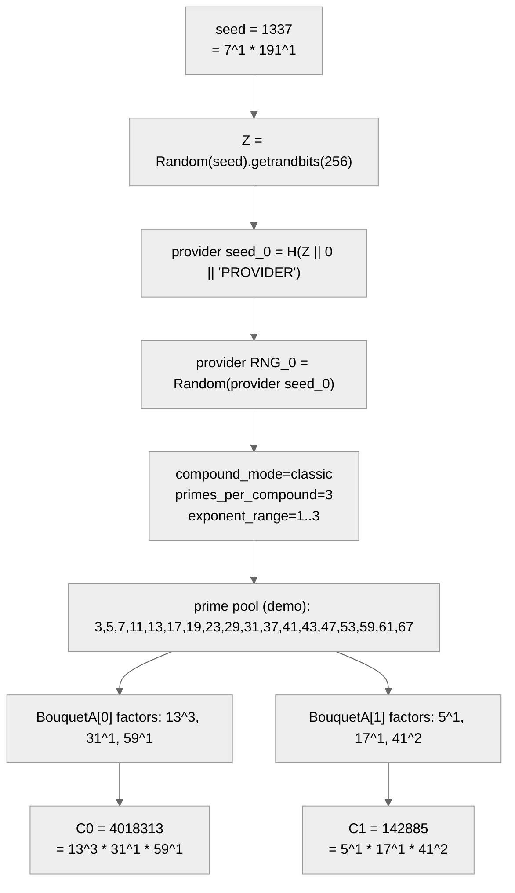
```mermaid
%%{init: {"theme":"neutral","flowchart":{"curve":"basis"}} }%%
flowchart TD
  Seed1337b["seed = 1337<br/>= 7^1 * 191^1"] --> Root1337["Z = Random(seed).getrandbits(256)"]
  Root1337 --> ProvSeed1337["provider seed_0 = H(Z || 0 || 'PROVIDER')"]
  ProvSeed1337 --> FixRng1337["provider RNG_0 = Random(provider seed_0)"]
  FixRng1337 --> Cfg1337["compound_mode=classic<br/>primes_per_compound=3<br/>exponent_range=1..3"]
  Cfg1337 --> Pool1337["prime pool (demo): 3,5,7,11,13,17,19,23,29,31,37,41,43,47,53,59,61,67"]
  Pool1337 --> PicksA0["BouquetA[0] factors: 13^3, 31^1, 59^1"]
  PicksA0 --> C0["C0 = 4018313<br/>= 13^3 * 31^1 * 59^1"]
  Pool1337 --> PicksA1["BouquetA[1] factors: 5^1, 17^1, 41^2"]
  PicksA1 --> C1["C1 = 142885<br/>= 5^1 * 17^1 * 41^2"]
```

## 4. PCPL protocol overview
The protocol uses:

1. A public phase clock (CRT residues and coupled products).
2. A per-block permutation schedule to enforce “returns every $x$”.
3. Hidden bouquets to derive lane-specific tokens.
4. Device-only seed evolution that chains all lanes.
5. A practical control split: a deterministic hot token core and a slower supervisory layer for clock drift, route pressure, and recovery.

### 4.1 User device circuit (emitter)
The device knows the full schedule and all lane secrets, so it computes only the
active lane per cycle and emits exactly one token.

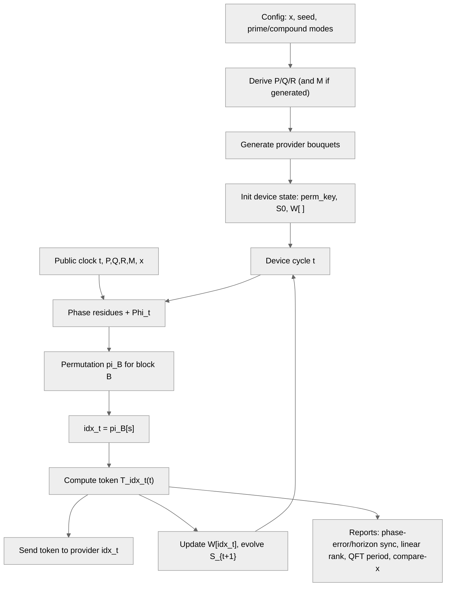
```mermaid
%%{init: {"theme":"neutral","flowchart":{"curve":"basis"}} }%%
flowchart TD
  Cfg["Config: x, seed, prime/compound modes"] --> Primes["Derive P/Q/R (and M if generated)"]
  Primes --> Bouquets["Generate provider bouquets"]
  Bouquets --> Init["Init device state: perm_key, S0, W[ ]"]
  Init --> Loop["Device cycle t"]
  Public["Public clock t, P,Q,R,M, x"] --> Phase["Phase residues + Phi_t"]
  Loop --> Phase
  Phase --> Perm["Permutation pi_B for block B"]
  Perm --> Pick["idx_t = pi_B[s]"]
  Pick --> Tok["Compute token T_idx_t(t)"]
  Tok --> Send["Send token to provider idx_t"]
  Tok --> Evolve["Update W[idx_t], evolve S_{t+1}"]
  Evolve --> Loop
  Tok --> Report["Reports: phase-error/horizon sync, linear rank, QFT period, compare-x"]
```

### 4.2 Blind provider circuit (validator)
Each provider only knows its own bouquets. It recomputes $T_i(t)$ every cycle, but the received token matches only once per block of $x$ cycles. The other $x-1$ cycles are expected mismatches because the device emitted a different lane.

**Why only 1-of-$x$ is correct:** the provider computes the *same* lane token formula as the device, but with a fixed lane index $i$. The device emits $T_{\mathrm{idx}_t}(t)$ where $\mathrm{idx}_t = \pi_B[s]$ is hidden by $\mathrm{perm\_key}$. Therefore the provider is correct iff $i = \mathrm{idx}_t$.
Because $\pi_B$ is a permutation, this happens exactly once per block of $x$ cycles. The device is “always right” because it emits the scheduled lane token; the provider is “blind” because it does not know $\mathrm{perm\_key}$ and cannot predict which cycle is its match.

Provider-side token generation (every cycle):

$$
\begin{aligned}
EA_i(t) &= \mathrm{Eval}(\mathrm{BouquetA}_i, a_t, u_1), \\
EB_i(t) &= \mathrm{Eval}(\mathrm{BouquetB}_i, b_t, u_2), \\
EC_i(t) &= \mathrm{Eval}(\mathrm{BouquetC}_i, c_t, u_3), \\
K_i(t) &= H\!\left(
\mathrm{enc\_i}(i)\|\mathrm{encM}(EA_i(t))\|\mathrm{encM}(EB_i(t))\|\mathrm{encM}(EC_i(t))\|\Phi_t\|\mathrm{KDF}
\right), \\
T_i(t) &= \mathrm{Trunc}_k\!\left(
H\!\left(K_i(t)\|\mathrm{enc\_t}(t)\|\Phi_t\|\mathrm{TOK}\right)
\right).
\end{aligned}
$$

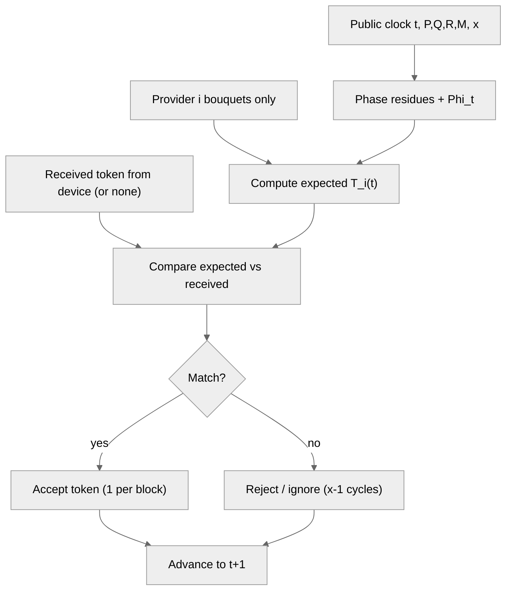
```mermaid
%%{init: {"theme":"neutral","flowchart":{"curve":"basis"}} }%%
flowchart TD
  Public["Public clock t, P,Q,R,M, x"] --> Phase["Phase residues + Phi_t"]
  Bouquets["Provider i bouquets only"] --> Expect["Compute expected T_i(t)"]
  Phase --> Expect
  Rx["Received token from device (or none)"] --> Compare["Compare expected vs received"]
  Expect --> Compare
  Compare --> Match{"Match?"}
  Match -->|yes| Accept["Accept token (1 per block)"]
  Match -->|no| Reject["Reject / ignore (x-1 cycles)"]
  Accept --> Next["Advance to t+1"]
  Reject --> Next
```

### 4.3 Shared vs distinct per-cycle logic
The device and each provider run a synchronized per-cycle hash pipeline. They differ in
which lane index is used and whether device-only state is updated.

- **Shared per-cycle hash pipeline (device + provider):** for a given lane index $i$ and cycle $t$, compute $\Phi_t$, then $EA_i(t), EB_i(t), EC_i(t)$, then $K_i(t)$ and $T_i(t)$ using the canonical encoding and domain tags. This runs every cycle.
- **Device-only additions:** compute $\mathrm{idx}_t$ from `perm_key`, evaluate only that lane, emit $T_{\mathrm{idx}_t}(t)$, update $W[\mathrm{idx}_t]$, and evolve $S_{t+1}$ from all $W$ and chain products. This makes every emitted token influence future cycles.
- **Provider-only behavior:** for its fixed lane $i$, compute $T_i(t)$ every cycle and compare against any received token. Exactly 1-of-$x$ cycles match because the device selects each lane once per block. Providers do not know `perm_key` and do not maintain $S_t$ or $W[ ]$.

### 4.4 Practical circuit split after co-evolution
The repository-local Evolvo synthesis makes the circuit boundary sharper. PCPL
should not be implemented as one large opaque controller. The deployable shape
is a small token datapath with sparse bouquet activation, surrounded by slower
supervisory circuits that are allowed to observe window-level facts but are not
allowed to add runtime challenge/response handshakes.

The practical architecture is therefore four-layered:

- **Hot token core:** every cycle, compute phase residues, select a
  profile-fixed small active subset of bouquet compounds, evaluate the modular
  products, derive $K_i(t)$, derive $T_i(t)$, and update the device's local
  state register. The primary sparse profile uses one active compound per
  bouquet per cycle; a two-active-compound profile is the first robustness
  comparison. This path is deterministic, branch-light, provider-recomputable
  for the addressed lane, and friendly to fixed hardware or native GPU
  execution.
- **Synchronization supervisor:** over a slower window, discipline the cycle
  counter from a precise external reference, such as a GPS-grade time source.
  This layer owns drift estimates, guard windows, recovery mode limits, and
  dead-idle avoidance. It does not negotiate with providers after provisioning.
- **Route-hardening monitor:** track lane-prediction pressure, schedule
  decorrelation, lane-salt epochs, and bounded phase jitter. This layer is
  allowed to change public or provider-observable policy limits, but not to
  inject hidden state into provider token derivation.
- **Execution audit layer:** measure timeout ratio, native execution coverage,
  active-compound density, final metric availability, attacker-panel breadth,
  and search plateau indicators. This prevents a circuit from being promoted
  only because it scores well in a narrow simulated slice while being unstable
  under the intended backend.

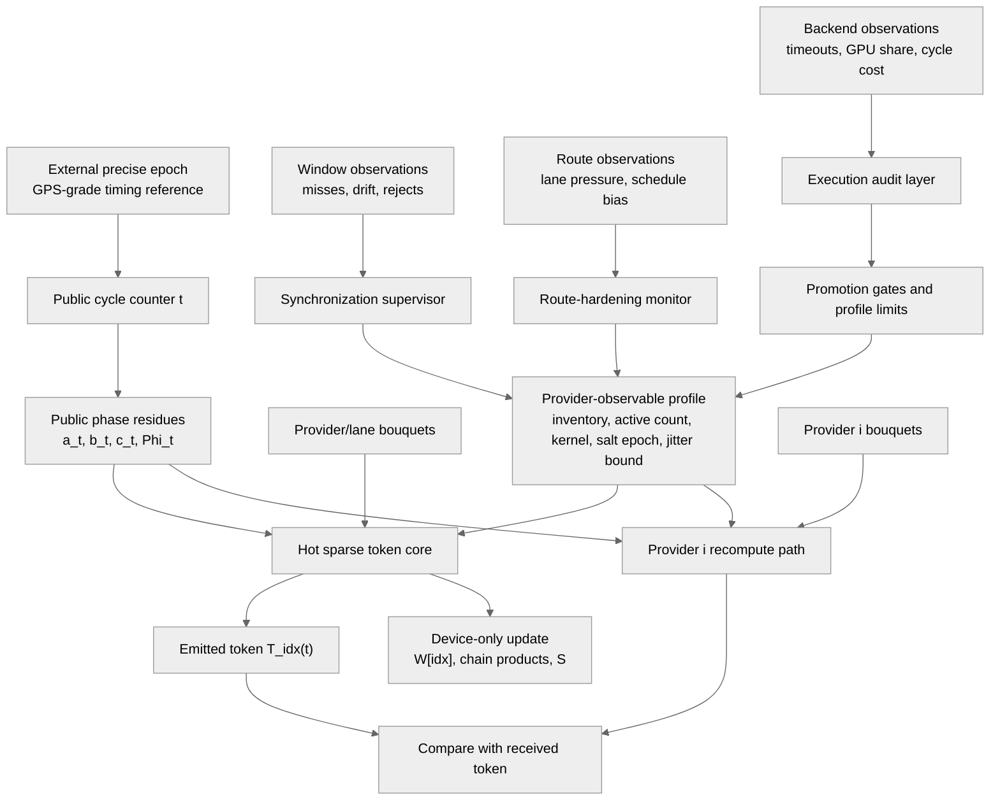
```mermaid
%%{init: {"theme":"neutral","flowchart":{"curve":"basis"}} }%%
flowchart TD
  Epoch["External precise epoch<br/>GPS-grade timing reference"] --> Clock["Public cycle counter t"]
  Clock --> Phase["Public phase residues<br/>a_t, b_t, c_t, Phi_t"]
  Phase --> Hot["Hot sparse token core"]
  Bouquets["Provider/lane bouquets"] --> Hot
  Policy["Provider-observable profile<br/>inventory, active count, kernel, salt epoch, jitter bound"] --> Hot
  Hot --> Token["Emitted token T_idx(t)"]
  Hot --> State["Device-only update<br/>W[idx], chain products, S"]

  Provider["Provider i recompute path"] --> Compare["Compare with received token"]
  Phase --> Provider
  BouquetsI["Provider i bouquets"] --> Provider
  Policy --> Provider
  Token --> Compare

  ObsSync["Window observations<br/>misses, drift, rejects"] --> Sync["Synchronization supervisor"]
  ObsRoute["Route observations<br/>lane pressure, schedule bias"] --> Route["Route-hardening monitor"]
  ObsExec["Backend observations<br/>timeouts, GPU share, cycle cost"] --> Audit["Execution audit layer"]

  Sync --> Policy
  Route --> Policy
  Audit --> Limits["Promotion gates and profile limits"]
  Limits --> Policy
```

This split changes the implementation strategy, not the core correctness
argument. The exact 1-of-$x$ property still comes from the block permutation;
the token value still comes from deterministic lane recomputation. The
supervisor may narrow a public acceptance window or rotate a public policy
epoch, but it must not force a provider to ask the device which formula to use.

The decisive improvement is architectural: token correctness, route hardening,
time discipline, and backend feasibility are separate concerns. Combining them
inside one branch-heavy datapath makes the provider contract fragile and gives
evolutionary search a misleading way to score well by exploiting evaluator
details. Separating them keeps the hot path simple enough for circuits while
leaving space for real engineering controls around it.

The possible weakness is also architectural: if the supervisory layer is vague,
an implementation may accidentally reintroduce handshake-like behavior under
the name of resynchronization. That would be a different protocol. In PCPL, all
post-provisioning control that affects provider recomputation must be public,
time-derived, provider-local, or explicitly carried in the emitted message.

## 5. Step-by-step algorithm

### 5.0 Canonical encoding and concatenation (unambiguous hash inputs)

The operator `||` / $\|$ in the formulas means **byte-string concatenation**. Implementations **MUST** use a canonical serialization so that different tuples cannot map to the same byte string (classic “`1|23` vs `12|3`” bug).

Use fixed-length big-endian integer encoding (**I2OSP [8]**) with lengths derived from the public moduli:

- $\ell_P=\lceil\log_2(P)/8\rceil$, $\ell_Q$, $\ell_R$, $\ell_M$ similarly
- lane identifier: $\ell_i=4$ bytes (`enc_i(i) = I2OSP(i,4)`) unless you need a larger ID space
- cycle counter: $\ell_t=8$ bytes (`enc_t(t) = I2OSP(t,8)`) unless you expect more than $2^{64}$ cycles
- small indices (bouquet element index $j$, prime-candidate index $k$, …): `encU32(n) = I2OSP(n,4)`

Encoding functions:

- `encP(a) = I2OSP(a, ℓP)` and similarly `encQ`, `encR`, `encM`
- `enc_i(i) = I2OSP(i, ℓi)`, `enc_t(t) = I2OSP(t, ℓt)`

Domain tags (`PHASE`, `EXP`, `KDF`, `TOK`, …) are fixed byte strings as defined in §3.0 and are appended **as-is**. If you prefer numeric tags, serialize the numeric constant with `I2OSP(tag, 4)` (or any fixed width) — the only requirement is uniqueness.

With this convention, the core digests become:

$$
\Phi_t = H\!\left(
\mathrm{encP}(a_t)\|\mathrm{encQ}(b_t)\|\mathrm{encR}(c_t)\|
\mathrm{encM}(u_1)\|\mathrm{encM}(u_2)\|\mathrm{encM}(u_3)\|
\mathrm{PHASE}
\right).
$$

$$
e_j = H\!\left(
\mathrm{encRes}(x_{\mathrm{res}})\|\mathrm{encM}(u)\|\mathrm{encU32}(j)\|\mathrm{EXP}
\right) \bmod (M-1),
$$
where `encRes` is the residue encoder for $a_t$ / $b_t$ / $c_t$ (use `encP`, `encQ`, or `encR` depending on which residue is in scope).

$$
K_i(t)=H\!\left(
\mathrm{enc\_i}(i)\|\mathrm{encM}(EA_i(t))\|\mathrm{encM}(EB_i(t))\|\mathrm{encM}(EC_i(t))\|
\Phi_t\|\mathrm{KDF}
\right),
$$

$$
T_i(t)=\mathrm{Trunc}_k\!\left(
H\!\left(K_i(t)\|\mathrm{enc\_t}(t)\|\Phi_t\|\mathrm{TOK}\right)
\right).
$$

`Trunc_k` can mean “take the first $k$ bits” (most common), or “interpret as an integer and reduce mod $2^k$”. The demo uses byte truncation.

**Rule of thumb:** never concatenate decimal strings, and never concatenate variable-length integers without either fixed widths, length-prefixes, or a tuple-hash construction. [8][9][21]

Demo note: the Python demo uses BLAKE2b [3] and a typed, length-prefixed encoding for each hash part (tag + 4-byte length) instead of fixed-width I2OSP. Older demo runs omitted `enc_i(i)` in the KDF; the current demo includes it to match the spec, so token traces differ from earlier runs.

### 5.1 Phase clock
Public offsets $a_0,b_0,c_0$ are part of the public configuration (§3.1.1).

For cycle $t$:

$$
\begin{aligned}
a_t &= (a_0 + t) \bmod P, \\
b_t &= (b_0 + t) \bmod Q, \\
c_t &= (c_0 + t) \bmod R.
\end{aligned}
$$

Coupled products:

$$
\begin{aligned}
u_1 &= (a_t\, b_t) \bmod M, \\
u_2 &= (b_t\, c_t) \bmod M, \\
u_3 &= (c_t\, a_t) \bmod M.
\end{aligned}
$$

Phase digest:

$$
\Phi_t = H\!\left(
\mathrm{encP}(a_t)\|\mathrm{encQ}(b_t)\|\mathrm{encR}(c_t)\|
\mathrm{encM}(u_1)\|\mathrm{encM}(u_2)\|\mathrm{encM}(u_3)\|
\mathrm{PHASE}
\right).
$$

### 5.2 Permutation schedule (“returns every x”)

The **schedule** (which provider is selected at each cycle) must be independent from the hashed token bytes.
It is driven only by the public cycle counter and the device’s private permutation key.

Define a block index and a slot inside that block:

$$
B = \left\lfloor \frac{t}{x} \right\rfloor,\qquad s = t \bmod x.
$$

For each block $B$, the device computes a permutation $\pi_B$ of $\{0,\ldots,x-1\}$ using a deterministic PRNG derived from:

- the device-only `perm_key`
- the block index $B$
- the public digest $\Phi_{B\cdot x}$ (fixed for the block start)
- the domain tag `PERMSEED`

Then the selected lane for cycle $t$ is:

$$
\mathrm{idx}_t = \pi_B[s].
$$

Because $\pi_B$ is a permutation, each lane appears **exactly once** per block of length $x$ (“returns every $x$”).
Hashing and truncation happen *after* this selection and therefore cannot break the 1-of-$x$ property. In implementation terms, `PermuteBlock` should be a deterministic Durstenfeld/Fisher-Yates shuffle over a PRF/DRBG byte stream, not a random-sort shortcut. [14][26][27]

### 5.2.1 Device-side destination selection

Using only public phase data and its private permutation key, the device computes:

$$
\begin{aligned}
B &= \left\lfloor \frac{t}{x} \right\rfloor,\quad s = t \bmod x, \\
\pi_B &= \mathrm{PermuteBlock}\left(\mathrm{perm\_key},\, B,\, \Phi_{B\cdot x},\, x\right), \\
\mathrm{idx}_t &= \pi_B[s].
\end{aligned}
$$

Providers do **not** know `perm_key`, so they cannot predict $\mathrm{idx}_t$ (even though $t$ and $\Phi_t$ are public).


### 5.3 Bouquet evaluation

Each bouquet is a list of compounds $C_j$, each a modular base (typically a product of primes). For a residue $x_{\mathrm{res}}$ and coupling $u$, define the per-element exponent:

$$
e_j = H\!\left(
\mathrm{encRes}(x_{\mathrm{res}})\|\mathrm{encM}(u)\|\mathrm{encU32}(j)\|\mathrm{EXP}
\right) \bmod (M-1).
$$

Bouquet evaluation is the modular product:

$$
\mathrm{Eval}(\mathrm{Bouquet}, x_{\mathrm{res}}, u) = \prod_j C_j^{e_j} \bmod M.
$$

For provider $i$:

$$
\begin{aligned}
EA_i(t) &= \mathrm{Eval}(\mathrm{BouquetA}_i, a_t, u_1), \\
EB_i(t) &= \mathrm{Eval}(\mathrm{BouquetB}_i, b_t, u_2), \\
EC_i(t) &= \mathrm{Eval}(\mathrm{BouquetC}_i, c_t, u_3).
\end{aligned}
$$

### 5.3.1 Prime-compound construction variants
Compounds do not need to be prime: any base coprime with $M$ is valid. Here, “prime compound” means a composite base built from two or more primes (a compound prime). This expands the base space and lets you tune complexity by increasing the number of factors and exponents, while preserving continuity.
The only hard requirement is $\gcd(C, M)=1$ (no factor of $M$). This coprimality is **with respect to the modulus $M$**, not with respect to $P,Q,R$ or $x$: compounds may share factors with each other, but they must not share factors with $M$ to stay in $\mathbb{F}_M^{\ast}$.

- **Multi-prime compounds:** $C = \prod_{i=1}^{r} p_i^{e_i}$ with $r \ge 2$ (the general case).
- **Prime powers:** $C = p^k$ (smooth but non-prime bases).
- **Semiprimes:** $C = p q$ (a 2-prime special case).
- **Offset compounds:** $C = \left(\prod p_i^{e_i}\right) + \delta$ with small $\delta$ to create a quasi-continuous family.
- **Quantized reals:** map a real parameter $\rho$ to $C = \lfloor \alpha \rho \rfloor$ for fixed scale $\alpha$, then ensure $\gcd(C, M)=1$.

The demo exposes these families via compound generation modes while keeping the exponent schedule unchanged; the “blend” mode just mixes these families and does not change the phase periodicity, which is driven solely by $P,Q,R$ and $x$.

### 5.4 Token derivation

Key derivation (domain-separated by lane identifier $i$):

$$
K_i(t) = H\!\left(
\mathrm{enc\_i}(i)\|\mathrm{encM}(EA_i(t))\|\mathrm{encM}(EB_i(t))\|\mathrm{encM}(EC_i(t))\|
\Phi_t\|\mathrm{KDF}
\right).
$$

Token:

$$
T_i(t) = \mathrm{Trunc}_k\!\left(
H\!\left(K_i(t)\|\mathrm{enc\_t}(t)\|\Phi_t\|\mathrm{TOK}\right)
\right).
$$

Implementation notes:
- In code, $K_i(t)$ is the **hash digest bytes** (not an integer).
- When concatenating integers, always use the canonical fixed-length encoding (§5.0).
- Including $i$ inside the KDF provides explicit lane domain-separation even if two providers were accidentally provisioned with identical bouquets.
- If you prefer a standardized PRF/KDF wrapper, use HMAC, HKDF, or an SP 800-108 KDF mode with explicit context labels. [4][5][10][22]

### 5.4.1 Worked example with real integers (toy parameters + SHA-256 [1])
This example is **not** meant to be secure (the primes are tiny); it exists only to show the math and key composition end-to-end with concrete numbers.

Parameters:

- $x=4$
- $P=11$, $Q=13$, $R=17$ (pairwise coprime and coprime with $x$)
- $M=19$ (prime modulus, so $\lvert\mathbb{F}_M^{\ast}\rvert=M-1=18$)
- public offsets: $a_0=2$, $b_0=3$, $c_0=5$
- lane: $i=2$
- cycle: $t=7$
- encoding: fixed-length big-endian as in §5.0 (here every modulus fits in 1 byte)
- hash: SHA-256, $k=64$ (token is first 64 bits of the final hash)

Provider $i=2$ bouquets (each base is coprime with $M$):

- $\mathrm{BouquetA}_2=[15,\,77]$ (compounds: $3\cdot 5$ and $7\cdot 11$)
- $\mathrm{BouquetB}_2=[91,\,143]$ (compounds: $7\cdot 13$ and $11\cdot 13$)
- $\mathrm{BouquetC}_2=[85,\,187]$ (compounds: $5\cdot 17$ and $11\cdot 17$)

Computed public phase values:

- $a_t=9$, $b_t=10$, $c_t=12$
- $u_1=14$, $u_2=6$, $u_3=13$
- $\Phi_t = \mathrm{SHA256}(\texttt{09 0a 0c 0e 06 0d} \| \text{PHASE}) = \texttt{0x809eec62…}$

Computed bouquet exponents and evaluations (all exponents reduced mod $18$):

- $e^A=[2,17] \Rightarrow EA_2(t)=16$
- $e^B=[7,5] \Rightarrow EB_2(t)=1$
- $e^C=[0,14] \Rightarrow EC_2(t)=4$

Final key and token:

- $K_2(t)=\mathrm{SHA256}(i\|EA\|EB\|EC\|\Phi_t\|\text{KDF})=\texttt{0x4ca0cd19…}$
- $T_2(t)=\mathrm{Trunc}_{64}(\mathrm{SHA256}(K_2(t)\|t\|\Phi_t\|\text{TOK}))=\texttt{0x548c40b9091d8ed7}$

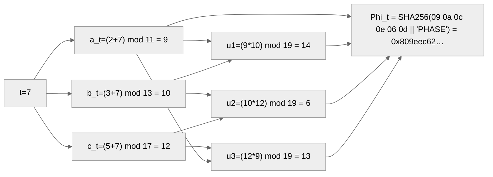
```mermaid
%%{init: {"theme":"neutral","flowchart":{"curve":"basis"}} }%%
flowchart LR
  T["t=7"] --> A["a_t=(2+7) mod 11 = 9"]
  T --> B["b_t=(3+7) mod 13 = 10"]
  T --> C["c_t=(5+7) mod 17 = 12"]

  A --> U1["u1=(9*10) mod 19 = 14"]
  B --> U1
  B --> U2["u2=(10*12) mod 19 = 6"]
  C --> U2
  C --> U3["u3=(12*9) mod 19 = 13"]
  A --> U3

  A --> PHI["Phi_t = SHA256(09 0a 0c 0e 06 0d || 'PHASE') = 0x809eec62…"]
  U1 --> PHI
  U2 --> PHI
  U3 --> PHI
```

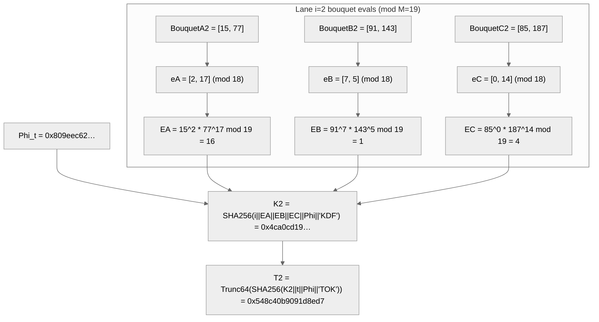
```mermaid
%%{init: {"theme":"neutral","flowchart":{"curve":"basis"}} }%%
flowchart TD
  subgraph A2["Lane i=2 bouquet evals (mod M=19)"]
    AIn["BouquetA2 = [15, 77]"] --> EAExp["eA = [2, 17] (mod 18)"]
    EAExp --> EA["EA = 15^2 * 77^17 mod 19 = 16"]

    BIn["BouquetB2 = [91, 143]"] --> EBExp["eB = [7, 5] (mod 18)"]
    EBExp --> EB["EB = 91^7 * 143^5 mod 19 = 1"]

    CIn["BouquetC2 = [85, 187]"] --> ECExp["eC = [0, 14] (mod 18)"]
    ECExp --> EC["EC = 85^0 * 187^14 mod 19 = 4"]
  end

  PHI2["Phi_t = 0x809eec62…"] --> K2["K2 = SHA256(i||EA||EB||EC||Phi||'KDF') = 0x4ca0cd19…"]
  EA --> K2
  EB --> K2
  EC --> K2

  K2 --> TOK["T2 = Trunc64(SHA256(K2||t||Phi||'TOK')) = 0x548c40b9091d8ed7"]
```

This is the exact structure the providers use: even though they cannot predict **which** lane the device will emit on a given cycle, they can still recompute their own lane's expected $T_i(t)$ and accept only when it matches.

### 5.4.2 Why SHA-256 and truncation still respect the permutation rule (and enable async validation)

PCPL has two *separate* mechanisms that people often conflate:

1. **Permutation rule (“returns every x”)** — decides **which lane** is active at time $t$.
2. **Token derivation** — decides **what value** the device emits for that lane at time $t$.

Truncation affects only (2), never (1).

#### A. The permutation rule is independent of hashing and truncation
Within a block $B=\lfloor t/x\rfloor$, the device computes a deterministic permutation $\pi_B$ of the lane indices and selects:

$$
\mathrm{idx}_t = \pi_B[t \bmod x].
$$

Because $\pi_B$ is a **permutation**, every lane appears exactly once per block, regardless of how you compute $K_i(t)$ or $T_i(t)$.
So “returns every $x$” is preserved as long as `Permute(...)` is deterministic.

#### B. Determinism is what makes re-derivation possible
For any fixed lane $i$ and cycle $t$, the derivation is a pure function:

$$
K_i(t)=H(\mathrm{enc}_i(i)\|\mathrm{encM}(EA_i(t))\|\mathrm{encM}(EB_i(t))\|\mathrm{encM}(EC_i(t))\|\Phi_t\|\mathrm{KDF})
$$

$$
T_i(t)=\mathrm{Trunc}_k\Big(H\big(K_i(t)\|\mathrm{enc}_t(t)\|\Phi_t\|\mathrm{TOK}\big)\Big).
$$

There are no hidden “external variables” beyond:

- public parameters ($P,Q,R,M,x,a_0,b_0,c_0$, and the definition of $H$ and truncation),
- the cycle counter $t$ (sent in the message, or derived from a shared epoch),
- and the lane’s provisioned secrets (bouquets).

So a provider can recompute its expected $T_i(t)$ **for any $t$**, even if it has not seen recent traffic.

#### C. Truncation preserves correctness (it only trades bandwidth for collision probability)
Both device and provider compute the same 256-bit hash output, then apply the same deterministic truncation rule.
Therefore truncation cannot “break synchronization” — it can only increase the chance that two different inputs collide in $k$ bits.
Choose $k$ large enough for your threat model (e.g., 64 bits is already far beyond typical OTP sizes).

#### D. Why this is “async”: providers don’t need the permutation key (but they still run a synchronized circuit)

Providers do **not** need `perm_key` or $\pi_B$ to validate, because the expected token for lane $i$ at cycle $t$ is a pure function of:

- public data: $t$ (or its epoch mapping) and $\Phi_t$
- provider-$i$ secrets: $\mathrm{BouquetA}_i,\mathrm{BouquetB}_i,\mathrm{BouquetC}_i$
- the agreed hash/KDF rules and domain tags

What “async” means here is: **no extra coordination channel** is required to tell a provider *when* it will be selected.
The provider simply runs the same per-cycle hash pipeline as the device (for its own lane only) and compares if/when a message arrives.

Operationally:

- Every cycle, provider $i$ advances its local counter to the current $t$ (using the same public epoch mapping as the device) and computes $T_i(t)$.
- Most cycles there is no message; the computed token is discarded.
- When a device message arrives claiming $(t, i, T)$, provider $i$ compares $T$ against its locally generated $T_i(t)$
  (optionally checking a small $\pm\Delta$ window for clock skew / network jitter).

Because the device contacts each provider **exactly once per block of length $x$**, a given provider sees a *matching* token only **1 time out of $x$ cycles** (and rejects/mismatches the other $x-1$).

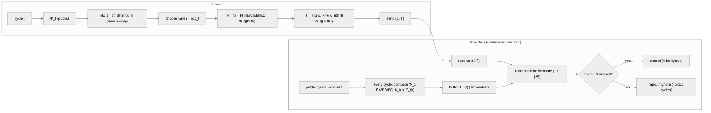
```mermaid
%%{init: {"theme":"neutral","flowchart":{"curve":"basis"}} }%%
flowchart LR
  subgraph Device
    t["cycle t"] --> Phi["Φ_t (public)"]
    Phi --> Perm["idx_t = π_B[t mod x] (device-only)"]
    Perm --> Lane["choose lane i = idx_t"]
    Lane --> Ki["K_i(t) = H(i||EA||EB||EC||Φ_t||KDF)"]
    Ki --> Tok["T = Trunc_k(H(K_i(t)||t||Φ_t||TOK))"]
    Tok --> Send["send (t,i,T)"]
  end

  subgraph Provider_i["Provider i (continuous validator)"]
    Clock["public epoch → local t"] --> Loop["every cycle: compute Φ_t, EA/EB/EC, K_i(t), T_i(t)"]
    Loop --> Buf["buffer T_i(t) (±Δ window)"]
    Rx["receive (t,i,T)"] --> Cmp["constant-time compare [17][25]"]
    Buf --> Cmp
    Cmp --> Match{"match & unused?"}
    Match -->|yes| Accept["accept (≈1/x cycles)"]
    Match -->|no| Reject["reject / ignore (≈x-1/x cycles)"]
  end

  Send --> Rx
```


### 5.5 Device emission and state evolution

The device computes only $T_{\mathrm{idx}_t}(t)$ for the scheduled lane and updates internal state:

- $W[i]$ is a per-lane **memory word**. Initialize as $W_i^{(0)}$ (§3.1), then update only when lane $i$ is active (e.g., store `Int(T) mod M` or store raw token bytes — choose one representation and encode it canonically in the hash below).
- The seed $S_t$ evolves using **all lanes** and adjacent products, so “inactive” lanes still influence the future through their last stored $W[i]$.

For $x$ lanes, define (non-cyclic adjacency):

$$
m_\ell = (W_\ell \cdot W_{\ell+1}) \bmod M, \quad \ell = 0,\ldots,x-2.
$$

Seed evolution:

$$
S_{t+1} = H\!\left(
S_t \| W_0 \| \cdots \| W_{x-1} \| m_0 \| \cdots \| m_{x-2} \| \Phi_t \| \mathrm{EVOLVE}
\right).
$$

Implementation note: if $W[i]$ and $m_\ell$ are stored as integers, serialize them with `encM(·)` (or another fixed-width encoder) before hashing.

### 5.6 Provider verification (continuous hashing circuit)

A provider is **not** a passive “checker that wakes up at the right permutation time”.
To be able to validate in constant time (and to match the intended hardware/circuit model), provider $i$ runs a synchronized per-cycle pipeline that continuously derives its current expected token.

Minimal runtime behavior:

1. **Clock discipline / epoch mapping.** Maintain a local view of the public cycle counter $t$ (e.g., from NTP [13], GPS-grade time, a block height, or any agreed public epoch-to-$t$ mapping); conceptually similar to the moving factor in HOTP/TOTP and to OTP authenticator guidance where the nonce is counter- or time-derived. [11][12][24]
2. **Per-cycle update.** For each cycle $t$, compute $\Phi_t$, then evaluate bouquets and derive:
   $EA_i(t), EB_i(t), EC_i(t) \rightarrow K_i(t) \rightarrow T_i(t)$.
3. **Small validation window (optional).** Keep $T_i(t)$ plus a small $\pm\Delta$ window (e.g., previous/next few cycles) to tolerate network delay and small clock skew.
4. **On receive.** When a message arrives with $(t, i, T)$:
   - reject if $i$ is not this provider’s identifier
   - reject if $t$ is outside the allowed window
   - constant-time compare $T$ with the locally buffered expected token(s), avoiding early-exit comparisons for secret-bearing material [17][25]
   - accept at most once per cycle (track recently accepted $(i,t)$ to prevent trivial replay inside the skew window)

**Acceptance frequency:** because the device selects each provider exactly once per block of length $x$, provider $i$ will see a valid match only about **1 time in $x$ cycles**. All other cycles either have no message or produce a mismatch by construction.


### 5.7 Device-side vs provider-side variables
The protocol deliberately separates what the device computes from what providers can infer:

- **Public inputs:** $t$ (or its epoch mapping), $x$, $P,Q,R,M$, the public offsets $a_0,b_0,c_0$, the permutation algorithm (but not `perm_key`), and the canonical encoding rules.
- **Device-only state:** $\mathrm{perm\_key}$, $S_t$, all lane secrets, and the lane-memory vector $W[0..x-1]$.
- **Provider $i$ secrets:** $\mathrm{BouquetA}_i, \mathrm{BouquetB}_i, \mathrm{BouquetC}_i$.
- **Ignored by providers:** $\mathrm{perm\_key}$, $S_t$, other providers’ bouquets, and the full $W$ vector.

The device computes only $T_{\mathrm{idx}_t}(t)$ for the current lane; the provider computes only its own lane token and does not need the device seed.

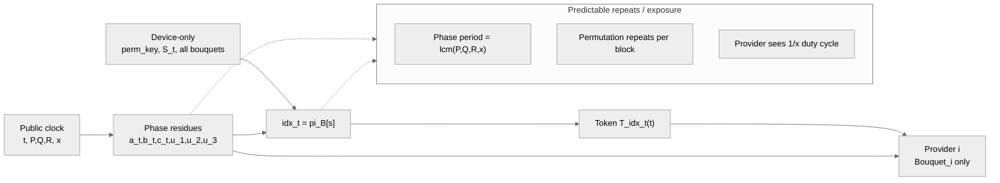
```mermaid
%%{init: {"theme":"neutral","flowchart":{"curve":"basis"}} }%%
flowchart LR
  Public["Public clock<br/>t, P,Q,R, x"] --> Phase["Phase residues<br/>a_t,b_t,c_t,u_1,u_2,u_3"]
  Device["Device-only<br/>perm_key, S_t, all bouquets"] --> Select["idx_t = pi_B[s]"]
  Phase --> Select
  Select --> Token["Token T_idx_t(t)"]
  Token --> Provider["Provider i<br/>Bouquet_i only"]
  Phase --> Provider

  subgraph Repeat["Predictable repeats / exposure"]
    R1["Phase period = lcm(P,Q,R,x)"]
    R2["Permutation repeats per block"]
    R3["Provider sees 1/x duty cycle"]
  end

  Phase -.-> Repeat
  Select -.-> Repeat
```


### 5.8 Reference pseudocode (implementation-oriented)

The following pseudocode matches the specification above (not optimized).

```text
# Public parameters (shared):
#   x, P, Q, R, M, a0, b0, c0
# Hash function H(·) and Trunc_k(·) agreed by all parties
# Canonical encoders: encP, encQ, encR, encM, enc_i, enc_t, encU32
# Domain tags: PHASE, EXP, KDF, TOK, EVOLVE, PERMSEED

function Phase(t):
    a = (a0 + t) mod P
    b = (b0 + t) mod Q
    c = (c0 + t) mod R
    u1 = (a * b) mod M
    u2 = (b * c) mod M
    u3 = (c * a) mod M

    Phi = H( encP(a) || encQ(b) || encR(c) ||
             encM(u1) || encM(u2) || encM(u3) ||
             PHASE )
    return (a,b,c,u1,u2,u3,Phi)

function PermuteBlock(perm_key, B, Phi_block, x):
    # Deterministic Fisher–Yates / Durstenfeld shuffle [14][26] using hash-derived bytes as a PRNG stream. [6][7][23]
    # Stable for the whole block B.
    seed = H( perm_key || encU32(B) || Phi_block || PERMSEED )
    L = [0,1,2,...,x-1]
    stream = Expand(seed)      # e.g., seed || H(seed||0) || H(seed||1) || ...
    for i from x-1 downto 1:
        r = NextU32(stream)    # pull 32 bits from stream
        j = r mod (i+1)
        swap L[i], L[j]
    return L   # permutation π_B

function EvalBouquet(bouquet, res_encoder, x_res, u, M):
    acc = 1 mod M
    for j from 0 to len(bouquet)-1:
        Cj = bouquet[j] mod M
        ej = H( res_encoder(x_res) || encM(u) || encU32(j) || EXP ) mod (M-1)
        acc = (acc * pow(Cj, ej, M)) mod M
    return acc

function LaneToken(i, t, bouquets_i):
    (a,b,c,u1,u2,u3,Phi) = Phase(t)
    EA = EvalBouquet(bouquets_i.A, encP, a, u1, M)
    EB = EvalBouquet(bouquets_i.B, encQ, b, u2, M)
    EC = EvalBouquet(bouquets_i.C, encR, c, u3, M)

    K  = H( enc_i(i) || encM(EA) || encM(EB) || encM(EC) || Phi || KDF )
    T  = Trunc_k( H( K || enc_t(t) || Phi || TOK ) )
    return T

# DEVICE (emitter)
state: perm_key (secret), S, W[0..x-1] (secret per-lane memory), bouquets_all
for each cycle t = 0,1,2,...:
    (a,b,c,u1,u2,u3,Phi) = Phase(t)

    B = floor(t / x)
    s = t mod x
    Phi_block = Phase(B*x).Phi
    pi = PermuteBlock(perm_key, B, Phi_block, x)
    idx = pi[s]

    T = LaneToken(idx, t, bouquets_all[idx])
    send (t, idx, T) to provider idx

    W[idx] = Int(T) mod M   # or store raw bytes; if bytes, encode consistently in EVOLVE
    m[ℓ] = (W[ℓ] * W[ℓ+1]) mod M for ℓ = 0..x-2
    S = H( S || W[0] || ... || W[x-1] || m[0] || ... || m[x-2] || Phi || EVOLVE )

# PROVIDER i (validator)
state: bouquets_i (secret), i (public identifier)
on receive (t, i, T_rx):
    T_exp = LaneToken(i, t, bouquets_i)
    accept iff (T_rx == T_exp)
```

Notes:
- `Expand(seed)` is any deterministic method to obtain enough pseudorandom bytes from `seed`
  (e.g., `H(seed||0)`, `H(seed||1)`, …). Both device and any party that needs to recompute `π_B`
  must use the **same** expansion.
- Providers do **not** need `perm_key` and do not need to know `π_B` to validate. In practice they run the per-cycle hash pipeline continuously and compare against the current (or ±Δ window) expected token when contacted.

### 5.9 Policy-controlled sparse bouquet evaluation

The reference pseudocode evaluates every compound in a bouquet. That is the
simplest specification, but it is not the only practical circuit profile. The
latest co-evolution synthesis repeatedly favored **sparse bouquet activation**:
keep a larger hidden bouquet inventory, but activate only a small deterministic
subset per cycle. This is not a claim that the secret inventory should be small.
It is a claim that the active arithmetic fan-in of the hot path should be
small, measurable, and explicitly specified.

The genetic programs are not copied into the protocol. They are translated into
four specification changes:

- `inventory_size` and `active_count` are explicit deployment parameters.
- the primary production profile is `active_count=1` per bouquet per cycle;
  `active_count=2` is a robustness profile, not the default.
- policy inputs are limited to public phase/time/lane data, explicit public
  epochs, and lane-local state that the provider can recompute and the device
  can mirror.
- route pressure and long-horizon drift change only public profile limits or
  fail-closed behavior; they do not change token formulas through hidden state.

Let a deterministic policy circuit produce a bounded control vector:

$$
\Theta_i(t)=\left(
\rho_i,\kappa_i,\sigma_i,\mu_i,\eta_i,h_i,\beta_i,\chi_i,\lambda_i,\tau_i,\jmath_i
\right).
$$

The intended meanings are:

- $\rho_i$: active-ratio control
- $\kappa_i$: token-mixing kernel selector
- $\sigma_i$: subset stride seed
- $\mu_i$: state-mix control
- $\eta_i$: exponent-bias control
- $h_i$: bounded hash-round count
- $\beta_i$: bouquet-spread control
- $\chi_i$: state-churn control
- $\lambda_i$: lane-salt control
- $\tau_i$: token-scramble control
- $\jmath_i$: phase-jitter control

The complete policy vector is useful for design search, but a deployment
profile should collapse it into a small public profile. For a bouquet of length
$n$, the deployed active count is:

$$
r_i(t)=\mathrm{clip}\left(A_{\mathrm{profile}}(t,i),\,1,\,n\right).
$$

The current primary profile is:

| profile | bouquet inventory | active count | intended use |
| --- | ---: | ---: | --- |
| `PCPL-S1` | $n \ge 5$ | `1` | default sparse hot path |
| `PCPL-S2` | $n \ge 5$ | `2` | robustness comparison for route-hardening tests |
| `PCPL-Sk` | deployment-specific | fixed small $k$ | only after beating `S1/S2` on route and sync metrics |

The continuous ratio form below is kept as an offline policy-search
parameterization, not as a requirement that production hardware vary fan-in
every cycle:

$$
\alpha_i(t)=\mathrm{clip}\left(\rho_i(t)\cdot(0.55+0.45\beta_i(t)),\,0,\,1\right),
$$

$$
r_i^{\mathrm{search}}(t)=1+\left\lfloor \alpha_i(t)(n-1)\right\rfloor.
$$

Then replace `EvalBouquet` with a deterministic subset evaluator:

$$
\mathrm{EvalSparse}(\mathcal{B},x_{\mathrm{res}},u,\Theta_i)
=\prod_{j\in\mathcal{I}(\mathcal{B},r_i,\sigma_i,\lambda_i,\jmath_i,t)}
C_j^{e'_j} \bmod M,
$$

where $\mathcal{I}$ is a deterministic subset of size $r_i(t)$ and
$e'_j$ is the usual `EXP` exponent with an optional bounded exponent bias
derived from $\eta_i(t)$. Kernel selection $\kappa_i$ then chooses a small
native-friendly mixer over $EA,EB,EC,\Phi_t,\lambda_i$ before the `KDF` step.

The blind-provider contract imposes an important restriction: every input used
by $\Theta_i(t)$ must be public or provider-observable. In the current
pcpl-evolvo setup, control hints are constrained to phase/time/lane-observable
channels, specifically to avoid dependencies on hidden token history. Therefore
a production policy circuit should be constrained to:

- public phase values and cycle counters,
- the provider's own lane identifier and public slot information,
- explicit public hints included in the token message,
- deterministic lane-local history only when both the device and that provider
  can derive the same value without a new handshake.

It should not depend on device-only state, other providers' bouquets, or hidden
tokens sent only to other lanes. Provider-local replay bookkeeping is still
useful, but it belongs outside token derivation unless it is mirrored by the
device or encoded as an explicit public hint.

### 5.9.1 Evolvo-derived policy pseudocode

The translated defender motif is a small public-policy generator, not a hidden
controller. In production it should be reduced to fixed profile choices and
bounded public selectors:

```text
PublicPolicy(t, lane_id, public_epoch):
    phase = PublicPhase(t, P, Q, R)
    profile = published_profile(public_epoch)

    active_count = profile.active_count          # PCPL-S1: 1, PCPL-S2: 2
    kernel_id = profile.kernel_id                # small native-friendly set
    stride_seed = H(PHASE || phase.Phi || lane_id || profile.stride_seed)
    salt_epoch = profile.salt_epoch
    jitter = bounded_public_jitter(phase, lane_id, profile.jitter_bound)
    hash_round_limit = profile.hash_round_limit  # fixed small upper bound

    return {
        active_count,
        kernel_id,
        stride_seed,
        salt_epoch,
        jitter,
        hash_round_limit,
        exponent_bias: profile.exponent_bias,
    }
```

The route-hardening and synchronization layers may publish a later
`public_epoch`, but the provider must be able to derive the same policy before
checking the token. If the required policy cannot be derived from public or
provider-local inputs, the correct behavior is to fail closed, not to negotiate.

### 5.9.2 Circuit-ready sparse evaluator

For implementation, the sparse evaluator can be written as a bounded datapath
with no data-dependent loop count after policy resolution:

```text
SparseBouquetEval(B, residue, phase, lane_id, t, policy):
    n = len(B)
    require n > 0
    r = clamp(policy.active_count, 1, n)
    start = H(PHASE || phase || lane_id || policy.salt_epoch) mod n
    stride = 1 + (H(PHASE || t || lane_id || policy.stride_seed) mod max(1, n - 1))
    acc = 1 mod M

    for k in 0 .. r-1:
        j = (start + k * stride) mod n
        e = EXP(residue, phase, lane_id, j)
        e = bounded_exponent_bias(e, policy.exponent_bias)
        acc = (acc * powmod(B[j], e, M)) mod M

    return acc
```

The selected indices must be reproducible by the provider for its own lane. The
device may know all lanes and all bouquets, but the provider only needs the
public phase, its lane identifier, its own bouquet, and the public or
provider-observable policy vector. The policy vector can be compact:

```text
policy = {
    inventory_size,      # provisioned bouquet size for this profile
    active_count,        # PCPL-S1 uses 1; PCPL-S2 uses 2
    kernel_id,           # small native-friendly mixer selector
    stride_seed,         # public/profile seed for subset walk
    salt_epoch,          # public lane-salt epoch
    jitter_bound,        # bounded phase offset, not a hidden resync command
    hash_round_limit,    # fixed small upper bound
}
```

The decisive circuit change is that `active_count` becomes a first-class
parameter. A deployment profile should state both the provisioned bouquet
inventory size and the per-cycle active subset size. This makes cost, leakage
surface, and hardware fan-in auditable.

### 5.9.3 Hot-core pseudocode with provider contract

The hot core can be specified once and used by both device and provider. The
device calls it for the scheduled lane; the provider calls it for its own lane.

```text
LaneTokenSparse(i, t, bouquets_i, policy):
    phase = PublicPhase(t, P, Q, R)

    EA = SparseBouquetEval(bouquets_i.A, phase.a, phase, i, t, policy)
    EB = SparseBouquetEval(bouquets_i.B, phase.b, phase, i, t, policy)
    EC = SparseBouquetEval(bouquets_i.C, phase.c, phase, i, t, policy)

    mix = BoundedKernel(policy.kernel_id, EA, EB, EC, phase.Phi, i)
    K_i = H(KDF || enc_i(i) || enc_t(t) || encM(mix) || phase.Phi)
    T_i = Trunc_k(H(TOK || K_i || enc_t(t) || phase.Phi))
    return T_i

DeviceCycle(t):
    B = floor(t / x)
    s = t mod x
    idx = PermuteBlock(perm_key, B)[s]
    public_epoch = CurrentPublicEpoch(t)
    policy = PublicPolicy(t, idx, public_epoch)
    phase = PublicPhase(t, P, Q, R)
    T = LaneTokenSparse(idx, t, bouquets_idx, policy)
    emit (t, idx, public_epoch, T)
    update_device_state(idx, T, phase)

ProviderCycle(i, message):
    (t, idx_hint, public_epoch, T_rx) = message
    policy = PublicPolicy(t, i, public_epoch)
    T_exp = LaneTokenSparse(i, t, bouquets_i, policy)
    accept iff T_rx == T_exp
```

`idx_hint` can be omitted if routing already identifies the destination
provider. If present, it is not a secret and it is not a proof of authenticity;
it is only a transport hint. The authentication event remains the token match.

For circuit definition, the hot path is a fixed five-stage pipeline:

```text
HotCorePipeline:
    stage 1: phase registers        -> a_t, b_t, c_t, Phi_t
    stage 2: subset selectors       -> active indices for A/B/C
    stage 3: sparse modular product -> EA, EB, EC using active_count lanes
    stage 4: bounded mix + KDF      -> K_i(t), T_i(t)
    stage 5: writeback              -> W[idx], chain products, S_{t+1}
```

Stages 1-4 are shared by device and provider for a lane. Stage 5 is device-only.
There is no data-dependent loop count, no post-initialization handshake, and no
hidden supervisory output inside token derivation.

### 5.9.4 Supervisory control pseudocode

The synchronization supervisor operates outside token derivation. It does not
ask providers for new information after the initial provisioning step. It only
updates public or provider-observable limits that both sides can recompute or
read from the message.

```text
SupervisoryWindow(window):
    drift = estimate_drift_from_precise_reference(window)
    miss_rate = count_expected_misses_and_accepts(window)
    route_pressure = estimate_lane_prediction_pressure(window.public_features)
    backend_headroom = measure_native_runtime_headroom(window)

    if drift exceeds bound:
        narrow_or_shift_public_accept_window()

    if route_pressure exceeds bound:
        rotate_public_salt_epoch()
        tighten_schedule_decorrelation_profile()

    if backend_headroom is weak:
        reject_profile_or_lower_public_kernel_limit()

    publish next public policy epoch
```

This layer is decisive for engineering but not part of the cryptographic token
equation. Its outputs are constraints on the next policy epoch, not secret
answers to a provider. A provider that knows the public epoch and its own lane
can still recompute its expected token without asking the device anything.


## 6. Correctness and periodicity

### 6.1 Exact 1-of-x matching

Within each block of length $x$, the device computes a permutation $\pi_B$ of $\{0,\ldots,x-1\}$ and selects:

$$
\mathrm{idx}_t = \pi_B[t \bmod x].
$$

As the slot $s=t\bmod x$ runs through $0,1,\ldots,x-1$ inside the same block $B$, the permutation property guarantees that each lane identifier appears **exactly once**.
Therefore:

- in every block of $x$ cycles, the device contacts each provider exactly once
- each provider $i$ will see a *matching* token only on its single scheduled cycle in that block (≈ **1 time out of $x$**)

Hashing and truncation do not affect this property because they happen after lane selection.

### 6.2 Phase and schedule periodicity

The public phase clock is defined by three modular counters:

$$
a_t=(a_0+t)\bmod P,\quad b_t=(b_0+t)\bmod Q,\quad c_t=(c_0+t)\bmod R.
$$

The triple $(a_t,b_t,c_t)$ repeats with period:

$$
L = \mathrm{lcm}(P,Q,R).
$$

If $P,Q,R$ are pairwise coprime, then $L=PQR$.
The derived values $u_1,u_2,u_3$ and the phase digest $\Phi_t$ are deterministic functions of $(a_t,b_t,c_t)$, so they repeat with the same period $L$.

The lane-selection schedule adds the block structure of length $x$.
If the permutation were fixed, combining phase period and block slotting would yield an overall cycle-period of $\mathrm{lcm}(L,x)$.
In PCPL the permutation is *re-derived per block* from $(\mathrm{perm\_key}, B, \Phi_{B\cdot x})$, so practical repetition is pushed out further and is dominated by:

- the phase period $L$ (public)
- the block counter wrap-around implied by the chosen encoding length for $B$ (e.g., $2^{32}$ blocks if `encU32(B)` is used)

### 6.3 Modular exponent correctness

The `Eval(·)` step uses modular exponentiation and products modulo $M$, following the usual finite-field and modular-arithmetic setting. [20][30]
To keep these operations well-defined and avoid degenerate values, enforce:

- **Coprime bases:** each base used in a product must be coprime with $M$ (in particular, not divisible by $M$), otherwise terms collapse (e.g., $C\equiv 0\pmod M$).
- **Group arithmetic:** if $M$ is prime, the multiplicative group $\mathbb{F}_M^{\ast}$ has order $M-1$, so exponents can be reduced modulo $M-1$ without changing the result.
  (If $M$ is composite, use a group where the reduction rule is explicit, or keep full-width exponents.)

These checks belong in provisioning and bouquet generation, not at verification time.


### 6.4 Peer-count variations (x=2,3,4 and composite counts)
Changing $x$ changes the block size, the number of permutations, and the chain width:

| x | block length | permutations | chain products | note |
|---:|---:|---:|---:|---|
| 2 | 2 | 2 | 1 | twin pairing (2 lanes) |
| 3 | 3 | 6 | 2 | prime lane count |
| 4 | 4 | 24 | 3 | $2^2$ prime power |
| 6 | 6 | 720 | 5 | composite ($2 \cdot 3$) |

In general: block length $= x$, permutation space $= x!$, chain width $= x-1$.
The public phase repeats with period $\mathrm{lcm}(P,Q,R)$; the $x$-cycle block structure is an additional factor, and re-deriving $\pi_B$ per block pushes repetition out further (bounded in practice by the counter wrap-around of the chosen block encoding). [20]
For composite $x$ (e.g., $6=2\cdot 3$), choose $P,Q,R$ coprime with all prime factors of $x$ to avoid shrinking the phase/block interaction period.

## 7. Security intuition (informal)
- **Lane isolation:** each provider uses distinct secret bouquets, so observing one lane does not reveal others.
- **Phase coupling:** public residues are mixed and hashed, preventing linear predictability from the CRT clock alone.
- **Device chaining:** even stale lanes influence future state, reinforcing the requirement that “every token matters”.
- **Route hardening:** attackers may still gain small lane-prediction advantages from public timing and phase features, so schedule decorrelation and lane-salt diversity should be tested directly.
- **Provider-observable control:** any practical policy controller must use only inputs that the intended provider can recompute; simulator-only global history can create a false sense of validity.
- **Quantum period-finding:** QFT can reveal the public period $\mathrm{lcm}(P,Q,R,x)$ but not the hidden bouquets or $\mathrm{perm\_key}$; use large coprimes and device-only chaining to avoid exploitable structure.

## 8. Experimental validation (deterministic simulation and offline search)
A simulator was implemented cycle-by-cycle to validate correctness. The demo verifies:

- Each block yields a valid permutation.
- Exactly one provider matches each cycle.
- Each provider appears once per block.
- Optional pre-hash difficulty metrics and QFT-visible period reports.
- Optional prime/compound generation modes for non-arbitrary parameter testing.

Repository: [cekkr/phaselane-algorithm@github.com](https://github.com/cekkr/phaselane-algorithm).
Reference implementation and traces are provided as supplementary software material.
For scientific interpretation, three distinctions are important. First, this section validates **protocol behavior** (schedule correctness, one-of-$x$, deterministic recomputation). Second, offline evolutionary experiments are used only as an **automatic search method** to discover candidate algorithmic/circuit policies under fixed objectives; they are not part of runtime protocol mechanics. This follows the broad genetic-algorithm / genetic-programming lineage, but PCPL uses it only as a design-search instrument, not as a proof method. [28][29] Third, scoring is a **model-dependent lens** on quality: when score components or weights change, absolute scores should be compared only within the same scoring family, while invariant-level correctness claims remain comparable.

### 8.1 Sample token trace (x=4, seed=1337)
For PDF export, the original wide table was replaced with an A4-friendly summary table and a sequence diagram (tokens truncated for readability; the matched provider’s recomputed token equals the device token by construction).

| t | block | slot | idx_t | device token (truncated) | matched provider |
|---:|---:|---:|---:|---|---:|
| 0 | 0 | 0 | 0 | `0xa30497f4…c90c11` | 0 |
| 1 | 0 | 1 | 2 | `0x2a387c5c…3593da` | 2 |
| 2 | 0 | 2 | 1 | `0x2bc18699…1d82b2` | 1 |
| 3 | 0 | 3 | 3 | `0x7b4d155d…bf1fcb` | 3 |
| 4 | 1 | 0 | 2 | `0xa3ff87a6…a27076` | 2 |
| 5 | 1 | 1 | 1 | `0x589b117f…9b345a` | 1 |
| 6 | 1 | 2 | 0 | `0xb95461b0…92d469` | 0 |
| 7 | 1 | 3 | 3 | `0x72df0d6f…3973e0` | 3 |

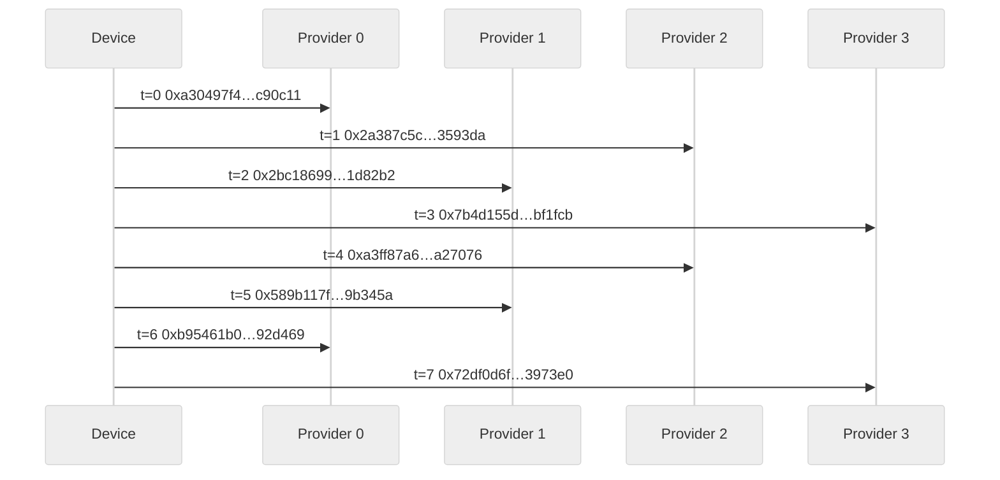
```mermaid
%%{init: {"theme":"neutral"} }%%
sequenceDiagram
  participant D as Device
  participant P0 as Provider 0
  participant P1 as Provider 1
  participant P2 as Provider 2
  participant P3 as Provider 3

  D->>P0: t=0  0xa30497f4…c90c11
  D->>P2: t=1  0x2a387c5c…3593da
  D->>P1: t=2  0x2bc18699…1d82b2
  D->>P3: t=3  0x7b4d155d…bf1fcb
  D->>P2: t=4  0xa3ff87a6…a27076
  D->>P1: t=5  0x589b117f…9b345a
  D->>P0: t=6  0xb95461b0…92d469
  D->>P3: t=7  0x72df0d6f…3973e0
```

### 8.2 Full token trace (verbatim values)

The full deterministic trace (block permutations, schedule, device tokens, and per-lane tokens) is maintained as supplementary material to keep the main narrative A4-friendly. The exact filename/location depends on the publication bundle.

### 8.3 Pre-hash difficulty and period reporting
The demo can emit a linear pre-hash difficulty report (rank of exponent vectors modulo 2 and 65537) and the QFT-visible public period:

- `python3 demo/pcpl_cycle_test.py --active-count 1 --linear-report --analysis-window 64`
- `python3 demo/pcpl_cycle_test.py --active-count 1 --qft-report`
- `python3 demo/pcpl_cycle_test.py --active-count 1 --compare-x 2,3,4,5,6`
- `python3 demo/pcpl_cycle_test.py --active-count 1 --prime-mode generated --prime-bits 31 --compound-mode blend --compound-prime-bits 12`
The reference implementation can emit linear pre-hash difficulty metrics (rank of exponent vectors modulo 2 and 65537), QFT-visible public period statistics, and compare-$x$ summaries over configurable prime/compound generation modes.

### 8.4 Multi-configuration results snapshot
All runs below completed the full correctness checks (permutation, 1-of-x matching, chaining).

Fixed primes (P/Q/R near 1e6, seed=1337) with compare-x and 64-cycle linear window:

| x | chain width (x-1) | QFT period bits | QFT period (decimal) |
|---:|---:|---:|---|
| 2 | 1 | 61 | 2000146002862007326 |
| 3 | 2 | 62 | 3000219004293010989 |
| 4 | 3 | 62 | 4000292005724014652 |
| 5 | 4 | 63 | 5000365007155018315 |
| 6 | 5 | 63 | 6000438008586021978 |

Across all x above, the pre-hash exponent vectors reached full rank (4/4) modulo 2 and 65537, with 64/64 unique rows for A/B/C over the sample window.

For $x=6$ (composite $2 \cdot 3$), the schedule still yields exactly one match
per cycle, but the duty cycle per provider is $1/6$ and the permutation space
grows to $6! = 720$. Ensure $P,Q,R$ are coprime with both 2 and 3 to keep the
public period large.

Generated primes (x=4, 64 cycles, 12-bit compound primes):

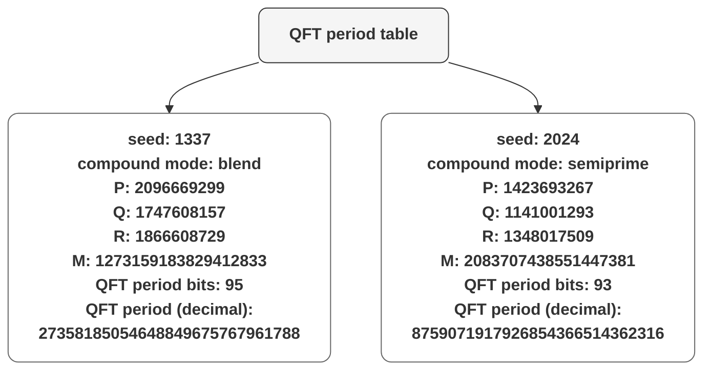
```mermaid
flowchart TB
  classDef root fill:#f5f5f5,stroke:#333,stroke-width:1px,font-weight:bold,rx:8,ry:8;
  classDef row  fill:#ffffff,stroke:#666,stroke-width:1px,rx:10,ry:10;

  T["QFT period table"]:::root

  T --> A["seed: 1337<br/>compound mode: blend<br/>P: 2096669299<br/>Q: 1747608157<br/>R: 1866608729<br/>M: 1273159183829412833<br/>QFT period bits: 95<br/>QFT period (decimal):<br/>27358185054648849675767961788"]:::row

  T --> B["seed: 2024<br/>compound mode: semiprime<br/>P: 1423693267<br/>Q: 1141001293<br/>R: 1348017509<br/>M: 2083707438551447381<br/>QFT period bits: 93<br/>QFT period (decimal):<br/>8759071917926854366514362316"]:::row
```

Additional multi-configuration outputs (other compound modes and seeds) are intended as supplementary material.

### 8.5 Evolvo synthesis: interpretation and constraints
Evolutionary campaigns are used here as automated design-space exploration. They
search for circuit policies under fixed objectives; they do not redefine PCPL
semantics and they do not replace correctness arguments in §6. The
repository-local synthesis is therefore read as evidence about implementable
circuit families, failure frontiers, and objective design.

The decisive conclusion is that PCPL should not be optimized as a single
self-healing token machine. The token path, route hardening, long-horizon sync,
and backend feasibility must be separated. The token path can remain compact
and sparse; the other concerns need explicit supervisory circuits and explicit
acceptance gates.

The stable design constraints are:

- Core PCPL invariants are easy to preserve under search: one-of-$x$, block
  fairness, permutation validity, replay rejection, and cross-lane separation
  remain saturated in the valid evidence family.
- Token recovery is not the observed attacker mode. It is zero in the complete
  valid full evidence, but that remains an empirical result rather than an
  impossibility claim. The stronger signal is lane/route inference from public
  phase and schedule structure.
- Sparse activation is not just a runtime trick. The best observed defender
  shape is the one-active-compound profile, with score falling as active
  compound density increases.
- Evolved defenders have not established a stable score ceiling above the hand
  sparse baselines. The evolved result is therefore architectural evidence, not
  a final optimum.
- Long-horizon synchronization is not solved by the token core. Projected
  horizon loss remains near saturation, so a precise external clock discipline
  and a separate supervisory layer are required.
- Native execution feasibility and archive evaluability are not equivalent to
  cryptographic correctness. They must be measured and gated separately.

The following table gives the paper-facing semantics of the latest tracked
conclusions in a self-contained form:

| evidence signal | paper interpretation | design consequence |
| --- | --- | --- |
| Principle invariants at `1.0000` | the construction preserves exact validation semantics | keep correctness proof tied to permutation and canonical recomputation |
| Token success at `0.0000` in complete valid evidence | token material recovery is not the active attacker mode, but absolute-zero should not be claimed | keep hash/KDF domain separation and preserve low-entropy stress-scenario attacker panels |
| Lane success nonzero while token success stays zero | route exposure is the useful adversarial pressure | add route-hardening objectives and schedule decorrelation metrics |
| One-active-compound bucket is strongest | sparse activation is a specification parameter, not only a speed optimization | state bouquet inventory and active subset size separately |
| Projected sync loss near saturation | long-window drift model remains the dominant weakness | do not claim the token core is a resynchronization solution |
| Best evolved defender below `minimal-cost` | evolution confirms sparse shape but not a new score ceiling | keep minimal-cost as a benchmark to beat |
| Runtime and evaluability weak under native execution | hardware feasibility and archive promotion are separate bottlenecks | add native backend gates, final-metric gates, and attacker-panel breadth gates |

### 8.6 Decisive circuit changes
The synthesis changes the practical PCPL circuit in the following decisive ways:

1. **Promote sparse activation to the specification surface.** A profile should
   state bouquet inventory size and active subset size separately. The current
   strongest direction is one active compound per cycle, with two active
   compounds as a nearby robustness point.
2. **Keep the token core feed-forward.** The core should perform phase
   extraction, sparse modular products, bounded mixing, KDF, truncation, and
   state-register update. It should not contain a large decision tree.
3. **Separate the synchronization supervisor.** Drift estimation, public accept
   window adjustment, recovery modes, and dead-idle avoidance belong outside the
   hot token equation and should be disciplined by a precise external clock.
4. **Separate the route-hardening monitor.** Lane salt epochs, schedule
   decorrelation, phase-jitter bounds, and lane-pressure estimates are
   supervisory inputs. They must remain public or provider-observable when they
   affect recomputation.
5. **Separate backend and archive auditing.** Timeout behavior, native GPU
   share, per-cycle fan-in, final metric availability, attacker-panel breadth,
   and plateau indicators are promotion criteria, not hidden terms inside token
   derivation.
6. **Reject post-init handshakes.** A candidate that needs extra runtime
   negotiation to select its formula is not a PCPL candidate. It changes the
   protocol and opens a new attack surface.

### 8.7 Circuit topology after synthesis
The practical circuit can be drawn as four cooperating machines. Only the first
machine computes token material; the others constrain public policy and decide
whether a profile is acceptable.

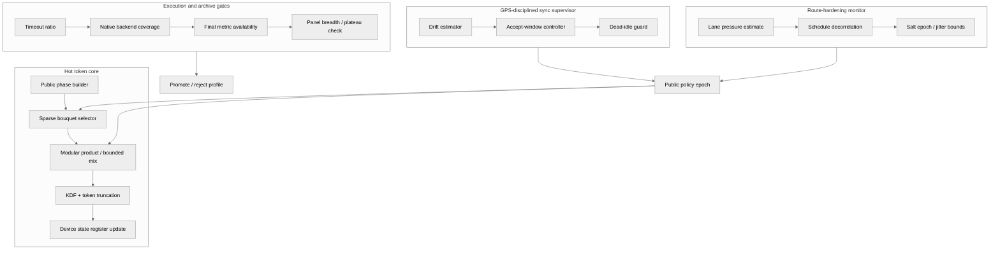
```mermaid
%%{init: {"theme":"neutral","flowchart":{"curve":"basis"}} }%%
flowchart TB
  subgraph Core["Hot token core"]
    C1["Public phase builder"]
    C2["Sparse bouquet selector"]
    C3["Modular product / bounded mix"]
    C4["KDF + token truncation"]
    C5["Device state register update"]
    C1 --> C2 --> C3 --> C4 --> C5
  end

  subgraph Sync["GPS-disciplined sync supervisor"]
    S1["Drift estimator"]
    S2["Accept-window controller"]
    S3["Dead-idle guard"]
    S1 --> S2 --> S3
  end

  subgraph Route["Route-hardening monitor"]
    R1["Lane pressure estimate"]
    R2["Schedule decorrelation"]
    R3["Salt epoch / jitter bounds"]
    R1 --> R2 --> R3
  end

  subgraph Audit["Execution and archive gates"]
    A1["Timeout ratio"]
    A2["Native backend coverage"]
    A3["Final metric availability"]
    A4["Panel breadth / plateau check"]
    A1 --> A2 --> A3 --> A4
  end

  Sync --> Policy["Public policy epoch"]
  Route --> Policy
  Audit --> Gate["Promote / reject profile"]
  Policy --> C2
  Policy --> C3
```

This topology avoids two common mistakes. First, it does not confuse a recovery
policy with token material. Second, it does not make hardware feasibility an
afterthought. A circuit that cannot complete stable evaluation under its
intended backend should not be promoted even if its token invariants look good.

### 8.8 Provider-observable control contract
Every value that changes provider token derivation must come from one of four
places:

- public configuration fixed at provisioning,
- public time/phase data,
- the provider's own lane-local secret material,
- explicit public fields carried with the emitted token.

The following are forbidden as token-derivation inputs:

- device-only seed or permutation state,
- other providers' bouquets or lane memory,
- hidden tokens emitted to other lanes,
- evaluator-only global history,
- runtime challenge/response output after initial provisioning.

This rule is stronger than a coding guideline. It is what makes sparse policy
control compatible with blind provider recomputation. A policy can choose a
smaller active set or a different public salt epoch, but the provider must be
able to derive the same choice without asking the device.

### 8.9 Generalized token-core pseudocode
The strongest evolved defender family can be translated into general PCPL
pseudocode as a compact arithmetic/hash spine:

```text
TokenCore(i, t, bouquets_i, public_policy):
    phase = PublicPhase(t, P, Q, R)

    carry = compact_public_or_lane_local_carry(i, t, public_policy)
    active_A = choose_sparse_subset(bouquets_i.A, phase, i, public_policy)
    active_B = choose_sparse_subset(bouquets_i.B, phase, i, public_policy)
    active_C = choose_sparse_subset(bouquets_i.C, phase, i, public_policy)

    a_mix = modular_product(active_A, phase.a, carry)
    b_mix = modular_product(active_B, phase.b, carry)
    c_mix = modular_product(active_C, phase.c, carry)

    lane_value = bounded_hash_phase_mix(a_mix, b_mix, c_mix, phase.Phi)
    key = H(KDF || enc_i(i) || enc_t(t) || enc(lane_value) || phase.Phi)
    token = Trunc_k(H(TOK || key || enc_t(t) || phase.Phi))
    return token
```

The critical property is that `carry` must be public or lane-local if the
provider uses it. Device-only state can still update the device's internal
chain after emission, but it cannot be required for provider recomputation.

### 8.10 Route-hardening pseudocode
The attacker model suggested by the synthesis is a public-feature lane
predictor. The defense should therefore measure and harden route exposure, not
only token inversion.

```text
RouteHardeningWindow(window):
    public_features = collect_phase_slot_epoch_features(window)
    lane_pressure = estimate_lane_predictability(public_features)
    repeated_bias = detect_schedule_bias(public_features)

    if lane_pressure > lane_pressure_bound:
        increase_schedule_decorrelation()
        rotate_public_lane_salt_epoch()

    if repeated_bias > bias_bound:
        change_public_stride_seed()
        tighten_phase_jitter_bound()

    emit next public route-hardening profile
```

This defense has to remain conservative. Excessive jitter can damage
recomputability; excessive salt churn can become an implicit handshake. The
goal is bounded public decorrelation, not hidden adaptive routing.

### 8.11 Synchronization pseudocode
Long-horizon synchronization is the decisive unresolved weakness. The correct
engineering answer is not to make the token core more complex. It is to define
a precise timing supervisor that both sides can reason about.

```text
SyncSupervisor(window, precise_time_reference):
    expected_t = cycle_from_epoch(precise_time_reference)
    observed_accepts = count_accepts(window)
    observed_rejects = count_rejects(window)
    drift = estimate_drift(expected_t, window.local_cycle)

    if abs(drift) <= normal_bound:
        mode = STEADY
        accept_window = nominal_window

    else if abs(drift) <= recovery_bound:
        mode = RECOVERY
        accept_window = widened_public_window(drift)

    else:
        mode = FAIL_CLOSED
        accept_window = none

    publish mode and window for the next public policy epoch
```

The supervisor is allowed to fail closed. It is not allowed to perform a
post-initialization challenge/response repair. If recovery requires private
negotiation, it is outside this PCPL design.

### 8.12 Potential improvements
The next productive improvements are specific:

- **Parameterize sparse profiles.** Document concrete profiles such as
  `inventory=5, active=1`, `inventory=5, active=2`, and larger inventories with
  fixed active count. Compare security and route exposure, not only score.
- **Increase route-hardening pressure.** Add attacker panels that specialize in
  lane prediction, schedule bias detection, and public phase feature learning.
- **Improve sync modeling.** Replace a single projected-loss pressure with
  bounded drift regimes, fail-closed behavior, and explicit recovery windows
  tied to the external timing reference.
- **Audit native execution separately.** Track per-operation backend coverage,
  CPU fallback, final sync overhead, and per-cycle budget consumption.
- **Stabilize attacker-panel evaluation.** Promote only candidates with final
  metrics, bounded timeout rescue, and enough attacker-panel breadth to avoid
  one-attacker selection artifacts.
- **Split reporting.** Future reports should separate token invariants,
  route/lane inference, supervisory horizon sync, and runtime backend behavior.
- **Keep minimal-cost as a hard baseline.** A new evolved profile should not be
  called an improvement unless it beats minimal-cost or explains a security
  tradeoff that minimal-cost lacks.

### 8.13 Possible weaknesses
The current design still has meaningful weak points:

- **Long-horizon drift remains open.** Local invariants can be perfect while
  projected sync loss is unacceptable. This is the main engineering frontier.
- **Route leakage is not eliminated.** Even when token guesses fail, attackers
  may learn small lane/route biases from public timing and phase structure.
- **Sparse activation may reduce mixing margin if misparameterized.** The
  inventory can be large, but the active subset schedule must still provide
  enough domain separation and period diversity.
- **Policy complexity can break recomputability.** If a policy depends on
  device-only state, it is invalid for blind providers.
- **Backend instability can distort search.** Timeout rescue and uneven native
  coverage can make a candidate look better than it is as a circuit.
- **Near-constant metrics can hide plateaus.** QFT, linear-rank, and compare-$x$
  checks are useful constraints, but under fixed scenario families they may not
  provide enough gradient for search.
- **Generation-0 survival can hide weak search pressure.** If final selections
  stay close to initial candidates, the evidence is better read as confirmation
  of a motif than as discovery of a mature controller.
- **The hand sparse baseline is still strong.** Evolution currently confirms
  the sparse architecture more than it discovers a better one.

## 9. Discussion and limitations
- Parameter choice matters; $P, Q, R, M$ must be prime and pairwise coprime, and
  their public period should be selected for the deployment horizon.
- The permutation schedule is device-only; leakage of the permutation key can
  reveal lane order, but not lane tokens by itself.
- The security of the scheme relies on the strength of $H(\cdot)$, strict
  domain separation, and bouquet secrecy, not on the hardness of factoring
  revealed integers.
- The public period $\mathrm{lcm}(P,Q,R,x)$ is visible and QFT-recoverable, so
  period size is a public engineering parameter rather than a hidden defense.
- For testing, primes and compound bases can be generated from a seeded stream
  to avoid arbitrary constants; production use still needs a real entropy-source
  story and deterministic expansion contract. [6][7][23]
- Co-evolution evidence supports a one-active-compound sparse selector over a
  fixed arithmetic PCPL core, not a dense universal controller.
- Sparse activation should not be confused with weak provisioning. The bouquet
  inventory can remain large; only the per-cycle active subset is small.
- Long-horizon synchronization remains the dominant practical weakness:
  resynchronization logic must be specified as a GPS-disciplined supervisory
  circuit with explicit drift bounds, recovery windows, and fail-closed rules.
- Attacker evidence is stronger on lane inference than on token inversion.
  Route-hardening should be evaluated directly because attackers can gain small
  advantages from public timing and phase features even when token guesses fail.
- Provider-side recomputation requires a strict input contract. Policy circuits
  must not depend on device-only state or on tokens sent only to other providers
  unless those values are explicitly public and reproducible.
- Post-initialization handshakes are excluded from the design. A solution that
  needs runtime challenge/response repair is solving a different problem.
- Practical optimization should prioritize phase-error regulation, horizon-sync
  gating, lane-hardening, and native execution coverage before further cost
  compression.
- Empirical score values are not absolute physical constants; they depend on
  the chosen objective set and weights. Cross-run comparisons should include
  objective-version metadata.
- QFT, linear-rank, and compare-$x$ terms validate important constraints, but
  under fixed scenario families they can become near-constant and provide
  limited evolutionary gradient.
- Panel fragility, timeout rescue, missing final metrics, and generation-0
  survival remain process weaknesses. Archive acceptance needs hard gates for
  final-metric availability, provider-observable inputs, bounded timeout ratio,
  attacker-panel breadth, and native execution coverage.
- The hand sparse baseline remains strong. Evolved candidates should be treated
  as architectural evidence until they beat that baseline or justify a clear
  security tradeoff.
- Evolutionary search is heuristic optimization, not a formal proof technique;
  correctness remains grounded in the protocol construction and invariants. [28][29]
- This paper was developed and formatted with the help of OpenAI models.

## 10. Conclusion
PCPL provides a deterministic, no-handshake token protocol with exact 1-of-$x$ matching and a device-only chaining mechanism. Combined with symmetric continuous tokenizer devices, it supports provider validation and peer-to-peer isolation with dynamic, evolving secrets.

The latest deterministic and evolutionary evidence makes the implementation direction more precise. The core token protocol is stable: permutation validity, per-block fairness, one-of-$x$ matching, replay rejection, and cross-lane separation remain saturated in valid evidence rows. The strongest evolved shape is a one-active-compound sparse profile, but it still does not beat the hand sparse baseline. The practical circuit should therefore not be a large opaque controller. It should be a sparse, feed-forward arithmetic token core coupled to a GPS-disciplined synchronization supervisor, a route-hardening monitor, and an execution audit layer.

The main remaining challenge is not token correctness. It is long-horizon synchronization, provider-observable control inputs, native execution stability, and resistance to lane-prediction leakage. Evolutionary search is useful for exposing these motifs and failure modes, but the protocol's correctness still comes from the construction: deterministic phase computation, private per-block permutation, domain-separated lane token derivation, and canonical recomputation by the intended provider.

The decisive implementation direction is conservative: keep the token core small, make active compound count explicit, assume a precise external timing reference, reject post-initialization handshakes, and report route exposure, horizon sync, runtime headroom, and archive evaluability separately from token invariants. Under those constraints, PCPL remains a plausible no-handshake lane-token protocol while leaving the open engineering work visible instead of hiding it inside an overcomplicated circuit.

## References
1. [NIST FIPS 180-4 (Update 1), *Secure Hash Standard (SHS)*](https://csrc.nist.gov/pubs/fips/180-4/upd1/final)
2. [NIST FIPS 202, *SHA-3 Standard: Permutation-Based Hash and Extendable-Output Functions*](https://csrc.nist.gov/pubs/fips/202/final)
3. [RFC 7693, *The BLAKE2 Cryptographic Hash and Message Authentication Code*](https://www.rfc-editor.org/rfc/rfc7693.html)
4. [RFC 2104, *HMAC: Keyed-Hashing for Message Authentication*](https://www.rfc-editor.org/rfc/rfc2104.html)
5. [RFC 5869, *HMAC-based Extract-and-Expand Key Derivation Function (HKDF)*](https://datatracker.ietf.org/doc/html/rfc5869)
6. [NIST SP 800-90A Rev. 1, *Recommendation for Random Number Generation Using Deterministic Random Bit Generators*](https://csrc.nist.gov/pubs/sp/800/90/a/r1/final)
7. [RFC 4086, *Randomness Requirements for Security*](https://datatracker.ietf.org/doc/html/rfc4086)
8. [RFC 8017, *PKCS #1: RSA Cryptography Specifications Version 2.2* — I2OSP/OS2IP](https://www.rfc-editor.org/rfc/rfc8017.html)
9. [NIST SP 800-185, *SHA-3 Derived Functions: cSHAKE, KMAC, TupleHash, and ParallelHash*](https://csrc.nist.gov/pubs/sp/800/185/final)
10. [NIST SP 800-56C Rev. 2, *Recommendation for Key-Derivation Methods in Key-Establishment Schemes*](https://csrc.nist.gov/pubs/sp/800/56/c/r2/final)
11. [RFC 4226, *HOTP: An HMAC-Based One-Time Password Algorithm*](https://www.rfc-editor.org/rfc/rfc4226.html)
12. [RFC 6238, *TOTP: Time-Based One-Time Password Algorithm*](https://www.rfc-editor.org/rfc/rfc6238.html)
13. [RFC 5905, *Network Time Protocol Version 4: Protocol and Algorithms Specification*](https://datatracker.ietf.org/doc/html/rfc5905)
14. [R. Durstenfeld (1964), “Algorithm 235: Random permutation”, *Communications of the ACM* 7(7)](https://dl.acm.org/doi/10.1145/364520.364540)
15. [B. Gassend, D. Clarke, M. van Dijk, and S. Devadas (2002), “Controlled Physical Random Functions”, ACSAC ’02](https://people.csail.mit.edu/devadas/pubs/cpuf.pdf)
16. [G. E. Suh and S. Devadas (2007), “Physical Unclonable Functions for Device Authentication and Secret Key Generation”, DAC ’07](https://people.csail.mit.edu/devadas/pubs/puf-dac07.pdf)
17. [P. C. Kocher (1996), “Timing Attacks on Implementations of Diffie-Hellman, RSA, DSS, and Other Systems”, CRYPTO ’96](https://paulkocher.com/doc/TimingAttacks.pdf)
18. [P. W. Shor (1994), “Algorithms for Quantum Computation: Discrete Logarithms and Factoring”, FOCS ’94](https://dl.acm.org/doi/10.1109/SFCS.1994.365700)
19. [M. A. Nielsen and I. L. Chuang, *Quantum Computation and Quantum Information*, Cambridge University Press](https://www.cambridge.org/highereducation/books/quantum-computation-and-quantum-information/01E10196D0A682A6AEFFEA52D53BE9AE)
20. [A. Menezes, P. van Oorschot, and S. Vanstone, *Handbook of Applied Cryptography*, Chapter 2: Mathematical Background](https://cacr.uwaterloo.ca/hac/about/chap2.pdf)
21. [RFC 9380, *Hashing to Elliptic Curves* — domain separation tags and hash-to-field encodings](https://datatracker.ietf.org/doc/html/rfc9380)
22. [NIST SP 800-108 Rev. 1, *Recommendation for Key Derivation Using Pseudorandom Functions*](https://csrc.nist.gov/pubs/sp/800/108/r1/final)
23. [NIST SP 800-90B, *Recommendation for the Entropy Sources Used for Random Bit Generation*](https://csrc.nist.gov/pubs/sp/800/90/b/final)
24. [NIST SP 800-63B, *Digital Identity Guidelines: Authentication and Lifecycle Management*](https://pages.nist.gov/800-63-4/sp800-63b.html)
25. [RFC 7518, *JSON Web Algorithms (JWA)* — constant-time HMAC validation guidance](https://datatracker.ietf.org/doc/html/rfc7518)
26. [NIST Dictionary of Algorithms and Data Structures, “Fisher-Yates shuffle”](https://www.nist.gov/dads/HTML/fisherYatesShuffle.html)
27. [NIST IR 8318, *The On-Line Dictionary of Algorithms and Data Structures*](https://nvlpubs.nist.gov/nistpubs/ir/2020/NIST.IR.8318.pdf)
28. [J. H. Holland, *Adaptation in Natural and Artificial Systems*, MIT Press](https://mitpress.mit.edu/9780262082136/adaptation-in-natural-and-artificial-systems/)
29. [J. R. Koza, *Genetic Programming: On the Programming of Computers by Means of Natural Selection*, MIT Press](https://mitpress.mit.edu/9780262527910/genetic-programming/)
30. [A. Menezes, P. van Oorschot, and S. Vanstone, *Handbook of Applied Cryptography*, Chapter 14: Efficient Implementation](https://cacr.uwaterloo.ca/hac/about/chap14.pdf)

[1]: https://csrc.nist.gov/pubs/fips/180-4/upd1/final
[2]: https://csrc.nist.gov/pubs/fips/202/final
[3]: https://www.rfc-editor.org/rfc/rfc7693.html
[4]: https://www.rfc-editor.org/rfc/rfc2104.html
[5]: https://datatracker.ietf.org/doc/html/rfc5869
[6]: https://csrc.nist.gov/pubs/sp/800/90/a/r1/final
[7]: https://datatracker.ietf.org/doc/html/rfc4086
[8]: https://www.rfc-editor.org/rfc/rfc8017.html
[9]: https://csrc.nist.gov/pubs/sp/800/185/final
[10]: https://csrc.nist.gov/pubs/sp/800/56/c/r2/final
[11]: https://www.rfc-editor.org/rfc/rfc4226.html
[12]: https://www.rfc-editor.org/rfc/rfc6238.html
[13]: https://datatracker.ietf.org/doc/html/rfc5905
[14]: https://dl.acm.org/doi/10.1145/364520.364540
[15]: https://people.csail.mit.edu/devadas/pubs/cpuf.pdf
[16]: https://people.csail.mit.edu/devadas/pubs/puf-dac07.pdf
[17]: https://paulkocher.com/doc/TimingAttacks.pdf
[18]: https://dl.acm.org/doi/10.1109/SFCS.1994.365700
[19]: https://www.cambridge.org/highereducation/books/quantum-computation-and-quantum-information/01E10196D0A682A6AEFFEA52D53BE9AE
[20]: https://cacr.uwaterloo.ca/hac/about/chap2.pdf
[21]: https://datatracker.ietf.org/doc/html/rfc9380
[22]: https://csrc.nist.gov/pubs/sp/800/108/r1/final
[23]: https://csrc.nist.gov/pubs/sp/800/90/b/final
[24]: https://pages.nist.gov/800-63-4/sp800-63b.html
[25]: https://datatracker.ietf.org/doc/html/rfc7518
[26]: https://www.nist.gov/dads/HTML/fisherYatesShuffle.html
[27]: https://nvlpubs.nist.gov/nistpubs/ir/2020/NIST.IR.8318.pdf
[28]: https://mitpress.mit.edu/9780262082136/adaptation-in-natural-and-artificial-systems/
[29]: https://mitpress.mit.edu/9780262527910/genetic-programming/
[30]: https://cacr.uwaterloo.ca/hac/about/chap14.pdf
