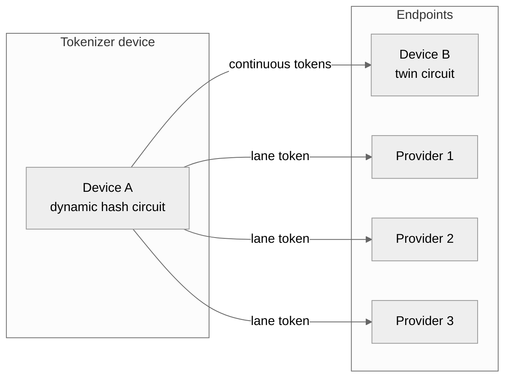
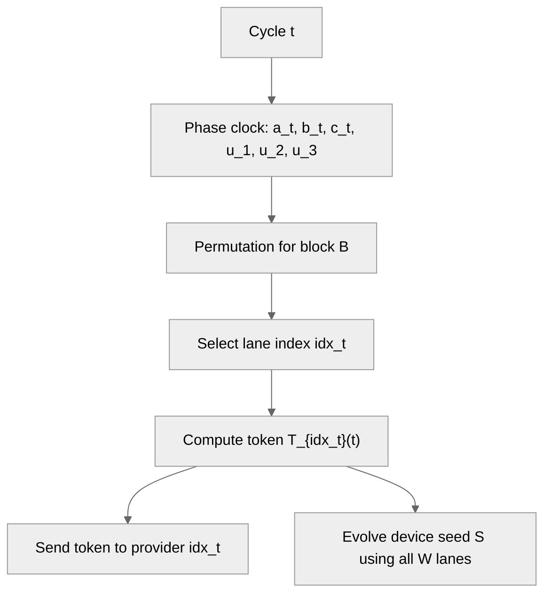
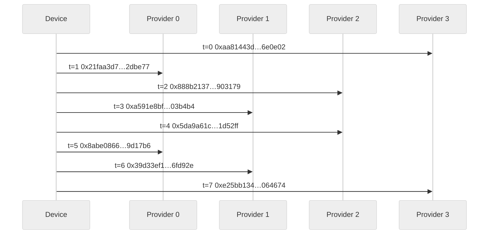

# Prime-Compound Phase-Lane Token Protocol (PCPL) for Symmetric Continuous Tokenizer Devices

## Abstract
We present the Prime-Compound Phase-Lane Token Protocol (PCPL), a no-handshake token system where a device emits one token per cycle and exactly one provider can validate it. PCPL combines (1) a public phase clock derived from coprime residues, (2) hidden prime-compound bouquets per provider, and (3) device-only state evolution that chains all lanes. We also introduce the symmetric continuous tokenizer device model, motivated by FPGA-based dynamic hash circuits and twin circuits for peer validation. A step-by-step algorithm description, correctness properties, and a deterministic simulation trace are provided.

## 1. Symmetric continuous tokenizer devices
PCPL runs on a “symmetric continuous tokenizer” device designed for consumer computing. The device is envisioned as a reconfigurable hardware unit (for example, an FPGA-based key) that can:

- Acquire unique, device-specific hashing circuits or internal start variables.
- Continuously generate short-lived tokens or keys.
- Be validated only by its twin circuit(s), which share the same circuit family or seed lineage.

The symmetry comes from pairing: two devices can load the same dynamic hash circuit and evolve internal state in the same way, enabling mutual validation without exposing the evolving secrets.

### 1.1 Forks by variable alternation
Beyond PCPL, the same circuit can be “forked” by alternating variable sets over time windows. Let a device maintain a base circuit $C$ and a family of variables $V_k$ selected by time window $W_k$. Each fork evolves as:

$$
\begin{aligned}
S_{t+1}^{(k)} &= H\!\left(C,\, S_t^{(k)},\, V_k,\, t\right), \\
&\quad t \in W_k.
\end{aligned}
$$

This creates multiple parallel token streams sharing the same circuit but with distinct, time-delimited variable schedules. Such forks can be used for provider lanes (as in PCPL) or for isolated peer-to-peer sessions that are difficult to parallelize or replay.

### 1.2 Peer-to-peer continuity
The device model also targets in-loco connections among peers. Two devices that share a circuit family and seed lineage can establish an isolated encryption context by evolving state in lockstep without querying a central provider.

## 2. System model and goals
PCPL is designed for:

- No runtime challenge/response or synchronization negotiation.
- One token per cycle, routed to exactly one provider out of $x$.
- Provider-side validation by local recomputation.

Threat model (minimal):

- A provider should not compute tokens for other providers.
- Observing accepted tokens should not reveal other lanes.
- Public time/phase information should not enable cross-lane forgery.

## 3. Notation and public parameters
Let:

- $x$ be the number of providers (lanes).
- $P, Q, R$ be pairwise coprime primes (also coprime with $x$).
- $M$ be a prime modulus for multiplicative-group arithmetic.
- $H(\cdot)$ be a cryptographic hash (or a dynamic hash circuit).
- $\mathrm{Trunc}_k(\cdot)$ be truncation to $k$ bits.
- $t$ be the cycle counter.
- $\|$ denote byte/bit-string concatenation.

Each provider $i$ has three secret bouquets: $\mathrm{BouquetA}_i, \mathrm{BouquetB}_i, \mathrm{BouquetC}_i$, each a list of prime compounds.

## 4. PCPL protocol overview
The protocol uses:

1. A public phase clock (CRT residues and coupled products).
2. A per-block permutation schedule to enforce “returns every $x$”.
3. Hidden bouquets to derive lane-specific tokens.
4. Device-only seed evolution that chains all lanes.

## 5. Step-by-step algorithm

### 5.1 Phase clock
For cycle $t$:

$$
\begin{aligned}
a_t &= (a_0 + t) \bmod P, \\
b_t &= (b_0 + t) \bmod Q, \\
c_t &= (c_0 + t) \bmod R.
\end{aligned}
$$

Coupled products:

$$
\begin{aligned}
u_1 &= (a_t\, b_t) \bmod M, \\
u_2 &= (b_t\, c_t) \bmod M, \\
u_3 &= (c_t\, a_t) \bmod M.
\end{aligned}
$$

Phase digest:

$$
\Phi_t = H\!\left(a_t \| b_t \| c_t \| u_1 \| u_2 \| u_3 \| \text{"PHASE"}\right).
$$

### 5.2 Permutation schedule (“returns every x”)
Let:

$$
B = \left\lfloor \frac{t}{x} \right\rfloor, \quad s = t \bmod x.
$$

Compute a permutation $\pi_B$ of $\{0,\ldots,x-1\}$ using a hash-driven shuffle seeded by a block-level phase digest (computed at $t = B\cdot x$) so the schedule is stable within each block. Then:

$$
\mathrm{idx}_t = \pi_B[s].
$$

This guarantees each provider appears exactly once per block.

### 5.3 Bouquet evaluation
Each bouquet is a list of compounds $C_j$, each a product of primes. For a residue $x_{\mathrm{res}}$ and coupling $u$, define:

$$
e_j = H\!\left(x_{\mathrm{res}} \| u \| j \| \text{"EXP"}\right) \bmod (M-1).
$$

$$
\mathrm{Eval}(\mathrm{Bouquet}, x_{\mathrm{res}}, u) = \prod_j C_j^{e_j} \bmod M.
$$

For provider $i$:

$$
\begin{aligned}
EA_i(t) &= \mathrm{Eval}(\mathrm{BouquetA}_i, a_t, u_1), \\
EB_i(t) &= \mathrm{Eval}(\mathrm{BouquetB}_i, b_t, u_2), \\
EC_i(t) &= \mathrm{Eval}(\mathrm{BouquetC}_i, c_t, u_3).
\end{aligned}
$$

### 5.4 Token derivation
Key derivation:

$$
K_i(t) = H\!\left(EA_i \| EB_i \| EC_i \| \Phi_t \| \text{"KDF"}\right).
$$

Token:

$$
T_i(t) = \mathrm{Trunc}_k\!\left(H\!\left(K_i \| t \| \Phi_t \| \text{"TOK"}\right)\right).
$$

### 5.5 Device emission and state evolution
The device computes only $T_{\mathrm{idx}_t}(t)$ and updates internal state:

- $W[i]$ stores the last token for lane $i$.
- The seed $S$ evolves using all lanes and adjacent products.

For $x$ lanes, define (non-cyclic adjacency):

$$
m_\ell = (W_\ell \cdot W_{\ell+1}) \bmod M, \quad \ell = 0,\ldots,x-2.
$$

$$
S_{t+1} = H\!\left(
S_t \| W_0 \| \cdots \| W_{x-1} \| m_0 \| \cdots \| m_{x-2} \| \Phi_t \| \text{"EVOLVE"}
\right).
$$

### 5.6 Provider verification
Provider $i$ recomputes $T_i(t)$ and accepts the token iff it matches.

## 6. Correctness and periodicity

### 6.1 Exact 1-of-x matching
Within each block of length $x$, $\pi_B$ is a permutation. Therefore each provider index appears exactly once per block, and exactly one provider matches per cycle.

### 6.2 Phase periodicity
If $P, Q, R$ are coprime, the tuple $(a_t, b_t, c_t)$ repeats after $PQR$. If $P, Q, R$ are also coprime with $x$, the deterministic schedule repeats after $PQRx$.

### 6.3 Modular exponent correctness
With $M$ prime, the multiplicative group $\mathbb{F}_M^\*$ has order $M-1$. Reducing exponents modulo $M-1$ makes $C_j^{e_j} \bmod M$ well-defined for any base $C_j$ not divisible by $M$.

## 7. Security intuition (informal)
- **Lane isolation:** each provider uses distinct secret bouquets, so observing one lane does not reveal others.
- **Phase coupling:** public residues are mixed and hashed, preventing linear predictability from the CRT clock alone.
- **Device chaining:** even stale lanes influence future state, reinforcing the requirement that “every token matters”.

## 8. Experimental validation (deterministic simulation)
We implemented a cycle-by-cycle simulator to validate correctness. The demo verifies:

- Each block yields a valid permutation.
- Exactly one provider matches each cycle.
- Each provider appears once per block.

### 8.1 Sample token trace (x=4, seed=1337)
For PDF export, the original wide table was replaced with an A4-friendly summary table and a sequence diagram (tokens truncated for readability; the matched provider’s recomputed token equals the device token by construction).

| t | block | slot | idx_t | device token (truncated) | matched provider |
|---:|---:|---:|---:|---|---:|
| 0 | 0 | 0 | 3 | `0xaa81443d…6e0e02` | 3 |
| 1 | 0 | 1 | 0 | `0x21faa3d7…2dbe77` | 0 |
| 2 | 0 | 2 | 2 | `0x888b2137…903179` | 2 |
| 3 | 0 | 3 | 1 | `0xa591e8bf…03b4b4` | 1 |
| 4 | 1 | 0 | 2 | `0x5da9a61c…1d52ff` | 2 |
| 5 | 1 | 1 | 0 | `0x8abe0866…9d17b6` | 0 |
| 6 | 1 | 2 | 1 | `0x39d33ef1…6fd92e` | 1 |
| 7 | 1 | 3 | 3 | `0xe25bb134…064674` | 3 |

### 8.2 Full token trace (verbatim values)

This trace covers four full blocks (t=0..15) so the provider order is visible. The matching order is not round-robin; it is defined per block by a permutation derived from the block phase digest. As a result, the order can look irregular, and **consecutive matches across a block boundary are expected** (e.g., P3 matches at t=11 and t=12 because block 2 ends with P3 and block 3 begins with P3). The tables are split by lane to keep the layout A4-friendly.

The schedule is:

$$
\pi_B = Permute(perm\_key, \Phi_{B \cdot x}), \quad idx_t = \pi_B[t \bmod x]
$$

**Block-level permutations (x=4, seed=1337)**

| block B | pi_B (slot order 0..3) | matching order |
| --- | --- | --- |
| 0 | [3, 0, 2, 1] | P3 → P0 → P2 → P1 |
| 1 | [2, 0, 1, 3] | P2 → P0 → P1 → P3 |
| 2 | [0, 1, 2, 3] | P0 → P1 → P2 → P3 |
| 3 | [3, 2, 1, 0] | P3 → P2 → P1 → P0 |

**Schedule (device-selected provider per cycle)**

| t | block | slot | idx (device routes to) |
| --- | --- | --- | --- |
| 0 | 0 | 0 | 3 |
| 1 | 0 | 1 | 0 |
| 2 | 0 | 2 | 2 |
| 3 | 0 | 3 | 1 |
| 4 | 1 | 0 | 2 |
| 5 | 1 | 1 | 0 |
| 6 | 1 | 2 | 1 |
| 7 | 1 | 3 | 3 |
| 8 | 2 | 0 | 0 |
| 9 | 2 | 1 | 1 |
| 10 | 2 | 2 | 2 |
| 11 | 2 | 3 | 3 |
| 12 | 3 | 0 | 3 |
| 13 | 3 | 1 | 2 |
| 14 | 3 | 2 | 1 |
| 15 | 3 | 3 | 0 |

**Lane traces (verbatim 128-bit tokens)**  
A checkmark means “this lane matches the device token for that cycle” (and therefore is the chosen lane).

#### DEVICE (emitted token)
| t | DEVICE token (128-bit) | matches provider |
| --- | --- | --- |
| 0 | `0xaa81443db40b5b1c43097327166e0e02` | P3 |
| 1 | `0x21faa3d7dacdd0e36103bdf69b2dbe77` | P0 |
| 2 | `0x888b21379781bc887f5d778c7b903179` | P2 |
| 3 | `0xa591e8bf0845bb6a46322befc003b4b4` | P1 |
| 4 | `0x5da9a61cd51d3ff367ba3113eb1d52ff` | P2 |
| 5 | `0x8abe0866002f7ce535808b65879d17b6` | P0 |
| 6 | `0x39d33ef184e9b1ddde964a83f06fd92e` | P1 |
| 7 | `0xe25bb134f354591bc4575918a9064674` | P3 |
| 8 | `0xc56aa5739df722c31e25cd016960b0fc` | P0 |
| 9 | `0x5c02f89f89b84cb8257ad888fa3d9957` | P1 |
| 10 | `0x3707398b4758b9a1737c9911ac1a9812` | P2 |
| 11 | `0x3a0fc3432c4dd5ff8a8446a3102bd2de` | P3 |
| 12 | `0xc4b3f3bae0d20b9750b43f66c88f642c` | P3 |
| 13 | `0xf968d10c70dbbb379d3e3508c2251622` | P2 |
| 14 | `0x615f4764ec38edccd78387d2203d56eb` | P1 |
| 15 | `0x93af54dd5d79da451932ab9b4df9451f` | P0 |

#### Provider lane P0
| t | P0 token (128-bit) | match? |
| --- | --- | --- |
| 0 | `0xeeafece1251ccf687691135f062cb4d7` |  |
| 1 | `0x21faa3d7dacdd0e36103bdf69b2dbe77` | ✅ |
| 2 | `0x88ad5efb2c5761de52f141d23bc88540` |  |
| 3 | `0x816f62b524482e9f535a2554d1b201a4` |  |
| 4 | `0xfbcc12ba1996112e91f04f5e5752007b` |  |
| 5 | `0x8abe0866002f7ce535808b65879d17b6` | ✅ |
| 6 | `0xaf724603668afe9e530ec505758015fd` |  |
| 7 | `0x69e26d5ca4b56e5ea99891eaaf15792c` |  |
| 8 | `0xc56aa5739df722c31e25cd016960b0fc` | ✅ |
| 9 | `0xae80b360eb05a477cb2ac8ea2dd786bf` |  |
| 10 | `0x420b9e2d7ad7cdb5d0d4b487303f2f83` |  |
| 11 | `0x43fa9c9ceaf9dfb8484de6bd801cbd8f` |  |
| 12 | `0x1e85d55fdc37d0c649ac9f87f969b652` |  |
| 13 | `0xb0e25671a557959fa14f17691393990f` |  |
| 14 | `0xc87fefc64d406946a9e3faf2c82584d6` |  |
| 15 | `0x93af54dd5d79da451932ab9b4df9451f` | ✅ |

#### Provider lane P1
| t | P1 token (128-bit) | match? |
| --- | --- | --- |
| 0 | `0xed74cbe26554bf9a270f1d1d90dcb25d` |  |
| 1 | `0xfcb1104a0c0ba7f9fa257abb65f4484f` |  |
| 2 | `0x673bce6b3a80330a1421b1bcf7102326` |  |
| 3 | `0xa591e8bf0845bb6a46322befc003b4b4` | ✅ |
| 4 | `0xdfb35020bcc5eda2736a65a8660cd188` |  |
| 5 | `0xc64b06a0c2b808e627c3fe2910f0536d` |  |
| 6 | `0x39d33ef184e9b1ddde964a83f06fd92e` | ✅ |
| 7 | `0x5c0d14d5cabd38ca17d323d54d8f0bcf` |  |
| 8 | `0x31e897180054b0ace446266558de4576` |  |
| 9 | `0x5c02f89f89b84cb8257ad888fa3d9957` | ✅ |
| 10 | `0x05853bcdb9a0f096c698c1a8345420a1` |  |
| 11 | `0xd4565699201a3440b4cb70c15c48f3c8` |  |
| 12 | `0x3d49f02aaf8349cabff87adf656dddfb` |  |
| 13 | `0x298d005a6185ac15562addf92fa945c2` |  |
| 14 | `0x615f4764ec38edccd78387d2203d56eb` | ✅ |
| 15 | `0x295062766449b339d2babc59ab90d7bc` |  |

#### Provider lane P2
| t | P2 token (128-bit) | match? |
| --- | --- | --- |
| 0 | `0xf84da16f0a9d23ca92b9598c2cccc4fb` |  |
| 1 | `0xb7f7f5fb372075bde5349158efa5fca9` |  |
| 2 | `0x888b21379781bc887f5d778c7b903179` | ✅ |
| 3 | `0x8593eef83487f09b5b30612843e00397` |  |
| 4 | `0x5da9a61cd51d3ff367ba3113eb1d52ff` | ✅ |
| 5 | `0x1715f8e9f51c0129907481780e0d03bc` |  |
| 6 | `0x9dd506512423c063f94c259c4517aff2` |  |
| 7 | `0xffa8817c6c4d6b3806705a3446de34ba` |  |
| 8 | `0x4d202a4ce2de455dd2f12d699a8e2b65` |  |
| 9 | `0xcb3d5d9c1fcbefebd131ee67788f7e5c` |  |
| 10 | `0x3707398b4758b9a1737c9911ac1a9812` | ✅ |
| 11 | `0x5dd99772024b726362467dafd4a6ad5f` |  |
| 12 | `0x645bc475ddc85d3edd5fda65e100737f` |  |
| 13 | `0xf968d10c70dbbb379d3e3508c2251622` | ✅ |
| 14 | `0xa9af89ad1e47092f6cb6e3ff59f49430` |  |
| 15 | `0xad5621c5d6a249f4fd6cc130133e8e4a` |  |

#### Provider lane P3
| t | P3 token (128-bit) | match? |
| --- | --- | --- |
| 0 | `0xaa81443db40b5b1c43097327166e0e02` | ✅ |
| 1 | `0xcb440e82f41dd12c05d861a210208faa` |  |
| 2 | `0x39001496e37a7d61dcd0b67485376618` |  |
| 3 | `0xc204fbda03f97faa7bcf2a6b737960b3` |  |
| 4 | `0x0984a1b59d2493b60a85a6b186402bf0` |  |
| 5 | `0x7a42a0eae1727b8d0b41996c692ad5e3` |  |
| 6 | `0xa2a9e6284b90f8fa643db155f801e918` |  |
| 7 | `0xe25bb134f354591bc4575918a9064674` | ✅ |
| 8 | `0x9dcc87ed4663e699f271be1c571433e1` |  |
| 9 | `0xa1aec92a45a9b8309c51ebeae3708f91` |  |
| 10 | `0xf7ddca66eb47f0744b70b1cecffef59f` |  |
| 11 | `0x3a0fc3432c4dd5ff8a8446a3102bd2de` | ✅ |
| 12 | `0xc4b3f3bae0d20b9750b43f66c88f642c` | ✅ |
| 13 | `0xb1dbfeaa9135401f55cb6c6aa769a19b` |  |
| 14 | `0xd3deef9dbdd25c405c3af02dd6784ee5` |  |
| 15 | `0x53ecfce7eeab443e8223131846a1cc4a` |  |

## 9. Discussion and limitations
- Parameter choice matters; $P, Q, R, M$ must be prime and pairwise coprime.
- The permutation schedule is device-only; leakage of the permutation key can reveal lane order, but not lane tokens.
- The security of the scheme relies on the strength of $H(\cdot)$ and the secrecy of bouquets, not on the hardness of factoring revealed integers.

## 10. Conclusion
PCPL provides a deterministic, no-handshake token protocol with exact 1-of-$x$ matching and a device-only chaining mechanism. Combined with symmetric continuous tokenizer devices, it supports both provider validation and peer-to-peer isolation with dynamic, evolving secrets. The included simulation and trace demonstrate the protocol’s behavior cycle by cycle.
