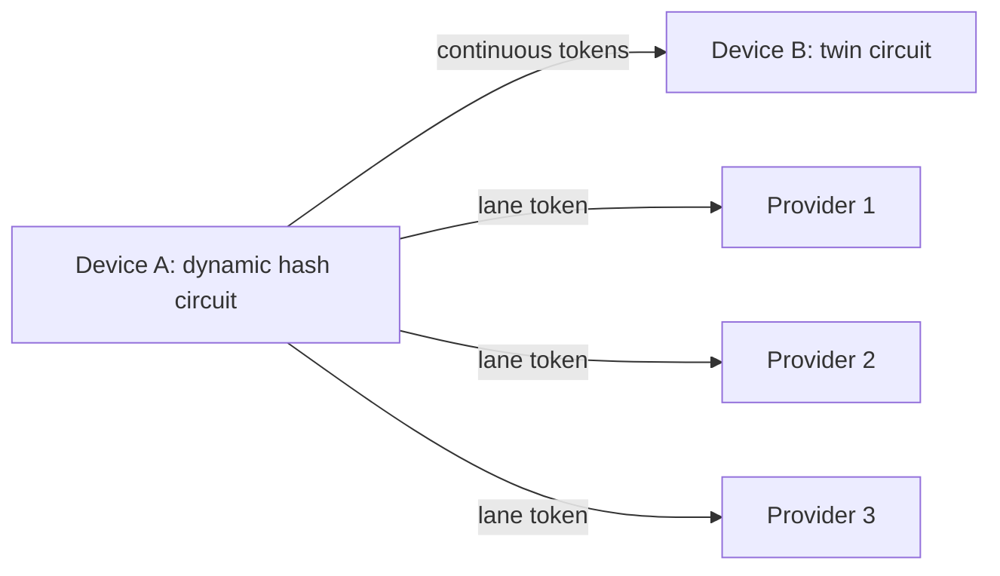

# Prime-Compound Phase-Lane Token Protocol (PCPL) for Symmetric Continuous Tokenizer Devices

## Abstract
We present the Prime-Compound Phase-Lane Token Protocol (PCPL), a no-handshake
token system where a device emits one token per cycle and exactly one provider
can validate it. PCPL combines (1) a public phase clock derived from coprime
residues, (2) hidden prime-compound bouquets per provider, and (3) device-only
state evolution that chains all lanes. We also introduce the symmetric continuous
tokenizer device model, motivated by FPGA-based dynamic hash circuits and twin
circuits for peer validation. A step-by-step algorithm description, correctness
properties, and a deterministic simulation trace are provided.

## 1. Symmetric continuous tokenizer devices (concept and motivation)
The broader platform for PCPL is a "symmetric continuous tokenizer" device
designed for consumer computing. The device is envisioned as a reconfigurable
hardware unit (for example, an FPGA-based key) that can:
- Acquire unique, device-specific hashing circuits or internal start variables.
- Continuously generate short-lived tokens or keys.
- Be validated only by its twin circuit(s), which share the same circuit family
  or seed lineage.

The symmetry comes from pairing: two devices can load the same dynamic hash
circuit and evolve internal state in the same way, enabling mutual validation
without exposing the evolving secrets.

### 1.1 Forks by variable alternation
Beyond PCPL, the same circuit can be "forked" by alternating variable sets over
time windows. Let a device maintain a base circuit `C` and a family of variables
`V_k` selected by time window `W_k`. Each fork evolves as:

$$
S_{t+1}^{(k)} = H(C, S_t^{(k)}, V_k, t), \quad t \in W_k
$$

This creates multiple parallel token streams sharing the same circuit but with
distinct, time-delimited variable schedules. Such forks can be used for
provider lanes (as in PCPL) or for isolated peer-to-peer sessions that are
difficult to parallelize or replay.

### 1.2 Peer-to-peer continuity
The device model also targets in-loco connections among peers. Two devices that
share a circuit family and seed lineage can establish an isolated encryption
context by evolving state in lockstep without querying a central provider.



## 2. System model and goals
PCPL is designed for:
- No runtime challenge/response or synchronization negotiation.
- One token per cycle, routed to exactly one provider out of `x`.
- Provider-side validation by local recomputation.

Threat model (minimal):
- A provider should not compute tokens for other providers.
- Observing accepted tokens should not reveal other lanes.
- Public time/phase information should not enable cross-lane forgery.

## 3. Notation and public parameters
Let:
- `x` be the number of providers.
- `P, Q, R` be pairwise coprime primes (also coprime with `x`).
- `M` be a prime modulus for multiplicative group arithmetic.
- `H()` be a cryptographic hash (or dynamic hash circuit).
- `Trunc_k()` truncate to `k` bits.
- `t` be the cycle counter.

Each provider `i` has three secret bouquets:
`BouquetA_i, BouquetB_i, BouquetC_i`, each a list of prime compounds.

## 4. PCPL protocol overview
The protocol uses:
1) A public phase clock (CRT residues and coupled products).
2) A per-block permutation schedule to enforce "returns every x".
3) Hidden bouquets to derive lane-specific tokens.
4) Device-only seed evolution that chains all lanes.

```mermaid
flowchart TD
  A[Cycle t] --> B[Phase clock: a_t,b_t,c_t,u1,u2,u3]
  B --> C[Permutation for block B]
  C --> D[Select lane idx_t]
  D --> E[Compute T_idx_t(t)]
  E --> F[Send token to provider idx_t]
  E --> G[Evolve device seed S using all W lanes]
```

## 5. Step-by-step algorithm

### 5.1 Phase clock
For cycle `t`:

$$
a_t = (a_0 + t) \bmod P,\quad
b_t = (b_0 + t) \bmod Q,\quad
c_t = (c_0 + t) \bmod R
$$

Coupled products:

$$
u_1 = (a_t b_t) \bmod M,\quad
u_2 = (b_t c_t) \bmod M,\quad
u_3 = (c_t a_t) \bmod M
$$

Phase digest:

$$
\Phi_t = H(a_t \| b_t \| c_t \| u_1 \| u_2 \| u_3 \| \text{"PHASE"})
$$

### 5.2 Permutation schedule ("returns every x")
Let:

$$
B = \lfloor t/x \rfloor,\quad s = t \bmod x
$$

Compute a permutation `pi_B` of `{0..x-1}` using a hash-driven shuffle seeded
by a block-level phase digest (computed at `t = B * x`) so the schedule is
stable within each block.
Then:

$$
idx_t = \pi_B[s]
$$

This guarantees each provider appears exactly once per block.

### 5.3 Bouquet evaluation
Each bouquet is a list of compounds `C_j`, each a product of primes. For a
residue `xres` and coupling `u`, define:

$$
e_j = H(xres \| u \| j \| \text{"EXP"}) \bmod (M-1)
$$

$$
Eval(Bouquet, xres, u) = \prod_j C_j^{e_j} \bmod M
$$

For provider `i`:

$$
EA_i(t) = Eval(BouquetA_i, a_t, u_1)
$$
$$
EB_i(t) = Eval(BouquetB_i, b_t, u_2)
$$
$$
EC_i(t) = Eval(BouquetC_i, c_t, u_3)
$$

### 5.4 Token derivation
Key derivation:

$$
K_i(t) = H(EA_i \| EB_i \| EC_i \| \Phi_t \| \text{"KDF"})
$$

Token:

$$
T_i(t) = Trunc_k(H(K_i \| t \| \Phi_t \| \text{"TOK"}))
$$

### 5.5 Device emission and state evolution
The device computes only `T_{idx_t}(t)` and updates internal state:
- `W[i]` stores the last token for lane `i`.
- The seed `S` evolves using all lanes and adjacent products.

For `x` lanes, define:

$$
m_\ell = (W_\ell \cdot W_{\ell+1}) \bmod M,\quad \ell = 0..x-2
$$

$$
S_{t+1} = H(S_t \| W_0 \| \cdots \| W_{x-1} \| m_0 \| \cdots \| m_{x-2}
          \| \Phi_t \| \text{"EVOLVE"})
$$

### 5.6 Provider verification
Provider `i` recomputes `T_i(t)` and accepts the token iff it matches.

## 6. Correctness and periodicity
### 6.1 Exact 1-of-x matching
Within each block of length `x`, `pi_B` is a permutation. Therefore each
provider index appears exactly once per block, and exactly one provider matches
per cycle.

### 6.2 Phase periodicity
If `P, Q, R` are coprime, the tuple `(a_t, b_t, c_t)` repeats after `PQR`.
If `P, Q, R` are also coprime with `x`, the deterministic schedule repeats
after `PQRx`.

### 6.3 Modular exponent correctness
With `M` prime, the group `F_M^*` has order `M-1`. Reducing exponents modulo
`M-1` makes `C_j^{e_j} mod M` well-defined for any base `C_j` not divisible by
`M`.

## 7. Security intuition (informal)
- Lane isolation: each provider uses distinct secret bouquets, so observing one
  lane does not reveal others.
- Phase coupling: public residues are mixed and hashed, preventing linear
  predictability from the CRT clock alone.
- Device chaining: even stale lanes influence future state, reinforcing the
  requirement that "every token matters".

## 8. Experimental validation (deterministic simulation)
We implemented a cycle-by-cycle simulator to validate correctness. The demo
verifies:
- Each block yields a valid permutation.
- Exactly one provider matches each cycle.
- Each provider appears once per block.

### 8.1 Sample token trace (x=4, seed=1337)
The following trace shows two full blocks. The device emits one token per cycle
and exactly one server token matches.

| t | block | slot | device idx | device token | server 0 token | server 1 token | server 2 token | server 3 token |
| --- | --- | --- | --- | --- | --- | --- | --- | --- |
| 0 | 0 | 0 | 3 | `0xaa81443db40b5b1c43097327166e0e02` | `0xeeafece1251ccf687691135f062cb4d7` | `0xed74cbe26554bf9a270f1d1d90dcb25d` | `0xf84da16f0a9d23ca92b9598c2cccc4fb` | `0xaa81443db40b5b1c43097327166e0e02` |
| 1 | 0 | 1 | 0 | `0x21faa3d7dacdd0e36103bdf69b2dbe77` | `0x21faa3d7dacdd0e36103bdf69b2dbe77` | `0xfcb1104a0c0ba7f9fa257abb65f4484f` | `0xb7f7f5fb372075bde5349158efa5fca9` | `0xcb440e82f41dd12c05d861a210208faa` |
| 2 | 0 | 2 | 2 | `0x888b21379781bc887f5d778c7b903179` | `0x88ad5efb2c5761de52f141d23bc88540` | `0x673bce6b3a80330a1421b1bcf7102326` | `0x888b21379781bc887f5d778c7b903179` | `0x39001496e37a7d61dcd0b67485376618` |
| 3 | 0 | 3 | 1 | `0xa591e8bf0845bb6a46322befc003b4b4` | `0x816f62b524482e9f535a2554d1b201a4` | `0xa591e8bf0845bb6a46322befc003b4b4` | `0x8593eef83487f09b5b30612843e00397` | `0xc204fbda03f97faa7bcf2a6b737960b3` |
| 4 | 1 | 0 | 2 | `0x5da9a61cd51d3ff367ba3113eb1d52ff` | `0xfbcc12ba1996112e91f04f5e5752007b` | `0xdfb35020bcc5eda2736a65a8660cd188` | `0x5da9a61cd51d3ff367ba3113eb1d52ff` | `0x0984a1b59d2493b60a85a6b186402bf0` |
| 5 | 1 | 1 | 0 | `0x8abe0866002f7ce535808b65879d17b6` | `0x8abe0866002f7ce535808b65879d17b6` | `0xc64b06a0c2b808e627c3fe2910f0536d` | `0x1715f8e9f51c0129907481780e0d03bc` | `0x7a42a0eae1727b8d0b41996c692ad5e3` |
| 6 | 1 | 2 | 1 | `0x39d33ef184e9b1ddde964a83f06fd92e` | `0xaf724603668afe9e530ec505758015fd` | `0x39d33ef184e9b1ddde964a83f06fd92e` | `0x9dd506512423c063f94c259c4517aff2` | `0xa2a9e6284b90f8fa643db155f801e918` |
| 7 | 1 | 3 | 3 | `0xe25bb134f354591bc4575918a9064674` | `0x69e26d5ca4b56e5ea99891eaaf15792c` | `0x5c0d14d5cabd38ca17d323d54d8f0bcf` | `0xffa8817c6c4d6b3806705a3446de34ba` | `0xe25bb134f354591bc4575918a9064674` |

## 9. Discussion and limitations
- Parameter choice matters; `P, Q, R, M` must be prime and pairwise coprime.
- The permutation schedule is device-only; leakage of `perm_key` can reveal
  lane order, but not lane tokens.
- The security of the scheme relies on the strength of `H()` and the secrecy
  of bouquets, not on the hardness of factoring revealed integers.

## 10. Conclusion
PCPL provides a deterministic, no-handshake token protocol with exact 1-of-x
matching and a device-only chaining mechanism. Combined with symmetric continuous
tokenizer devices, it supports both provider validation and peer-to-peer
isolation with dynamic, evolving secrets. The included simulation and trace
demonstrate the protocol's effective behavior cycle by cycle.
