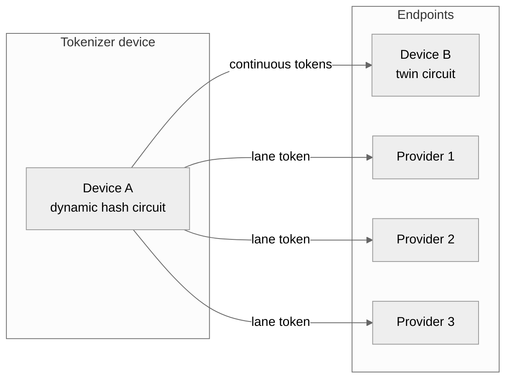
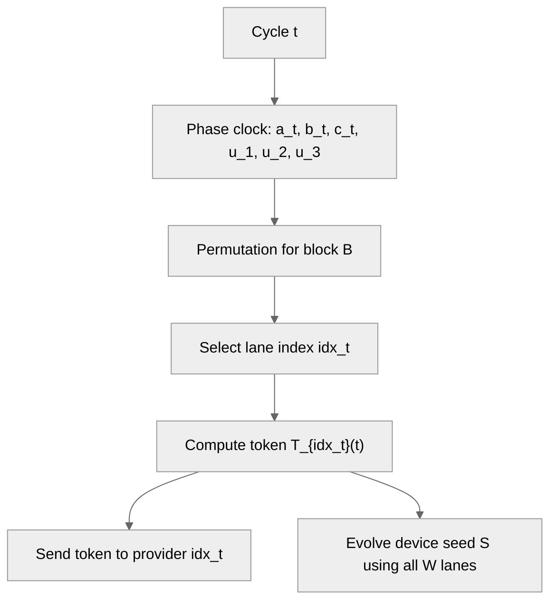
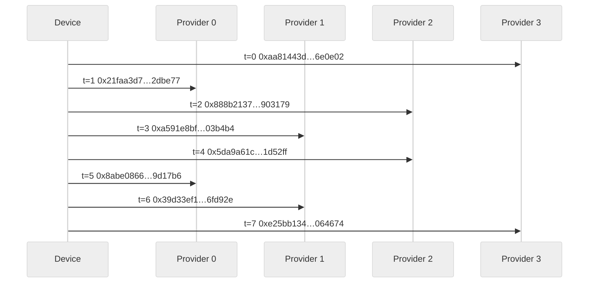

<table><tr><td>Riccardo Cecchini</td><td>rcecchini.ds[at]gmail.com</td><td>25 December 2025</td></tr></table>

# Prime-Compound Phase-Lane Token Protocol (PCPL) for Symmetric Continuous Tokenizer Devices

## Abstract
I present the Prime-Compound Phase-Lane Token Protocol (PCPL), a no-handshake token system where a device emits one token per cycle and exactly one provider can validate it. PCPL combines (1) a public phase clock derived from coprime residues, (2) hidden prime-compound bouquets per provider, and (3) device-only state evolution that chains all lanes. I also introduce the symmetric continuous tokenizer device model, motivated by FPGA-based dynamic hash circuits and twin circuits for peer validation. A step-by-step algorithm description, correctness properties, and a deterministic simulation trace are provided.

## 1. Symmetric continuous tokenizer devices
PCPL runs on a “symmetric continuous tokenizer” device designed for consumer computing. The device is envisioned as a reconfigurable hardware unit (for example, an FPGA-based key) that can:

- Acquire unique, device-specific hashing circuits or internal start variables.
- Continuously generate short-lived tokens or keys.
- Be validated only by its twin circuit(s), which share the same circuit family or seed lineage.

The symmetry comes from pairing: two devices can load the same dynamic hash circuit and evolve internal state in the same way, enabling mutual validation without exposing the evolving secrets.

### 1.1 Forks by variable alternation
Beyond PCPL, the same circuit can be “forked” by alternating variable sets over time windows. Let a device maintain a base circuit $C$ and a family of variables $V_k$ selected by time window $W_k$. Each fork evolves as:

$$
\begin{aligned}
S_{t+1}^{(k)} &= H\!\left(C,\, S_t^{(k)},\, V_k,\, t\right), \\
&\quad t \in W_k.
\end{aligned}
$$

This creates multiple parallel token streams sharing the same circuit but with distinct, time-delimited variable schedules. Such forks can be used for provider lanes (as in PCPL) or for isolated peer-to-peer sessions that are difficult to parallelize or replay.

### 1.2 Peer-to-peer continuity
The device model also targets in-loco connections among peers. Two devices that share a circuit family and seed lineage can establish an isolated encryption context by evolving state in lockstep without querying a central provider.

## 2. System model and goals
PCPL is designed for:

- No runtime challenge/response or synchronization negotiation.
- One token per cycle, routed to exactly one provider out of $x$.
- Provider-side validation by local recomputation.

Threat model (minimal):

- A provider should not compute tokens for other providers.
- Observing accepted tokens should not reveal other lanes.
- Public time/phase information should not enable cross-lane forgery.

## 3. Notation and public parameters
Let:

- $x$ be the number of providers (lanes).
- $P, Q, R$ be pairwise coprime primes (also coprime with $x$).
- $M$ be a prime modulus for multiplicative-group arithmetic.
- $H(\cdot)$ be a cryptographic hash (or a dynamic hash circuit).
- $\mathrm{Trunc}_k(\cdot)$ be truncation to $k$ bits.
- $t$ be the cycle counter.
- $\|$ denote byte/bit-string concatenation.

Each provider $i$ has three secret bouquets: $\mathrm{BouquetA}_i, \mathrm{BouquetB}_i, \mathrm{BouquetC}_i$, each a list of prime compounds.

## 4. PCPL protocol overview
The protocol uses:

1. A public phase clock (CRT residues and coupled products).
2. A per-block permutation schedule to enforce “returns every $x$”.
3. Hidden bouquets to derive lane-specific tokens.
4. Device-only seed evolution that chains all lanes.

## 5. Step-by-step algorithm

### 5.1 Phase clock
For cycle $t$:

$$
\begin{aligned}
a_t &= (a_0 + t) \bmod P, \\
b_t &= (b_0 + t) \bmod Q, \\
c_t &= (c_0 + t) \bmod R.
\end{aligned}
$$

Coupled products:

$$
\begin{aligned}
u_1 &= (a_t\, b_t) \bmod M, \\
u_2 &= (b_t\, c_t) \bmod M, \\
u_3 &= (c_t\, a_t) \bmod M.
\end{aligned}
$$

Phase digest:

$$
\Phi_t = H\!\left(a_t \| b_t \| c_t \| u_1 \| u_2 \| u_3 \| \text{"PHASE"}\right).
$$

### 5.2 Permutation schedule (“returns every x”)
Let:

$$
B = \left\lfloor \frac{t}{x} \right\rfloor, \quad s = t \bmod x.
$$

Compute a permutation $\pi_B$ of $\{0,\ldots,x-1\}$ using a hash-driven shuffle seeded by a block-level phase digest (computed at $t = B\cdot x$) so the schedule is stable within each block. Then:

$$
\mathrm{idx}_t = \pi_B[s].
$$

This guarantees each provider appears exactly once per block.

### 5.3 Bouquet evaluation
Each bouquet is a list of compounds $C_j$, each a product of primes. For a residue $x_{\mathrm{res}}$ and coupling $u$, define:

$$
e_j = H\!\left(x_{\mathrm{res}} \| u \| j \| \text{"EXP"}\right) \bmod (M-1).
$$

$$
\mathrm{Eval}(\mathrm{Bouquet}, x_{\mathrm{res}}, u) = \prod_j C_j^{e_j} \bmod M.
$$

For provider $i$:

$$
\begin{aligned}
EA_i(t) &= \mathrm{Eval}(\mathrm{BouquetA}_i, a_t, u_1), \\
EB_i(t) &= \mathrm{Eval}(\mathrm{BouquetB}_i, b_t, u_2), \\
EC_i(t) &= \mathrm{Eval}(\mathrm{BouquetC}_i, c_t, u_3).
\end{aligned}
$$

### 5.4 Token derivation
Key derivation:

$$
K_i(t) = H\!\left(EA_i \| EB_i \| EC_i \| \Phi_t \| \text{"KDF"}\right).
$$

Token:

$$
T_i(t) = \mathrm{Trunc}_k\!\left(H\!\left(K_i \| t \| \Phi_t \| \text{"TOK"}\right)\right).
$$

### 5.5 Device emission and state evolution
The device computes only $T_{\mathrm{idx}_t}(t)$ and updates internal state:

- $W[i]$ stores the last token for lane $i$.
- The seed $S$ evolves using all lanes and adjacent products.

For $x$ lanes, define (non-cyclic adjacency):

$$
m_\ell = (W_\ell \cdot W_{\ell+1}) \bmod M, \quad \ell = 0,\ldots,x-2.
$$

$$
S_{t+1} = H\!\left(
S_t \| W_0 \| \cdots \| W_{x-1} \| m_0 \| \cdots \| m_{x-2} \| \Phi_t \| \text{"EVOLVE"}
\right).
$$

### 5.6 Provider verification
Provider $i$ recomputes $T_i(t)$ and accepts the token iff it matches.

## 6. Correctness and periodicity

### 6.1 Exact 1-of-x matching
Within each block of length $x$, $\pi_B$ is a permutation. Therefore each provider index appears exactly once per block, and exactly one provider matches per cycle.

### 6.2 Phase periodicity
If $P, Q, R$ are coprime, the tuple $(a_t, b_t, c_t)$ repeats after $PQR$. If $P, Q, R$ are also coprime with $x$, the deterministic schedule repeats after $PQRx$.

### 6.3 Modular exponent correctness
With $M$ prime, the multiplicative group $\mathbb{F}_M^\*$ has order $M-1$. Reducing exponents modulo $M-1$ makes $C_j^{e_j} \bmod M$ well-defined for any base $C_j$ not divisible by $M$.

## 7. Security intuition (informal)
- **Lane isolation:** each provider uses distinct secret bouquets, so observing one lane does not reveal others.
- **Phase coupling:** public residues are mixed and hashed, preventing linear predictability from the CRT clock alone.
- **Device chaining:** even stale lanes influence future state, reinforcing the requirement that “every token matters”.

## 8. Experimental validation (deterministic simulation)
We implemented a cycle-by-cycle simulator to validate correctness. The demo verifies:

- Each block yields a valid permutation.
- Exactly one provider matches each cycle.
- Each provider appears once per block.

### 8.1 Sample token trace (x=4, seed=1337)
For PDF export, the original wide table was replaced with an A4-friendly summary table and a sequence diagram (tokens truncated for readability; the matched provider’s recomputed token equals the device token by construction).

| t | block | slot | idx_t | device token (truncated) | matched provider |
|---:|---:|---:|---:|---|---:|
| 0 | 0 | 0 | 3 | `0xaa81443d…6e0e02` | 3 |
| 1 | 0 | 1 | 0 | `0x21faa3d7…2dbe77` | 0 |
| 2 | 0 | 2 | 2 | `0x888b2137…903179` | 2 |
| 3 | 0 | 3 | 1 | `0xa591e8bf…03b4b4` | 1 |
| 4 | 1 | 0 | 2 | `0x5da9a61c…1d52ff` | 2 |
| 5 | 1 | 1 | 0 | `0x8abe0866…9d17b6` | 0 |
| 6 | 1 | 2 | 1 | `0x39d33ef1…6fd92e` | 1 |
| 7 | 1 | 3 | 3 | `0xe25bb134…064674` | 3 |

### 8.2 Full token trace (verbatim values)

The full deterministic trace (block permutations, schedule, device tokens, and per-lane tokens) is exported to a separate, auto-generated file to keep the paper A4-friendly. See `papers/token-trace.md`, generated by `demo/export_token_trace.py`.

Regenerate with:
`python3 demo/export_token_trace.py --blocks 4 --out papers/token-trace.md`

## 9. Discussion and limitations
- Parameter choice matters; $P, Q, R, M$ must be prime and pairwise coprime.
- The permutation schedule is device-only; leakage of the permutation key can reveal lane order, but not lane tokens.
- The security of the scheme relies on the strength of $H(\cdot)$ and the secrecy of bouquets, not on the hardness of factoring revealed integers.

## 10. Conclusion
PCPL provides a deterministic, no-handshake token protocol with exact 1-of-$x$ matching and a device-only chaining mechanism. Combined with symmetric continuous tokenizer devices, it supports both provider validation and peer-to-peer isolation with dynamic, evolving secrets. The included simulation and trace demonstrate the protocol’s behavior cycle by cycle.
