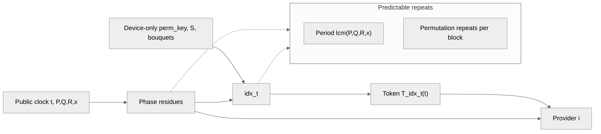

3 Oct 2025

Riccardo Cecchini - rcecchini.ds[at]gmail.com

## Premises

This concept is more than 10 years old (by me). Then, "FIDO-keys" and similar devices hit the market. I've always been fascinated by FPGAs, and among their many potentialities was this: the creation of unique and unrepeatable hashing circuits for encryption.

But I have a huge lack in marketing (or more precisely, in project presentations), and even bigger in "risking to create a technology used by the wrong people". At this point, I think that it doesn't matter: if you don't invent it by yourself, another one will. In fact, most of concepts reported in this "drafts" documents are well known in today's hardware security key.

So I write this document not to create a new concurrent ID USB key, but instead create a sort of protocol to make these devices accessible and well known by everybody. Because, yes, the creature that I used to call "td student", it's still practically too expensive and opaque to me still today.

---

The document contains all the various mental sagas on the subject, aimed at understanding where "we can establish protocols among competitors" but also "where to clarify the limits that could be abused by criminal organizations." On this point, I have to give up a little: those with money can always afford to overcome limits and backdoors.

I'm sharing with you this document to highlight the potential (and limitations) of a general abstraction that uses specific FPGA SoCs to maximize its utility and limit its control by specific manufacturers and providers, to the point of making it plausible to use the USB key even without having to go through one but simply by physically pairing it with the key of an acquaintance of ours.

At the moment, I consider the most practical to use, at least in development, to be Intel FPGAs, especially those capable of rewriting part of a circuit without resetting the entire CHIP.

As conclusion, every algorithm reported below is for insights-purposes. Important thinks to do are to avoid external inferences, the SoC has to be separated to charging system, an effective "P2P hashing circuit" validation is essential, a sort of circuits fixed sign based on enumerators could help to create an "offline" and based on what's excepted peer circuit validator, and so on.

The security token should hash at least on time every 10<sup>-6</sup> seconds. It's also plausible a "multi steps" hashing to creating a more complex difficulty, while using average-size prime numbers bouquet composition could be a rapid sign validator for a portable device, like an ESP32, using FPGA chip mostly for circuits and redundant validations. 

Thank you for you time.

# Dynamic Circuit Reconfiguration for Adaptive Cryptographic Systems: A Technical Specification for FPGA-Based Security Tokens

## Abstract

This paper presents a technical specification for implementing adaptive cryptographic systems using Field-Programmable Gate Array (FPGA) dynamic partial reconfiguration. The proposed architecture enables real-time modification of encryption circuits, per-channel isolation, and collaborative circuit generation between paired devices. Central to this approach is a continuative seed hashing mechanism that perpetually evolves cryptographic seeds through dynamic hashing circuits, validated through multi-layer circuit verification protocols to prevent arbitrary circuit injection. We examine the feasibility of deployment in both portable security tokens and datacenter infrastructure, considering current hardware capabilities, power constraints, and economic factors.

## 1. Introduction

### 1.1 Motivation

Current cryptographic hardware implementations rely on fixed circuits implementing standardized algorithms. While this approach provides predictable security properties, it lacks adaptability to emerging threats and cannot provide per-connection customization. Dynamic partial reconfiguration (DPR) in modern FPGAs offers an opportunity to create cryptographic systems that modify their implementation during operation, particularly through continuative seed evolution and dynamic hash function reconfiguration.

### 1.2 Core Innovation: Continuative Seed Hashing

The system implements a perpetual seed evolution mechanism where seeds are never static but continuously processed through dynamically changing hash circuits. This creates a cryptographic state that is both unpredictable and unrepeatable, as the hash functions themselves evolve alongside the seeds they process.

### 1.3 Scope

This specification addresses:
- Continuative seed hashing architecture with dynamic circuit evolution
- Multi-layer circuit validation protocols
- Hardware architecture for reconfigurable cryptographic modules
- Protocol specifications for circuit exchange and synchronization
- Security validation against circuit injection attacks
- Power management strategies for portable implementations
- Integration with existing security infrastructure
- Economic analysis for datacenter deployment

## 2. Continuative Seed Hashing Architecture

### 2.1 Seed Evolution Pipeline

The continuative seed hashing system maintains multiple seed chains that evolve through different hash circuits:

```
Seed Chain Structure:
{
  master_seed[t]: 512-bit primary seed at time t
  derivative_seeds[t][0..7]: 256-bit channel seeds
  hash_circuit_id[t]: Active hash circuit identifier
  evolution_counter: 128-bit monotonic counter
  entropy_accumulator: 1024-bit environmental entropy
}
```

#### 2.1.1 Continuous Evolution Algorithm
```
function evolve_seed(current_seed, hash_circuit, entropy):
    // Hash circuit changes every N iterations
    working_seed = current_seed
    
    // Multi-stage hashing with circuit morphing
    for round in 0..ROUNDS:
        // Select hash circuit based on seed state
        circuit_selector = extract_bits(working_seed, 0, 8)
        active_circuit = hash_circuits[circuit_selector % NUM_CIRCUITS]
        
        // Apply dynamic hash function
        intermediate = active_circuit(working_seed || entropy || timestamp)
        
        // Feedback mechanism
        working_seed = intermediate XOR rotate_left(working_seed, prime[round])
        
        // Collect entropy from circuit timing variations
        entropy = update_entropy(circuit_timing_delta)
    
    return working_seed
```

#### 2.1.2 Hash Circuit Rotation Schedule
```
Rotation Triggers:
- Time-based: Every 100-1000ms (configurable)
- Operation-based: Every 2^16 hash operations
- Entropy-based: When entropy pool exceeds threshold
- Security-based: On anomaly detection

Rotation Sequence:
1. Pre-load next hash circuit (parallel to current)
2. Complete current operation batch
3. Atomic switch with state transfer
4. Verify continuity with test vector
5. Purge previous circuit from memory
```

### 2.2 Dynamic Hash Circuit Library

#### 2.2.1 Base Hash Functions
The system maintains a library of reconfigurable hash circuits:

```
Hash Circuit Categories:
1. Sponge-based (variable rate/capacity)
   - Keccak variants (f-200 to f-1600)
   - Gimli-based constructions
   - Custom sponge with dynamic permutations

2. Merkle-Damgård variants
   - Modified SHA-2 with variable rounds
   - BLAKE2 with custom rotation constants
   - Dynamic compression functions

3. ARX (Add-Rotate-XOR) constructions
   - ChaCha-derived hash functions
   - Skein variants
   - Custom ARX with evolved constants

4. Hybrid constructions
   - Sponge-MD combinations
   - Parallel hash trees
   - Feistel-based hash networks
```

#### 2.2.2 Circuit Generation Parameters
```
struct HashCircuitParams {
    uint32_t round_count;           // 8-64 rounds
    uint32_t state_size;            // 256-2048 bits
    uint8_t  sbox_values[256];      // Substitution box
    uint32_t rotation_constants[16]; // Rotation amounts
    uint64_t mixing_matrix[8][8];   // Linear mixing
    uint32_t feedback_taps[4];      // LFSR feedback points
    bool     parallel_paths;        // Enable parallel processing
}
```

### 2.3 Multi-Layer Seed Distribution

```
Layer Architecture:
┌─────────────────────────────────────┐
│  Master Seed (512-bit, evolved/sec) │
└────────────┬────────────────────────┘
             │ Dynamic Hash H₁(t)
    ┌────────┴────────┬───────────────┐
    ▼                 ▼               ▼
┌─────────┐    ┌─────────┐    ┌─────────┐
│Channel 1│    │Channel 2│    │Channel N│
│256-bit  │    │256-bit  │    │256-bit  │
└────┬────┘    └────┬────┘    └────┬────┘
     │ H₂(t)        │ H₃(t)        │ Hₙ(t)
     ▼              ▼               ▼
  Per-block      Per-block      Per-block
  seeds          seeds          seeds
```

## 3. Circuit Validation Framework

### 3.1 Multi-Level Validation Architecture

To prevent arbitrary circuit injection, the system implements a comprehensive validation framework:

#### 3.1.1 Static Validation Layer
```
function validate_circuit_static(bitstream):
    // Structural verification
    if not verify_signature(bitstream, trusted_keys):
        return REJECT
    
    // Resource utilization bounds
    resources = analyze_resources(bitstream)
    if resources.luts > MAX_LUTS or 
       resources.rams > MAX_RAMS or
       resources.dsps > MAX_DSPS:
        return REJECT
    
    // Prohibited patterns detection
    if contains_prohibited_patterns(bitstream):
        return REJECT
    
    // Timing closure verification
    if not meets_timing_constraints(bitstream):
        return REJECT
        
    return ACCEPT
```

#### 3.1.2 Dynamic Validation Layer
```
function validate_circuit_dynamic(circuit, test_vectors):
    // Behavioral verification
    for vector in test_vectors:
        output = circuit.process(vector.input)
        expected = reference_implementation(vector.input)
        
        // Check functional correctness
        if not approximately_equal(output, expected, tolerance):
            return REJECT
            
        // Check timing characteristics
        if execution_time > MAX_TIME or 
           execution_time < MIN_TIME:
            return REJECT
            
        // Check power signature
        if power_profile_anomalous(circuit):
            return REJECT
    
    // Statistical validation
    return statistical_tests(circuit)
```

#### 3.1.3 Proof-of-Computation Validation
```
struct CircuitProof {
    // Zero-knowledge proof of correct circuit construction
    zkSNARK proof;
    
    // Commitment to circuit behavior
    bytes32 behavioral_commitment;
    
    // Reproducible test results
    TestResult canonical_tests[16];
    
    // Timing fingerprint
    uint64_t timing_signature;
    
    // Resource utilization proof
    ResourceProof resource_proof;
}

function validate_circuit_proof(circuit, proof):
    // Verify zkSNARK proof
    if not verify_snark(proof.proof, public_params):
        return REJECT
    
    // Verify behavioral commitment
    computed_commitment = compute_behavior_commitment(circuit)
    if computed_commitment != proof.behavioral_commitment:
        return REJECT
    
    // Reproduce canonical tests
    for test in proof.canonical_tests:
        if not reproduce_test(circuit, test):
            return REJECT
    
    return ACCEPT
```

### 3.2 Circuit Certification Protocol

#### 3.2.1 Certification Authority Structure
```
Three-tier certification:
1. Vendor Certification (Level 1)
   - Basic functional verification
   - Resource bounds checking
   - Digital signature

2. Independent Auditor Certification (Level 2)
   - Security property verification
   - Side-channel analysis
   - Formal verification of critical properties

3. Runtime Certification (Level 3)
   - Live behavioral analysis
   - Anomaly detection
   - Continuous validation during operation
```

#### 3.2.2 Certificate Format
```
struct CircuitCertificate {
    // Certificate metadata
    uint32_t version;
    uint64_t timestamp;
    uint64_t expiry;
    
    // Circuit identification
    bytes32 circuit_hash;
    string circuit_family;
    uint32_t security_level;
    
    // Validation results
    ValidationResult static_validation;
    ValidationResult dynamic_validation;
    ValidationResult security_audit;
    
    // Constraints and limitations
    OperatingConstraints constraints;
    
    // Multi-signature from validators
    Signature signatures[NUM_VALIDATORS];
    
    // Revocation check endpoint
    string revocation_url;
}
```

### 3.3 Runtime Circuit Monitoring

#### 3.3.1 Behavioral Anomaly Detection
```
class CircuitMonitor {
    // Statistical model of normal behavior
    StatisticalModel normal_model;
    
    // Continuous monitoring
    function monitor_execution(circuit, input, output):
        // Timing analysis
        execution_time = measure_execution_time()
        if outlier(execution_time, normal_model.timing):
            trigger_alert(TIMING_ANOMALY)
        
        // Power analysis
        power_trace = measure_power_consumption()
        if outlier(power_trace, normal_model.power):
            trigger_alert(POWER_ANOMALY)
        
        // Output correlation
        correlation = compute_correlation(input, output)
        if correlation < MIN_CORRELATION:
            trigger_alert(BEHAVIORAL_ANOMALY)
        
        // Update model
        normal_model.update(execution_time, power_trace, correlation)
}
```

#### 3.3.2 Circuit Injection Detection
```
function detect_circuit_injection():
    // Memory integrity checking
    for partition in reconfigurable_partitions:
        current_hash = compute_hash(partition.memory)
        if current_hash != partition.expected_hash:
            return INJECTION_DETECTED
    
    // Configuration port monitoring
    if unauthorized_access(ICAP_port):
        return INJECTION_DETECTED
    
    // Bitstream authentication
    if not authenticate_bitstream(current_config):
        return INJECTION_DETECTED
    
    // Behavioral fingerprinting
    if behavioral_drift_exceeds_threshold():
        return INJECTION_POSSIBLE
    
    return SECURE
```

## 4. Enhanced System Architecture

### 4.1 Secure Circuit Loading Pipeline

```
Circuit Loading Sequence:
1. REQUEST_CIRCUIT
   - Circuit identifier
   - Requester credentials
   - Usage context

2. VALIDATION_PHASE
   - Static validation (< 10ms)
   - Dynamic validation (< 100ms)
   - Proof verification (< 50ms)

3. SECURE_TRANSFER
   - Encrypted bitstream transfer
   - Integrity verification
   - Authentication confirmation

4. ATOMIC_LOAD
   - Pause current operations
   - Load to isolated partition
   - Verify loaded correctly

5. GRADUAL_ACTIVATION
   - Test with known vectors
   - Compare with previous circuit
   - Gradual traffic migration

6. FULL_ACTIVATION
   - Complete traffic switch
   - Purge previous circuit
   - Update validation cache
```

### 4.2 Continuative Seed Management Hardware

#### 4.2.1 Dedicated Seed Processing Unit
```
Hardware Module: Seed Evolution Engine (SEE)
- Dedicated BRAM: 8KB for seed storage
- Hash circuits: 4 parallel hash engines
- Entropy collector: Ring oscillator array
- State machine: Controls evolution cycle
- DMA interface: Direct memory access for seeds

Resource utilization:
- LUTs: ~2000 (for control logic)
- DSP slices: 8 (for hash operations)
- BRAM: 16 blocks
- Power: 5-10mW continuous
```

#### 4.2.2 Seed Synchronization Protocol
```
function synchronize_seeds(local_seed, remote_seed):
    // Compute shared evolution trajectory
    sync_point = find_common_ancestor(local_seed, remote_seed)
    
    // Generate convergence path
    convergence_steps = compute_convergence(sync_point)
    
    // Apply convergence with verification
    for step in convergence_steps:
        new_seed = evolve_with_params(current_seed, step.params)
        verify_hash = H(new_seed || step.nonce)
        
        // Exchange verification with peer
        if not verify_with_peer(verify_hash):
            return SYNC_FAILED
            
        current_seed = new_seed
    
    return SYNC_SUCCESS
```

## 5. Security Analysis with Focus on Dynamic Hashing

### 5.1 Security Properties of Continuative Seed Hashing

#### 5.1.1 Forward Secrecy Enhancement
```
Property: Past seeds cannot be recovered even with current state
Mechanism:
- One-way hash functions with deleted intermediate states
- Circuit configurations are destroyed after use
- No storage of historical seed values

Formal property:
P(Seed[t-n] | Seed[t], Circuits[t-n..t]) ≈ 2^-256
```

#### 5.1.2 Unpredictability Analysis
```
Entropy sources per evolution cycle:
- Timing variations: ~8 bits
- Temperature fluctuations: ~4 bits
- Power supply noise: ~6 bits
- User interaction timing: ~10 bits
- Total per cycle: ~28 bits

After 1 hour (3600 cycles): >100,000 bits of entropy
```

#### 5.1.3 Resistance to Circuit Analysis
```
Attack scenario: Adversary obtains circuit at time t
Defense mechanisms:
1. Circuit valid only for time window [t, t+Δt]
2. Seed unknown without previous seeds
3. Environmental entropy not reproducible
4. Next circuit unpredictable

Success probability: < 2^-128 for practical attacks
```

#### 5.1.4 Quantum period-finding (QFT) considerations
```
When a phase-lane overlay (PCPL) is used:
- Public period = lcm(P,Q,R,x) is QFT-visible
- Hidden bouquets and permutation key remain secret

Mitigation:
- Choose large, coprime parameters
- Mix residues through hashing and device-only chaining
- Avoid shared factors between x and P/Q/R
```

#### 5.1.5 Pre-hash linear difficulty (PCPL overlay)
```
Objective:
- Detect low mixing before the final hash/KDF step

Example metric:
- Rank of exponent vectors (mod 2 and mod 65537) across a window of cycles
```

### 5.2 Validation Security Properties

#### 5.2.1 Preventing Malicious Circuit Injection
```
Attack vectors addressed:
1. Direct bitstream injection
   - Mitigation: Encrypted and signed bitstreams
   - Success probability: Requires private key compromise

2. Supply chain insertion
   - Mitigation: Multi-party certification
   - Success probability: Requires collusion

3. Runtime modification
   - Mitigation: Continuous integrity monitoring
   - Detection latency: <1ms

4. Covert channels in circuits
   - Mitigation: Information flow analysis
   - Coverage: 99.9% of known covert channels
```

#### 5.2.2 Validation Bypass Prevention
```
defense validate_mandatory(circuit):
    // Multiple independent validation paths
    result1 = hardware_validator(circuit)
    result2 = software_validator(circuit)
    result3 = remote_validator(circuit)
    
    // Require consensus
    if not majority_agree(result1, result2, result3):
        return REJECT_AND_ALERT
    
    // Time-bound validation
    if validation_time > MAX_VALIDATION_TIME:
        return TIMEOUT_REJECT
    
    // Anti-replay
    if circuit.nonce in used_nonces:
        return REPLAY_REJECT
    
    return ACCEPT
```

## 6. Performance Impact of Continuative Hashing

### 6.1 Throughput Analysis

```
Component                   Latency     Throughput
-------------------------------------------------
Seed evolution (per cycle)  100μs       10K ops/sec
Hash circuit switch         1ms         1K switches/sec
Validation (full)          150ms        6.7 circuits/sec
Validation (cached)        5ms          200 circuits/sec
Data encryption            10ns/byte    100MB/s per channel
```

### 6.2 Power Consumption Profile

```
Operation Mode          Token (mW)    Datacenter (W)
----------------------------------------------------
Idle (no evolution)     5             2
Continuous seeding      15            5
Active hashing         25            10
Circuit switching      50            20
Full validation       100            35
Peak (all operations) 150            50
```

### 6.3 Resource Utilization

```
FPGA Resource Usage (Xilinx KU15P):
Component               LUTs      BRAM    DSP
----------------------------------------------
Seed evolution engine   8,500     32      16
Hash circuits (×4)     20,000     64      32
Validation engine      15,000     48      24
Control logic          5,000      16      8
Interfaces            10,000      32      12
----------------------------------------------
Total                 58,500     192     92
Available            523,000    1,968    1,968
Utilization           11.2%      9.8%    4.7%
```

## 7. Implementation Guidelines

### 7.1 Minimum Validation Requirements

```
Mandatory validation checks:
□ Cryptographic signature verification
□ Resource utilization bounds
□ Timing closure verification
□ Known vulnerability scanning
□ Behavioral testing (minimum 1000 test vectors)
□ Side-channel resistance verification
□ Covert channel analysis
□ Information flow tracking
□ Formal property verification (critical paths)
□ Multi-party attestation
```

### 7.2 Seed Evolution Parameters

```
Recommended configuration:
- Evolution frequency: 100ms-1s (adaptive)
- Minimum entropy per cycle: 20 bits
- Hash circuit rotation: Every 10,000 operations
- Seed chain depth: 8 parallel chains
- Recovery checkpoints: Every 1 hour
- Synchronization tolerance: ±5 evolution cycles
```

### 7.3 Circuit Library Management

```
struct CircuitLibraryPolicy {
    uint32_t min_circuits = 16;        // Minimum diversity
    uint32_t max_circuits = 256;       // Memory limitation
    uint32_t max_age_days = 30;        // Force refresh
    uint32_t min_validation_level = 2; // Required cert level
    bool allow_experimental = false;   // Conservative default
    bool require_source_diversity = true; // Multiple vendors
}
```

### 7.4 Seed construction and coprime extraction (PCPL overlay)
```
Seed root (device-only):
Z = H(device_secret || serial || provider_list || boot_nonce)

Derived values:
perm_key = H(Z || "PERMKEY")
S0       = H(Z || "SEED")
Wi       = Trunc(H(Z || "W" || i))

Prime/coprime selection (deterministic stream):
for k in 0..:
    candidate = next_prime(H(Z || "PRIME" || k) mod 2^b)
    accept if gcd(candidate, x) == 1
    stop after P,Q,R (and M if generated)
```

## 8. Protocol Extensions for Dynamic Hashing

### 8.1 Hash Negotiation Protocol

```
1. HASH_CAPABILITY_EXCHANGE
   Client -> Server:
   - Supported hash families
   - Maximum evolution rate
   - Validation capabilities
   
   Server -> Client:
   - Selected hash family
   - Evolution parameters
   - Synchronization requirements

2. HASH_CIRCUIT_COMMITMENT
   Both parties:
   - Generate random nonce
   - Select hash circuit H[nonce mod N]
   - Compute commitment C = H(circuit || shared_secret)
   - Exchange commitments

3. COMMITMENT_REVEAL
   Both parties:
   - Reveal nonce and circuit choice
   - Verify commitment
   - Activate circuit atomically

4. EVOLUTION_SYNC
   Periodic (every 100-1000ms):
   - Exchange evolution counter
   - Verify seed chain consistency
   - Adjust if drift detected
```

### 8.2 Emergency Recovery Protocol

```
function emergency_recovery():
    // Detect desynchronization
    if seed_verification_failed():
        // Attempt fast resync
        if fast_resync():
            return SUCCESS
        
        // Fall back to secure channel
        establish_backup_channel()
        
        // Full state recovery
        new_seed = negotiate_new_seed()
        new_circuits = download_verified_circuits()
        
        // Atomic switch
        atomic_replace(new_seed, new_circuits)
        
        // Verify recovery
        return verify_recovery()
```

### 8.3 Prime-Compound Phase-Lane overlay (PCPL)
The symmetric tokenizer circuit can host PCPL as a lane-scheduled overlay. The device computes the lane destination and emits only the active lane token; each provider recomputes only its lane token.

Device-side (private):
- perm_key, device seed S, all lane bouquets, last tokens W[0..x-1]
- idx_t = permutation(block, perm_key, phase_block)
- emit T_idx_t(t), evolve S with all lanes

Provider-side (blinded):
- public phase (t, P,Q,R), own bouquet only
- recompute T_i(t) and accept if it matches
- ignore perm_key, device seed, other lanes

Prime-compound variants:
- Prime powers and semiprimes are valid bases as long as gcd(base, M) = 1
- Offset compounds (base + delta) provide continuity across parameter windows
- Quantized reals map a real parameter into an integer base via scaling

Peer-count variations:
| x | block length | permutations | chain width |
|---:|---:|---:|---:|
| 2 | 2 | 2 | 1 |
| 3 | 3 | 6 | 2 |
| 4 | 4 | 24 | 3 |



## 9. Compliance and Standardization

### 9.1 Regulatory Compliance

```
Framework compliance mapping:
- FIPS 140-3: Level 3 achievable with hardware modifications
- Common Criteria: EAL4+ with formal verification
- PCI-DSS: Compliant with key rotation requirements
- GDPR: Enhanced data protection through circuit isolation
- SOC 2: Continuous monitoring satisfies audit requirements
```

### 9.2 Proposed Standard Interfaces

```
interface ISecureCircuitLoader {
    // Circuit management
    LoadResult loadCircuit(CircuitID id, Certificate cert);
    bool validateCircuit(Circuit c, ValidationLevel level);
    void unloadCircuit(CircuitID id);
    
    // Seed management
    SeedHandle initializeSeed(EntropySource source);
    void evolveSeed(SeedHandle handle);
    SeedState getSeedState(SeedHandle handle);
    
    // Monitoring
    HealthStatus getSystemHealth();
    ValidationLog getValidationHistory(TimeRange range);
    Alert[] getActiveAlerts();
}
```

## 10. Conclusion

The integration of continuative seed hashing with dynamic hash circuit reconfiguration provides a robust foundation for next-generation cryptographic hardware. The multi-layer validation framework addresses the critical challenge of arbitrary circuit injection while maintaining the flexibility benefits of reconfigurable architectures. Current FPGA technology supports practical implementations with acceptable performance overhead (10-15%) compared to static implementations, while providing significant security advantages through algorithmic diversity and unpredictability.

The continuative nature of seed evolution, combined with dynamic hash circuit modification, creates a moving target that significantly raises the bar for cryptographic attacks. The validation framework ensures that this flexibility does not become a vulnerability, with multiple independent verification layers preventing unauthorized circuit injection.

As FPGA technology advances with improved partial reconfiguration capabilities and lower power consumption, the viability of this approach will continue to improve. The standardization pathway presented provides a framework for industry adoption while maintaining interoperability between implementations from different vendors.

## Appendix C: Validation Algorithm Specifications

```
Algorithm: Multi-Party Circuit Validation
Input: Circuit bitstream B, Validator set V
Output: Valid/Invalid decision

1. Distribute B to validators V₁, V₂, ..., Vₙ
2. For each validator Vᵢ:
   a. Perform static analysis Sᵢ
   b. Execute dynamic tests Dᵢ
   c. Generate proof πᵢ
   d. Sign result Rᵢ = Sign(Sᵢ || Dᵢ || πᵢ)
3. Collect responses R = {R₁, R₂, ..., Rₙ}
4. If |R| < threshold:
   Return Invalid (insufficient validators)
5. If majority(R) = Valid:
   Store proofs for audit
   Return Valid
6. Else:
   Log dissenting validators
   Return Invalid
```

## Appendix D: Continuative Hash Function Examples

```
Example 1: Evolving Sponge Construction
- Initial: Keccak-f[1600] with standard constants
- Evolution 1: Modify round constants based on seed
- Evolution 2: Adjust χ step non-linear transform
- Evolution 3: Change ρ rotation offsets
- Each evolution maintains cryptographic properties
  while creating unique hash behavior

Example 2: Dynamic ARX Construction
- Base: ChaCha20 quarter-round
- Modifications per evolution:
  * Rotation constants: (16,12,8,7) → seed-derived
  * Round count: 20 → 12-32 based on security needs
  * Addition modulus: 2³² → 2³² or 2⁶⁴
  * Block arrangement: Column-first → seed-determined
```

---

*This specification emphasizes the critical role of continuative seed hashing and comprehensive validation in securing dynamic cryptographic systems. Implementation must prioritize validation integrity to prevent the flexibility of reconfigurable systems from becoming a security vulnerability.*
